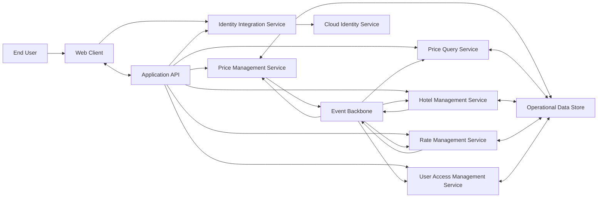

# HPS ADD 3.0 Conversation Log

Started: 2026-05-29T15:03:06.567386902+08:00

## 2026-05-29T15:03:06.838325212+08:00 - Application - READY

```text
Conversation log is active: /home/apophis/SAD/MultiAgentHPS/2026_swsd/logs/conversation-20260529-150306.md
```

## 2026-05-29T15:03:35.010912536+08:00 - ADD Workflow Controller - BUILT_IN_RUN

```text
Run Iteration 1 using the built-in ADD workflow prompt. Do not run other iterations and do not synthesize the final report.
```

## 2026-05-29T15:03:35.012465791+08:00 - Driver Analyst - INPUT

```text
Iteration 1 goal: Establishing an Overall System Structure

Execute ADD Step 1 and Step 2. Review the prior knowledge and select the architectural drivers for this iteration.
```

## 2026-05-29T15:03:39.429943069+08:00 - Driver Analyst - OUTPUT

```text
1. **CRN-1** — This iteration’s central purpose is to establish the initial overall system structure, which directly matches the Iteration 1 plan.
2. **CRN-2** — The overall structure should leverage the team’s existing expertise in Java, Angular, and Kafka, as explicitly identified as a primary driver for Iteration 1.
3. **CRN-3** — The initial architecture should support task allocation among the development team, which is listed as a primary concern for this iteration.
4. **CON-1** — The system structure must support user access through a web browser across Windows, OSX, Linux, and multiple device types, making this a structural constraint for the first iteration.
5. **CON-2** — The architecture must incorporate cloud identity service-based user management and cloud-hosted resources, which directly constrains the initial system design.
6. **CON-6** — A cloud-native architecture is preferred, so the overall system structure should be established in a way that aligns with this constraint.
```

## 2026-05-29T15:03:39.431276124+08:00 - Structure Designer - INPUT

```text
Iteration 1 — Selected Drivers:
1. **CRN-1** — This iteration’s central purpose is to establish the initial overall system structure, which directly matches the Iteration 1 plan.
2. **CRN-2** — The overall structure should leverage the team’s existing expertise in Java, Angular, and Kafka, as explicitly identified as a primary driver for Iteration 1.
3. **CRN-3** — The initial architecture should support task allocation among the development team, which is listed as a primary concern for this iteration.
4. **CON-1** — The system structure must support user access through a web browser across Windows, OSX, Linux, and multiple device types, making this a structural constraint for the first iteration.
5. **CON-2** — The architecture must incorporate cloud identity service-based user management and cloud-hosted resources, which directly constrains the initial system design.
6. **CON-6** — A cloud-native architecture is preferred, so the overall system structure should be established in a way that aligns with this constraint.


Execute ADD Steps 3, 4, and 5. Propose architectural elements and design concepts.
```

## 2026-05-29T15:04:25.519900406+08:00 - Structure Designer - OUTPUT

```text
## Iteration 1 — ADD Steps 3, 4, and 5

## Step 3 — Choose Elements to Refine

Because this is the first iteration for a greenfield system, the element to refine is:

- **HPS System**
  - **Single responsibility:** Provide the overall hotel pricing platform structure.
  - **Reason for refinement:** Iteration 1 is focused on establishing the initial overall system structure. [CRN-1]

The HPS System is refined into the following top-level architectural elements.

---

## Step 4 — Choose Design Concepts

The following design concepts are selected to satisfy the iteration goal and selected drivers.

### 1. Browser-based client and server-side application structure
- **Concept:** Separate a web-based frontend from backend services.
- **Why selected:** Supports browser access across operating systems and device types. [CON-1]
- **Trade-off:** Introduces frontend/backend integration boundaries, but improves portability and clear responsibility separation. [CON-1, CRN-3]

### 2. Layered / service-based cloud-native structure
- **Concept:** Organize the backend into independently deployable cloud-hosted services around major system responsibilities.
- **Why selected:** Aligns with cloud-hosted resources and cloud-native preference. [CON-2, CON-6]
- **Trade-off:** More inter-element interfaces are needed, but this improves decomposition and team task allocation. [CRN-3, CON-6]

### 3. Externalized identity integration
- **Concept:** Use a dedicated authentication/authorization boundary that delegates identity verification to the cloud identity service.
- **Why selected:** User management must use a cloud identity service. [CON-2]
- **Trade-off:** Depends on an external provider, but satisfies the mandatory constraint and isolates identity concerns. [CON-2]

### 4. Event-driven integration backbone
- **Concept:** Introduce an internal asynchronous messaging backbone for collaboration among backend services.
- **Why selected:** Leverages team expertise in Kafka and supports decoupling between services. [CRN-2, CRN-3]
- **Trade-off:** Adds messaging infrastructure and eventual coordination complexity, but improves modularity and work partitioning. [CRN-2, CRN-3]

### 5. Clear service ownership around business capabilities
- **Concept:** Partition backend elements by major business capability rather than as one monolith.
- **Why selected:** Supports team task allocation and establishes a scalable initial structure. [CRN-1, CRN-3]
- **Trade-off:** Requires more explicit interfaces, but reduces coupling among capability areas. [CRN-3]

### 6. Technology alignment with team expertise
- **Concept:** Use Angular for the browser client, Java-based backend services, and Kafka-based messaging integration.
- **Why selected:** Explicitly leverages existing team expertise. [CRN-2]
- **Trade-off:** Constrains implementation choices, but reduces ramp-up risk in the limited delivery timeline context implied by architectural concerns. [CRN-2]

---

## Step 5 — Instantiate Architectural Elements

## (a) Architectural elements — name, responsibility, relationships

### 1. **Web Client**
- **Single responsibility:** Provide the browser-based user interface for business users and admins.
- **Relationships:**
  - Consumes the **Application API** for system functions.
  - Redirects/coordinates with the **Identity Integration Service** for login flows.
- **Driver basis:** [CON-1, CRN-1, CRN-2]

### 2. **Application API**
- **Single responsibility:** Expose backend capabilities to the Web Client through a single application-facing interface.
- **Relationships:**
  - Serves the **Web Client**.
  - Delegates authentication-related interactions to the **Identity Integration Service**.
  - Routes functional requests to domain backend services:
    - **Price Management Service**
    - **Price Query Service**
    - **Hotel Management Service**
    - **Rate Management Service**
    - **User Access Management Service**
- **Driver basis:** [CRN-1, CRN-3, CON-1]

### 3. **Identity Integration Service**
- **Single responsibility:** Integrate HPS authentication and user identity verification with the cloud identity service.
- **Relationships:**
  - Called by **Web Client** and/or **Application API** for login/identity validation.
  - Uses the external **Cloud Identity Service**.
  - Supplies authenticated identity context to the **Application API**.
- **Driver basis:** [CON-2, CRN-1]

### 4. **Price Management Service**
- **Single responsibility:** Handle hotel price change operations and related pricing business processing.
- **Relationships:**
  - Invoked by the **Application API**.
  - Publishes pricing-related events to the **Event Backbone**.
  - Exchanges data with the **Operational Data Store**.
- **Driver basis:** [CRN-1, CRN-3, CON-6]

### 5. **Price Query Service**
- **Single responsibility:** Provide price retrieval capabilities for application use and future external access points.
- **Relationships:**
  - Invoked by the **Application API**.
  - Reads from the **Operational Data Store**.
  - May consume relevant pricing events from the **Event Backbone** if needed for data propagation.
- **Driver basis:** [CRN-1, CRN-3, CON-6]

### 6. **Hotel Management Service**
- **Single responsibility:** Manage hotel master data.
- **Relationships:**
  - Invoked by the **Application API**.
  - Reads/writes the **Operational Data Store**.
  - Publishes hotel-related changes to the **Event Backbone** if other services require them.
- **Driver basis:** [CRN-1, CRN-3]

### 7. **Rate Management Service**
- **Single responsibility:** Manage rate definitions and pricing calculation rule definitions.
- **Relationships:**
  - Invoked by the **Application API**.
  - Reads/writes the **Operational Data Store**.
  - Publishes rate-related changes to the **Event Backbone** if needed by dependent services.
- **Driver basis:** [CRN-1, CRN-3]

### 8. **User Access Management Service**
- **Single responsibility:** Manage HPS user-to-permission and hotel-authorization mappings.
- **Relationships:**
  - Invoked by the **Application API**.
  - Reads/writes the **Operational Data Store**.
  - Provides authorization data for use alongside identity information from the **Identity Integration Service**.
- **Driver basis:** [CRN-1, CRN-3, CON-2]

### 9. **Event Backbone**
- **Single responsibility:** Provide asynchronous event distribution among backend services.
- **Relationships:**
  - Receives events from domain services such as **Price Management Service**, **Hotel Management Service**, and **Rate Management Service**.
  - Delivers events to interested backend services.
- **Driver basis:** [CRN-2, CRN-3]

### 10. **Operational Data Store**
- **Single responsibility:** Persist application business data in cloud-hosted storage.
- **Relationships:**
  - Used by **Price Management Service**
  - Used by **Price Query Service**
  - Used by **Hotel Management Service**
  - Used by **Rate Management Service**
  - Used by **User Access Management Service**
- **Driver basis:** [CON-2, CON-6, CRN-1]

### 11. **Cloud Identity Service** (external)
- **Single responsibility:** Verify user identity and provide cloud-based identity management capabilities.
- **Relationships:**
  - Used by the **Identity Integration Service**.
- **Driver basis:** [CON-2]

---

## Overall relationship summary
- **Web Client** ↔ **Application API**
- **Web Client/Application API** ↔ **Identity Integration Service** → **Cloud Identity Service**
- **Application API** → domain services
- Domain services ↔ **Operational Data Store**
- Domain services ↔ **Event Backbone**

---

## (b) Primary functionality coverage — HPS ID mapped to responsible elements

Iteration 1 is not yet focused on full functional detailing, but the initial structure allocates anticipated ownership as follows:

- **HPS-1 Log In**
  - **Responsible elements:** Web Client, Application API, Identity Integration Service, Cloud Identity Service, User Access Management Service

- **HPS-2 Change Prices**
  - **Responsible elements:** Web Client, Application API, Price Management Service, Operational Data Store, Event Backbone

- **HPS-3 Query Prices**
  - **Responsible elements:** Web Client, Application API, Price Query Service, Operational Data Store

- **HPS-4 Manage Hotels**
  - **Responsible elements:** Web Client, Application API, Hotel Management Service, Operational Data Store

- **HPS-5 Manage Rates**
  - **Responsible elements:** Web Client, Application API, Rate Management Service, Operational Data Store

- **HPS-6 Manage Users**
  - **Responsible elements:** Web Client, Application API, User Access Management Service, Operational Data Store, Identity Integration Service

---

## (c) Interfaces — producer, consumer, purpose

### 1. Web UI Interface
- **Producer:** Web Client
- **Consumer:** End users via browser
- **Purpose:** Provide browser-based access to HPS functionality. [CON-1]

### 2. Application Service Interface
- **Producer:** Application API
- **Consumer:** Web Client
- **Purpose:** Expose backend application operations to the browser client. [CRN-1, CON-1]

### 3. Identity Verification Interface
- **Producer:** Identity Integration Service
- **Consumer:** Web Client / Application API
- **Purpose:** Start and complete login and identity verification using cloud identity resources. [CON-2]

### 4. Cloud Identity Provider Interface
- **Producer:** Cloud Identity Service
- **Consumer:** Identity Integration Service
- **Purpose:** Verify credentials and provide identity assertions. [CON-2]

### 5. Price Command Interface
- **Producer:** Price Management Service
- **Consumer:** Application API
- **Purpose:** Accept requests related to price modification processing. [CRN-1]

### 6. Price Query Interface
- **Producer:** Price Query Service
- **Consumer:** Application API
- **Purpose:** Return hotel pricing information. [CRN-1]

### 7. Hotel Management Interface
- **Producer:** Hotel Management Service
- **Consumer:** Application API
- **Purpose:** Support hotel data maintenance operations. [CRN-1]

### 8. Rate Management Interface
- **Producer:** Rate Management Service
- **Consumer:** Application API
- **Purpose:** Support rate and rule maintenance operations. [CRN-1]

### 9. User Access Management Interface
- **Producer:** User Access Management Service
- **Consumer:** Application API
- **Purpose:** Support user permission and hotel authorization management. [CRN-1, CON-2]

### 10. Event Publication Interface
- **Producer:** Event Backbone
- **Consumer:** Domain backend services
- **Purpose:** Distribute asynchronous domain events among backend services. [CRN-2, CRN-3]

### 11. Data Access Interface
- **Producer:** Operational Data Store
- **Consumer:** Domain backend services
- **Purpose:** Store and retrieve persistent business data. [CON-2, CON-6]

---

## (d) Design decisions — numbered list, each citing driver IDs

1. **Refine the whole HPS system into a browser-based frontend plus backend platform structure.**
   - Rationale: Establishes the initial overall system structure and satisfies browser access needs. [CRN-1, CON-1]

2. **Introduce a dedicated Web Client as the user-facing entry point.**
   - Rationale: Users must access through a web browser across multiple operating systems and device types. [CON-1]

3. **Introduce an Application API as the single backend entry point for the Web Client.**
   - Rationale: Provides a clear initial structural boundary and simplifies team task allocation by separating frontend work from backend capability work. [CRN-1, CRN-3]

4. **Isolate identity handling in an Identity Integration Service that uses the cloud identity service.**
   - Rationale: User management must use a cloud identity service and cloud-hosted resources. [CON-2]

5. **Partition backend business responsibilities into separate capability-oriented services: Price Management, Price Query, Hotel Management, Rate Management, and User Access Management.**
   - Rationale: Establishes a clean overall structure and supports parallel team ownership. [CRN-1, CRN-3]

6. **Use an event backbone for asynchronous collaboration among backend services.**
   - Rationale: Leverages team expertise with Kafka and improves decoupling among teams and services. [CRN-2, CRN-3]

7. **Use a cloud-hosted Operational Data Store shared at the architectural level by domain services.**
   - Rationale: The architecture must rely on cloud-hosted resources and align with cloud-native deployment preferences. [CON-2, CON-6]

8. **Align implementation direction with team expertise by using Angular for the browser client, Java for backend services, and Kafka for event distribution.**
   - Rationale: Explicitly leverages existing technical expertise. [CRN-2]

9. **Choose a service-based cloud-native decomposition rather than a single undifferentiated backend element.**
   - Rationale: Better supports cloud-native structure, clearer ownership, and team task allocation. [CON-6, CRN-3, CRN-1]

10. **Keep authentication/identity concerns separate from business capability services.**
    - Rationale: Reduces coupling and ensures the cloud identity constraint is handled in a dedicated boundary. [CON-2, CRN-1]

---

## (e) Risks or issues for the Quality Validator

1. **Service boundary depth may be too coarse or too fine.**
   - The initial decomposition supports structure and team allocation, but later iterations must validate whether the chosen service boundaries best support primary functionality and quality attributes. [CRN-1, CRN-3]

2. **The Application API may become a concentration point.**
   - Future iterations should verify it does not become an undesirable bottleneck or overly centralized responsibility holder. [CRN-1]

3. **The Event Backbone is selected primarily from team expertise and structural decoupling needs, not yet from validated quality scenarios.**
   - Later iterations should confirm that its use is necessary and properly scoped for functional and quality requirements. [CRN-2, CRN-3]

4. **Authorization behavior is only structurally allocated, not yet fully designed.**
   - Later iterations must verify how post-login authorization for hotel-specific access is enforced. [CON-2; future relation to QA-5]

5. **Data ownership boundaries are not yet fully specified.**
   - The current structure identifies an Operational Data Store, but later iterations should validate whether each service needs stricter ownership boundaries for modifiability, reliability, and testing. [CRN-1, CON-6]

6. **External interface scope is only partially defined in this iteration.**
   - Iteration 2 should refine the functional interfaces needed for HPS-1 through HPS-6. [CRN-1]

7. **Cloud-native preference is reflected structurally, but deployment, operability, and environment movement concerns remain unresolved.**
   - Later iterations must address deployability and operations concerns explicitly. [CON-6]
```

## 2026-05-29T15:04:25.523501334+08:00 - View Recorder - INPUT

```text
Iteration 1 — Architectural Structure:
## Iteration 1 — ADD Steps 3, 4, and 5

## Step 3 — Choose Elements to Refine

Because this is the first iteration for a greenfield system, the element to refine is:

- **HPS System**
  - **Single responsibility:** Provide the overall hotel pricing platform structure.
  - **Reason for refinement:** Iteration 1 is focused on establishing the initial overall system structure. [CRN-1]

The HPS System is refined into the following top-level architectural elements.

---

## Step 4 — Choose Design Concepts

The following design concepts are selected to satisfy the iteration goal and selected drivers.

### 1. Browser-based client and server-side application structure
- **Concept:** Separate a web-based frontend from backend services.
- **Why selected:** Supports browser access across operating systems and device types. [CON-1]
- **Trade-off:** Introduces frontend/backend integration boundaries, but improves portability and clear responsibility separation. [CON-1, CRN-3]

### 2. Layered / service-based cloud-native structure
- **Concept:** Organize the backend into independently deployable cloud-hosted services around major system responsibilities.
- **Why selected:** Aligns with cloud-hosted resources and cloud-native preference. [CON-2, CON-6]
- **Trade-off:** More inter-element interfaces are needed, but this improves decomposition and team task allocation. [CRN-3, CON-6]

### 3. Externalized identity integration
- **Concept:** Use a dedicated authentication/authorization boundary that delegates identity verification to the cloud identity service.
- **Why selected:** User management must use a cloud identity service. [CON-2]
- **Trade-off:** Depends on an external provider, but satisfies the mandatory constraint and isolates identity concerns. [CON-2]

### 4. Event-driven integration backbone
- **Concept:** Introduce an internal asynchronous messaging backbone for collaboration among backend services.
- **Why selected:** Leverages team expertise in Kafka and supports decoupling between services. [CRN-2, CRN-3]
- **Trade-off:** Adds messaging infrastructure and eventual coordination complexity, but improves modularity and work partitioning. [CRN-2, CRN-3]

### 5. Clear service ownership around business capabilities
- **Concept:** Partition backend elements by major business capability rather than as one monolith.
- **Why selected:** Supports team task allocation and establishes a scalable initial structure. [CRN-1, CRN-3]
- **Trade-off:** Requires more explicit interfaces, but reduces coupling among capability areas. [CRN-3]

### 6. Technology alignment with team expertise
- **Concept:** Use Angular for the browser client, Java-based backend services, and Kafka-based messaging integration.
- **Why selected:** Explicitly leverages existing team expertise. [CRN-2]
- **Trade-off:** Constrains implementation choices, but reduces ramp-up risk in the limited delivery timeline context implied by architectural concerns. [CRN-2]

---

## Step 5 — Instantiate Architectural Elements

## (a) Architectural elements — name, responsibility, relationships

### 1. **Web Client**
- **Single responsibility:** Provide the browser-based user interface for business users and admins.
- **Relationships:**
  - Consumes the **Application API** for system functions.
  - Redirects/coordinates with the **Identity Integration Service** for login flows.
- **Driver basis:** [CON-1, CRN-1, CRN-2]

### 2. **Application API**
- **Single responsibility:** Expose backend capabilities to the Web Client through a single application-facing interface.
- **Relationships:**
  - Serves the **Web Client**.
  - Delegates authentication-related interactions to the **Identity Integration Service**.
  - Routes functional requests to domain backend services:
    - **Price Management Service**
    - **Price Query Service**
    - **Hotel Management Service**
    - **Rate Management Service**
    - **User Access Management Service**
- **Driver basis:** [CRN-1, CRN-3, CON-1]

### 3. **Identity Integration Service**
- **Single responsibility:** Integrate HPS authentication and user identity verification with the cloud identity service.
- **Relationships:**
  - Called by **Web Client** and/or **Application API** for login/identity validation.
  - Uses the external **Cloud Identity Service**.
  - Supplies authenticated identity context to the **Application API**.
- **Driver basis:** [CON-2, CRN-1]

### 4. **Price Management Service**
- **Single responsibility:** Handle hotel price change operations and related pricing business processing.
- **Relationships:**
  - Invoked by the **Application API**.
  - Publishes pricing-related events to the **Event Backbone**.
  - Exchanges data with the **Operational Data Store**.
- **Driver basis:** [CRN-1, CRN-3, CON-6]

### 5. **Price Query Service**
- **Single responsibility:** Provide price retrieval capabilities for application use and future external access points.
- **Relationships:**
  - Invoked by the **Application API**.
  - Reads from the **Operational Data Store**.
  - May consume relevant pricing events from the **Event Backbone** if needed for data propagation.
- **Driver basis:** [CRN-1, CRN-3, CON-6]

### 6. **Hotel Management Service**
- **Single responsibility:** Manage hotel master data.
- **Relationships:**
  - Invoked by the **Application API**.
  - Reads/writes the **Operational Data Store**.
  - Publishes hotel-related changes to the **Event Backbone** if other services require them.
- **Driver basis:** [CRN-1, CRN-3]

### 7. **Rate Management Service**
- **Single responsibility:** Manage rate definitions and pricing calculation rule definitions.
- **Relationships:**
  - Invoked by the **Application API**.
  - Reads/writes the **Operational Data Store**.
  - Publishes rate-related changes to the **Event Backbone** if needed by dependent services.
- **Driver basis:** [CRN-1, CRN-3]

### 8. **User Access Management Service**
- **Single responsibility:** Manage HPS user-to-permission and hotel-authorization mappings.
- **Relationships:**
  - Invoked by the **Application API**.
  - Reads/writes the **Operational Data Store**.
  - Provides authorization data for use alongside identity information from the **Identity Integration Service**.
- **Driver basis:** [CRN-1, CRN-3, CON-2]

### 9. **Event Backbone**
- **Single responsibility:** Provide asynchronous event distribution among backend services.
- **Relationships:**
  - Receives events from domain services such as **Price Management Service**, **Hotel Management Service**, and **Rate Management Service**.
  - Delivers events to interested backend services.
- **Driver basis:** [CRN-2, CRN-3]

### 10. **Operational Data Store**
- **Single responsibility:** Persist application business data in cloud-hosted storage.
- **Relationships:**
  - Used by **Price Management Service**
  - Used by **Price Query Service**
  - Used by **Hotel Management Service**
  - Used by **Rate Management Service**
  - Used by **User Access Management Service**
- **Driver basis:** [CON-2, CON-6, CRN-1]

### 11. **Cloud Identity Service** (external)
- **Single responsibility:** Verify user identity and provide cloud-based identity management capabilities.
- **Relationships:**
  - Used by the **Identity Integration Service**.
- **Driver basis:** [CON-2]

---

## Overall relationship summary
- **Web Client** ↔ **Application API**
- **Web Client/Application API** ↔ **Identity Integration Service** → **Cloud Identity Service**
- **Application API** → domain services
- Domain services ↔ **Operational Data Store**
- Domain services ↔ **Event Backbone**

---

## (b) Primary functionality coverage — HPS ID mapped to responsible elements

Iteration 1 is not yet focused on full functional detailing, but the initial structure allocates anticipated ownership as follows:

- **HPS-1 Log In**
  - **Responsible elements:** Web Client, Application API, Identity Integration Service, Cloud Identity Service, User Access Management Service

- **HPS-2 Change Prices**
  - **Responsible elements:** Web Client, Application API, Price Management Service, Operational Data Store, Event Backbone

- **HPS-3 Query Prices**
  - **Responsible elements:** Web Client, Application API, Price Query Service, Operational Data Store

- **HPS-4 Manage Hotels**
  - **Responsible elements:** Web Client, Application API, Hotel Management Service, Operational Data Store

- **HPS-5 Manage Rates**
  - **Responsible elements:** Web Client, Application API, Rate Management Service, Operational Data Store

- **HPS-6 Manage Users**
  - **Responsible elements:** Web Client, Application API, User Access Management Service, Operational Data Store, Identity Integration Service

---

## (c) Interfaces — producer, consumer, purpose

### 1. Web UI Interface
- **Producer:** Web Client
- **Consumer:** End users via browser
- **Purpose:** Provide browser-based access to HPS functionality. [CON-1]

### 2. Application Service Interface
- **Producer:** Application API
- **Consumer:** Web Client
- **Purpose:** Expose backend application operations to the browser client. [CRN-1, CON-1]

### 3. Identity Verification Interface
- **Producer:** Identity Integration Service
- **Consumer:** Web Client / Application API
- **Purpose:** Start and complete login and identity verification using cloud identity resources. [CON-2]

### 4. Cloud Identity Provider Interface
- **Producer:** Cloud Identity Service
- **Consumer:** Identity Integration Service
- **Purpose:** Verify credentials and provide identity assertions. [CON-2]

### 5. Price Command Interface
- **Producer:** Price Management Service
- **Consumer:** Application API
- **Purpose:** Accept requests related to price modification processing. [CRN-1]

### 6. Price Query Interface
- **Producer:** Price Query Service
- **Consumer:** Application API
- **Purpose:** Return hotel pricing information. [CRN-1]

### 7. Hotel Management Interface
- **Producer:** Hotel Management Service
- **Consumer:** Application API
- **Purpose:** Support hotel data maintenance operations. [CRN-1]

### 8. Rate Management Interface
- **Producer:** Rate Management Service
- **Consumer:** Application API
- **Purpose:** Support rate and rule maintenance operations. [CRN-1]

### 9. User Access Management Interface
- **Producer:** User Access Management Service
- **Consumer:** Application API
- **Purpose:** Support user permission and hotel authorization management. [CRN-1, CON-2]

### 10. Event Publication Interface
- **Producer:** Event Backbone
- **Consumer:** Domain backend services
- **Purpose:** Distribute asynchronous domain events among backend services. [CRN-2, CRN-3]

### 11. Data Access Interface
- **Producer:** Operational Data Store
- **Consumer:** Domain backend services
- **Purpose:** Store and retrieve persistent business data. [CON-2, CON-6]

---

## (d) Design decisions — numbered list, each citing driver IDs

1. **Refine the whole HPS system into a browser-based frontend plus backend platform structure.**
   - Rationale: Establishes the initial overall system structure and satisfies browser access needs. [CRN-1, CON-1]

2. **Introduce a dedicated Web Client as the user-facing entry point.**
   - Rationale: Users must access through a web browser across multiple operating systems and device types. [CON-1]

3. **Introduce an Application API as the single backend entry point for the Web Client.**
   - Rationale: Provides a clear initial structural boundary and simplifies team task allocation by separating frontend work from backend capability work. [CRN-1, CRN-3]

4. **Isolate identity handling in an Identity Integration Service that uses the cloud identity service.**
   - Rationale: User management must use a cloud identity service and cloud-hosted resources. [CON-2]

5. **Partition backend business responsibilities into separate capability-oriented services: Price Management, Price Query, Hotel Management, Rate Management, and User Access Management.**
   - Rationale: Establishes a clean overall structure and supports parallel team ownership. [CRN-1, CRN-3]

6. **Use an event backbone for asynchronous collaboration among backend services.**
   - Rationale: Leverages team expertise with Kafka and improves decoupling among teams and services. [CRN-2, CRN-3]

7. **Use a cloud-hosted Operational Data Store shared at the architectural level by domain services.**
   - Rationale: The architecture must rely on cloud-hosted resources and align with cloud-native deployment preferences. [CON-2, CON-6]

8. **Align implementation direction with team expertise by using Angular for the browser client, Java for backend services, and Kafka for event distribution.**
   - Rationale: Explicitly leverages existing technical expertise. [CRN-2]

9. **Choose a service-based cloud-native decomposition rather than a single undifferentiated backend element.**
   - Rationale: Better supports cloud-native structure, clearer ownership, and team task allocation. [CON-6, CRN-3, CRN-1]

10. **Keep authentication/identity concerns separate from business capability services.**
    - Rationale: Reduces coupling and ensures the cloud identity constraint is handled in a dedicated boundary. [CON-2, CRN-1]

---

## (e) Risks or issues for the Quality Validator

1. **Service boundary depth may be too coarse or too fine.**
   - The initial decomposition supports structure and team allocation, but later iterations must validate whether the chosen service boundaries best support primary functionality and quality attributes. [CRN-1, CRN-3]

2. **The Application API may become a concentration point.**
   - Future iterations should verify it does not become an undesirable bottleneck or overly centralized responsibility holder. [CRN-1]

3. **The Event Backbone is selected primarily from team expertise and structural decoupling needs, not yet from validated quality scenarios.**
   - Later iterations should confirm that its use is necessary and properly scoped for functional and quality requirements. [CRN-2, CRN-3]

4. **Authorization behavior is only structurally allocated, not yet fully designed.**
   - Later iterations must verify how post-login authorization for hotel-specific access is enforced. [CON-2; future relation to QA-5]

5. **Data ownership boundaries are not yet fully specified.**
   - The current structure identifies an Operational Data Store, but later iterations should validate whether each service needs stricter ownership boundaries for modifiability, reliability, and testing. [CRN-1, CON-6]

6. **External interface scope is only partially defined in this iteration.**
   - Iteration 2 should refine the functional interfaces needed for HPS-1 through HPS-6. [CRN-1]

7. **Cloud-native preference is reflected structurally, but deployment, operability, and environment movement concerns remain unresolved.**
   - Later iterations must address deployability and operations concerns explicitly. [CON-6]


Execute ADD Step 6. Produce the Mermaid diagram and record numbered design decisions.
```

## 2026-05-29T15:04:37.122243026+08:00 - View Recorder - OUTPUT

```text
## Architecture View — Iteration 1


## Design Decisions
1. Refine the HPS system into a browser-based frontend and backend platform structure to establish the initial overall system shape and satisfy browser access requirements. (Drivers: CRN-1, CON-1)
2. Introduce a dedicated Web Client as the user-facing entry point for business users and admins using web browsers across supported operating systems and device types. (Drivers: CON-1, CRN-1)
3. Use an Application API as the single application-facing backend entry point for the Web Client to provide a clear structural boundary and support team task allocation. (Drivers: CRN-1, CRN-3, CON-1)
4. Isolate authentication and identity handling in an Identity Integration Service that delegates verification to the Cloud Identity Service to satisfy the cloud identity constraint and separate identity concerns from business capabilities. (Drivers: CON-2, CRN-1)
5. Partition backend responsibilities into capability-oriented services: Price Management Service, Price Query Service, Hotel Management Service, Rate Management Service, and User Access Management Service, to establish clear ownership boundaries and support parallel development. (Drivers: CRN-1, CRN-3)
6. Introduce an Event Backbone for asynchronous collaboration among backend services to leverage Kafka expertise and improve service decoupling. (Drivers: CRN-2, CRN-3)
7. Use a cloud-hosted Operational Data Store as the persistent business data store for the domain services to align with cloud-hosted resource requirements and cloud-native preferences. (Drivers: CON-2, CON-6, CRN-1)
8. Align the implementation direction with team expertise by using Angular for the Web Client, Java for backend services, and Kafka for event distribution. (Drivers: CRN-2)
9. Choose a service-based cloud-native decomposition instead of a single undifferentiated backend element to better support cloud-native architecture, system structuring, and team allocation. (Drivers: CON-6, CRN-1, CRN-3)
10. Keep identity/authentication concerns separate from business capability services so the mandatory cloud identity integration is handled in a dedicated architectural boundary. (Drivers: CON-2, CRN-1)
```

## 2026-05-29T15:04:37.122770470+08:00 - Quality Validator - INPUT

```text
Iteration 1 — Architecture View and Design Decisions:
## Architecture View — Iteration 1


## Design Decisions
1. Refine the HPS system into a browser-based frontend and backend platform structure to establish the initial overall system shape and satisfy browser access requirements. (Drivers: CRN-1, CON-1)
2. Introduce a dedicated Web Client as the user-facing entry point for business users and admins using web browsers across supported operating systems and device types. (Drivers: CON-1, CRN-1)
3. Use an Application API as the single application-facing backend entry point for the Web Client to provide a clear structural boundary and support team task allocation. (Drivers: CRN-1, CRN-3, CON-1)
4. Isolate authentication and identity handling in an Identity Integration Service that delegates verification to the Cloud Identity Service to satisfy the cloud identity constraint and separate identity concerns from business capabilities. (Drivers: CON-2, CRN-1)
5. Partition backend responsibilities into capability-oriented services: Price Management Service, Price Query Service, Hotel Management Service, Rate Management Service, and User Access Management Service, to establish clear ownership boundaries and support parallel development. (Drivers: CRN-1, CRN-3)
6. Introduce an Event Backbone for asynchronous collaboration among backend services to leverage Kafka expertise and improve service decoupling. (Drivers: CRN-2, CRN-3)
7. Use a cloud-hosted Operational Data Store as the persistent business data store for the domain services to align with cloud-hosted resource requirements and cloud-native preferences. (Drivers: CON-2, CON-6, CRN-1)
8. Align the implementation direction with team expertise by using Angular for the Web Client, Java for backend services, and Kafka for event distribution. (Drivers: CRN-2)
9. Choose a service-based cloud-native decomposition instead of a single undifferentiated backend element to better support cloud-native architecture, system structuring, and team allocation. (Drivers: CON-6, CRN-1, CRN-3)
10. Keep identity/authentication concerns separate from business capability services so the mandatory cloud identity integration is handled in a dedicated architectural boundary. (Drivers: CON-2, CRN-1)


Execute ADD Step 7. Validate this design against the iteration drivers and quality requirements.
```

## 2026-05-29T15:04:37.209491102+08:00 - Quality Validator - OUTPUT

```text
Exception: HTTP 400 - {"message":"this model has beta-limitations, temperature, top_p and n are fixed at 1, while presence_penalty and frequency_penalty are fixed at 0 trace_id: 476e63b85c550a6d06e47ca8ee8fa7ee","type":"invalid_request_error"}

```

