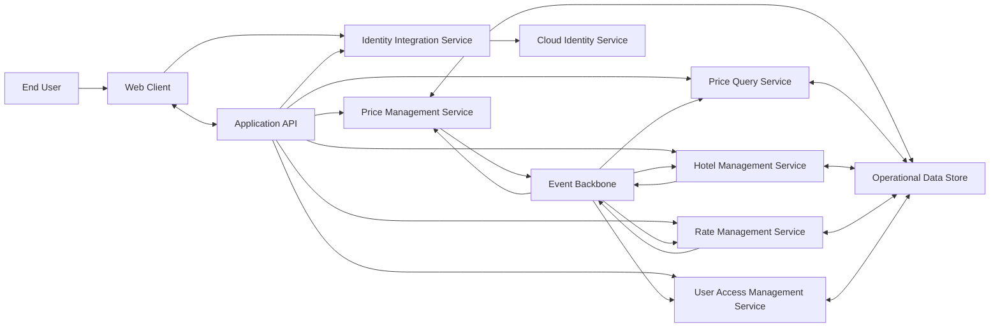
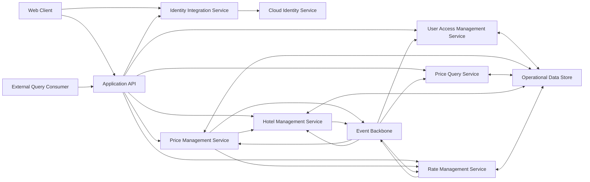
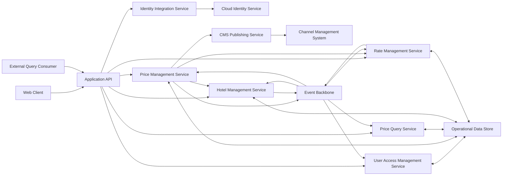

# HPS ADD 3.0 Conversation Log

Started: 2026-05-29T15:09:44.160179524+08:00

## 2026-05-29T15:09:44.418864570+08:00 - Application - READY

```text
Conversation log is active: /home/apophis/SAD/MultiAgentHPS/2026_swsd/logs/conversation-20260529-150944.md
```

## 2026-05-29T15:09:56.100166744+08:00 - ADD Workflow Controller - AUTO_LOCAL_CONTEXT_FILE

```text
/home/apophis/SAD/MultiAgentHPS/2026_swsd/logs/conversation-20260529-150306.md
```

## 2026-05-29T15:09:56.100375146+08:00 - ADD Workflow Controller - BUILT_IN_RUN

```text
Run Iteration 2 using the built-in ADD workflow prompt. Do not run other iterations and do not synthesize the final report.
```

## 2026-05-29T15:09:56.101865355+08:00 - Driver Analyst - INPUT

```text
Iteration 2 goal: Identifying Structures to Support Primary Functionality


Previous iteration context supplied by the caller. Use it only as prior ADD output; do not treat it as new requirements:
# HPS ADD 3.0 Conversation Log

Started: 2026-05-29T15:03:06.567386902+08:00

## 2026-05-29T15:03:06.838325212+08:00 - Application - READY

```text
Conversation log is active: /home/apophis/SAD/MultiAgentHPS/2026_swsd/logs/conversation-20260529-150306.md
```

## 2026-05-29T15:03:35.010912536+08:00 - ADD Workflow Controller - BUILT_IN_RUN

```text
Run Iteration 1 using the built-in ADD workflow prompt. Do not run other iterations and do not synthesize the final report.
```

## 2026-05-29T15:03:35.012465791+08:00 - Driver Analyst - INPUT

```text
Iteration 1 goal: Establishing an Overall System Structure

Execute ADD Step 1 and Step 2. Review the prior knowledge and select the architectural drivers for this iteration.
```

## 2026-05-29T15:03:39.429943069+08:00 - Driver Analyst - OUTPUT

```text
1. **CRN-1** — This iteration’s central purpose is to establish the initial overall system structure, which directly matches the Iteration 1 plan.
2. **CRN-2** — The overall structure should leverage the team’s existing expertise in Java, Angular, and Kafka, as explicitly identified as a primary driver for Iteration 1.
3. **CRN-3** — The initial architecture should support task allocation among the development team, which is listed as a primary concern for this iteration.
4. **CON-1** — The system structure must support user access through a web browser across Windows, OSX, Linux, and multiple device types, making this a structural constraint for the first iteration.
5. **CON-2** — The architecture must incorporate cloud identity service-based user management and cloud-hosted resources, which directly constrains the initial system design.
6. **CON-6** — A cloud-native architecture is preferred, so the overall system structure should be established in a way that aligns with this constraint.
```

## 2026-05-29T15:03:39.431276124+08:00 - Structure Designer - INPUT

```text
Iteration 1 — Selected Drivers:
1. **CRN-1** — This iteration’s central purpose is to establish the initial overall system structure, which directly matches the Iteration 1 plan.
2. **CRN-2** — The overall structure should leverage the team’s existing expertise in Java, Angular, and Kafka, as explicitly identified as a primary driver for Iteration 1.
3. **CRN-3** — The initial architecture should support task allocation among the development team, which is listed as a primary concern for this iteration.
4. **CON-1** — The system structure must support user access through a web browser across Windows, OSX, Linux, and multiple device types, making this a structural constraint for the first iteration.
5. **CON-2** — The architecture must incorporate cloud identity service-based user management and cloud-hosted resources, which directly constrains the initial system design.
6. **CON-6** — A cloud-native architecture is preferred, so the overall system structure should be established in a way that aligns with this constraint.


Execute ADD Steps 3, 4, and 5. Propose architectural elements and design concepts.
```

## 2026-05-29T15:04:25.519900406+08:00 - Structure Designer - OUTPUT

```text
## Iteration 1 — ADD Steps 3, 4, and 5

## Step 3 — Choose Elements to Refine

Because this is the first iteration for a greenfield system, the element to refine is:

- **HPS System**
  - **Single responsibility:** Provide the overall hotel pricing platform structure.
  - **Reason for refinement:** Iteration 1 is focused on establishing the initial overall system structure. [CRN-1]

The HPS System is refined into the following top-level architectural elements.

---

## Step 4 — Choose Design Concepts

The following design concepts are selected to satisfy the iteration goal and selected drivers.

### 1. Browser-based client and server-side application structure
- **Concept:** Separate a web-based frontend from backend services.
- **Why selected:** Supports browser access across operating systems and device types. [CON-1]
- **Trade-off:** Introduces frontend/backend integration boundaries, but improves portability and clear responsibility separation. [CON-1, CRN-3]

### 2. Layered / service-based cloud-native structure
- **Concept:** Organize the backend into independently deployable cloud-hosted services around major system responsibilities.
- **Why selected:** Aligns with cloud-hosted resources and cloud-native preference. [CON-2, CON-6]
- **Trade-off:** More inter-element interfaces are needed, but this improves decomposition and team task allocation. [CRN-3, CON-6]

### 3. Externalized identity integration
- **Concept:** Use a dedicated authentication/authorization boundary that delegates identity verification to the cloud identity service.
- **Why selected:** User management must use a cloud identity service. [CON-2]
- **Trade-off:** Depends on an external provider, but satisfies the mandatory constraint and isolates identity concerns. [CON-2]

### 4. Event-driven integration backbone
- **Concept:** Introduce an internal asynchronous messaging backbone for collaboration among backend services.
- **Why selected:** Leverages team expertise in Kafka and supports decoupling between services. [CRN-2, CRN-3]
- **Trade-off:** Adds messaging infrastructure and eventual coordination complexity, but improves modularity and work partitioning. [CRN-2, CRN-3]

### 5. Clear service ownership around business capabilities
- **Concept:** Partition backend elements by major business capability rather than as one monolith.
- **Why selected:** Supports team task allocation and establishes a scalable initial structure. [CRN-1, CRN-3]
- **Trade-off:** Requires more explicit interfaces, but reduces coupling among capability areas. [CRN-3]

### 6. Technology alignment with team expertise
- **Concept:** Use Angular for the browser client, Java-based backend services, and Kafka-based messaging integration.
- **Why selected:** Explicitly leverages existing team expertise. [CRN-2]
- **Trade-off:** Constrains implementation choices, but reduces ramp-up risk in the limited delivery timeline context implied by architectural concerns. [CRN-2]

---

## Step 5 — Instantiate Architectural Elements

## (a) Architectural elements — name, responsibility, relationships

### 1. **Web Client**
- **Single responsibility:** Provide the browser-based user interface for business users and admins.
- **Relationships:**
  - Consumes the **Application API** for system functions.
  - Redirects/coordinates with the **Identity Integration Service** for login flows.
- **Driver basis:** [CON-1, CRN-1, CRN-2]

### 2. **Application API**
- **Single responsibility:** Expose backend capabilities to the Web Client through a single application-facing interface.
- **Relationships:**
  - Serves the **Web Client**.
  - Delegates authentication-related interactions to the **Identity Integration Service**.
  - Routes functional requests to domain backend services:
    - **Price Management Service**
    - **Price Query Service**
    - **Hotel Management Service**
    - **Rate Management Service**
    - **User Access Management Service**
- **Driver basis:** [CRN-1, CRN-3, CON-1]

### 3. **Identity Integration Service**
- **Single responsibility:** Integrate HPS authentication and user identity verification with the cloud identity service.
- **Relationships:**
  - Called by **Web Client** and/or **Application API** for login/identity validation.
  - Uses the external **Cloud Identity Service**.
  - Supplies authenticated identity context to the **Application API**.
- **Driver basis:** [CON-2, CRN-1]

### 4. **Price Management Service**
- **Single responsibility:** Handle hotel price change operations and related pricing business processing.
- **Relationships:**
  - Invoked by the **Application API**.
  - Publishes pricing-related events to the **Event Backbone**.
  - Exchanges data with the **Operational Data Store**.
- **Driver basis:** [CRN-1, CRN-3, CON-6]

### 5. **Price Query Service**
- **Single responsibility:** Provide price retrieval capabilities for application use and future external access points.
- **Relationships:**
  - Invoked by the **Application API**.
  - Reads from the **Operational Data Store**.
  - May consume relevant pricing events from the **Event Backbone** if needed for data propagation.
- **Driver basis:** [CRN-1, CRN-3, CON-6]

### 6. **Hotel Management Service**
- **Single responsibility:** Manage hotel master data.
- **Relationships:**
  - Invoked by the **Application API**.
  - Reads/writes the **Operational Data Store**.
  - Publishes hotel-related changes to the **Event Backbone** if other services require them.
- **Driver basis:** [CRN-1, CRN-3]

### 7. **Rate Management Service**
- **Single responsibility:** Manage rate definitions and pricing calculation rule definitions.
- **Relationships:**
  - Invoked by the **Application API**.
  - Reads/writes the **Operational Data Store**.
  - Publishes rate-related changes to the **Event Backbone** if needed by dependent services.
- **Driver basis:** [CRN-1, CRN-3]

### 8. **User Access Management Service**
- **Single responsibility:** Manage HPS user-to-permission and hotel-authorization mappings.
- **Relationships:**
  - Invoked by the **Application API**.
  - Reads/writes the **Operational Data Store**.
  - Provides authorization data for use alongside identity information from the **Identity Integration Service**.
- **Driver basis:** [CRN-1, CRN-3, CON-2]

### 9. **Event Backbone**
- **Single responsibility:** Provide asynchronous event distribution among backend services.
- **Relationships:**
  - Receives events from domain services such as **Price Management Service**, **Hotel Management Service**, and **Rate Management Service**.
  - Delivers events to interested backend services.
- **Driver basis:** [CRN-2, CRN-3]

### 10. **Operational Data Store**
- **Single responsibility:** Persist application business data in cloud-hosted storage.
- **Relationships:**
  - Used by **Price Management Service**
  - Used by **Price Query Service**
  - Used by **Hotel Management Service**
  - Used by **Rate Management Service**
  - Used by **User Access Management Service**
- **Driver basis:** [CON-2, CON-6, CRN-1]

### 11. **Cloud Identity Service** (external)
- **Single responsibility:** Verify user identity and provide cloud-based identity management capabilities.
- **Relationships:**
  - Used by the **Identity Integration Service**.
- **Driver basis:** [CON-2]

---

## Overall relationship summary
- **Web Client** ↔ **Application API**
- **Web Client/Application API** ↔ **Identity Integration Service** → **Cloud Identity Service**
- **Application API** → domain services
- Domain services ↔ **Operational Data Store**
- Domain services ↔ **Event Backbone**

---

## (b) Primary functionality coverage — HPS ID mapped to responsible elements

Iteration 1 is not yet focused on full functional detailing, but the initial structure allocates anticipated ownership as follows:

- **HPS-1 Log In**
  - **Responsible elements:** Web Client, Application API, Identity Integration Service, Cloud Identity Service, User Access Management Service

- **HPS-2 Change Prices**
  - **Responsible elements:** Web Client, Application API, Price Management Service, Operational Data Store, Event Backbone

- **HPS-3 Query Prices**
  - **Responsible elements:** Web Client, Application API, Price Query Service, Operational Data Store

- **HPS-4 Manage Hotels**
  - **Responsible elements:** Web Client, Application API, Hotel Management Service, Operational Data Store

- **HPS-5 Manage Rates**
  - **Responsible elements:** Web Client, Application API, Rate Management Service, Operational Data Store

- **HPS-6 Manage Users**
  - **Responsible elements:** Web Client, Application API, User Access Management Service, Operational Data Store, Identity Integration Service

---

## (c) Interfaces — producer, consumer, purpose

### 1. Web UI Interface
- **Producer:** Web Client
- **Consumer:** End users via browser
- **Purpose:** Provide browser-based access to HPS functionality. [CON-1]

### 2. Application Service Interface
- **Producer:** Application API
- **Consumer:** Web Client
- **Purpose:** Expose backend application operations to the browser client. [CRN-1, CON-1]

### 3. Identity Verification Interface
- **Producer:** Identity Integration Service
- **Consumer:** Web Client / Application API
- **Purpose:** Start and complete login and identity verification using cloud identity resources. [CON-2]

### 4. Cloud Identity Provider Interface
- **Producer:** Cloud Identity Service
- **Consumer:** Identity Integration Service
- **Purpose:** Verify credentials and provide identity assertions. [CON-2]

### 5. Price Command Interface
- **Producer:** Price Management Service
- **Consumer:** Application API
- **Purpose:** Accept requests related to price modification processing. [CRN-1]

### 6. Price Query Interface
- **Producer:** Price Query Service
- **Consumer:** Application API
- **Purpose:** Return hotel pricing information. [CRN-1]

### 7. Hotel Management Interface
- **Producer:** Hotel Management Service
- **Consumer:** Application API
- **Purpose:** Support hotel data maintenance operations. [CRN-1]

### 8. Rate Management Interface
- **Producer:** Rate Management Service
- **Consumer:** Application API
- **Purpose:** Support rate and rule maintenance operations. [CRN-1]

### 9. User Access Management Interface
- **Producer:** User Access Management Service
- **Consumer:** Application API
- **Purpose:** Support user permission and hotel authorization management. [CRN-1, CON-2]

### 10. Event Publication Interface
- **Producer:** Event Backbone
- **Consumer:** Domain backend services
- **Purpose:** Distribute asynchronous domain events among backend services. [CRN-2, CRN-3]

### 11. Data Access Interface
- **Producer:** Operational Data Store
- **Consumer:** Domain backend services
- **Purpose:** Store and retrieve persistent business data. [CON-2, CON-6]

---

## (d) Design decisions — numbered list, each citing driver IDs

1. **Refine the whole HPS system into a browser-based frontend plus backend platform structure.**
   - Rationale: Establishes the initial overall system structure and satisfies browser access needs. [CRN-1, CON-1]

2. **Introduce a dedicated Web Client as the user-facing entry point.**
   - Rationale: Users must access through a web browser across multiple operating systems and device types. [CON-1]

3. **Introduce an Application API as the single backend entry point for the Web Client.**
   - Rationale: Provides a clear initial structural boundary and simplifies team task allocation by separating frontend work from backend capability work. [CRN-1, CRN-3]

4. **Isolate identity handling in an Identity Integration Service that uses the cloud identity service.**
   - Rationale: User management must use a cloud identity service and cloud-hosted resources. [CON-2]

5. **Partition backend business responsibilities into separate capability-oriented services: Price Management, Price Query, Hotel Management, Rate Management, and User Access Management.**
   - Rationale: Establishes a clean overall structure and supports parallel team ownership. [CRN-1, CRN-3]

6. **Use an event backbone for asynchronous collaboration among backend services.**
   - Rationale: Leverages team expertise with Kafka and improves decoupling among teams and services. [CRN-2, CRN-3]

7. **Use a cloud-hosted Operational Data Store shared at the architectural level by domain services.**
   - Rationale: The architecture must rely on cloud-hosted resources and align with cloud-native deployment preferences. [CON-2, CON-6]

8. **Align implementation direction with team expertise by using Angular for the browser client, Java for backend services, and Kafka for event distribution.**
   - Rationale: Explicitly leverages existing technical expertise. [CRN-2]

9. **Choose a service-based cloud-native decomposition rather than a single undifferentiated backend element.**
   - Rationale: Better supports cloud-native structure, clearer ownership, and team task allocation. [CON-6, CRN-3, CRN-1]

10. **Keep authentication/identity concerns separate from business capability services.**
    - Rationale: Reduces coupling and ensures the cloud identity constraint is handled in a dedicated boundary. [CON-2, CRN-1]

---

## (e) Risks or issues for the Quality Validator

1. **Service boundary depth may be too coarse or too fine.**
   - The initial decomposition supports structure and team allocation, but later iterations must validate whether the chosen service boundaries best support primary functionality and quality attributes. [CRN-1, CRN-3]

2. **The Application API may become a concentration point.**
   - Future iterations should verify it does not become an undesirable bottleneck or overly centralized responsibility holder. [CRN-1]

3. **The Event Backbone is selected primarily from team expertise and structural decoupling needs, not yet from validated quality scenarios.**
   - Later iterations should confirm that its use is necessary and properly scoped for functional and quality requirements. [CRN-2, CRN-3]

4. **Authorization behavior is only structurally allocated, not yet fully designed.**
   - Later iterations must verify how post-login authorization for hotel-specific access is enforced. [CON-2; future relation to QA-5]

5. **Data ownership boundaries are not yet fully specified.**
   - The current structure identifies an Operational Data Store, but later iterations should validate whether each service needs stricter ownership boundaries for modifiability, reliability, and testing. [CRN-1, CON-6]

6. **External interface scope is only partially defined in this iteration.**
   - Iteration 2 should refine the functional interfaces needed for HPS-1 through HPS-6. [CRN-1]

7. **Cloud-native preference is reflected structurally, but deployment, operability, and environment movement concerns remain unresolved.**
   - Later iterations must address deployability and operations concerns explicitly. [CON-6]
```

## 2026-05-29T15:04:25.523501334+08:00 - View Recorder - INPUT

```text
Iteration 1 — Architectural Structure:
## Iteration 1 — ADD Steps 3, 4, and 5

## Step 3 — Choose Elements to Refine

Because this is the first iteration for a greenfield system, the element to refine is:

- **HPS System**
  - **Single responsibility:** Provide the overall hotel pricing platform structure.
  - **Reason for refinement:** Iteration 1 is focused on establishing the initial overall system structure. [CRN-1]

The HPS System is refined into the following top-level architectural elements.

---

## Step 4 — Choose Design Concepts

The following design concepts are selected to satisfy the iteration goal and selected drivers.

### 1. Browser-based client and server-side application structure
- **Concept:** Separate a web-based frontend from backend services.
- **Why selected:** Supports browser access across operating systems and device types. [CON-1]
- **Trade-off:** Introduces frontend/backend integration boundaries, but improves portability and clear responsibility separation. [CON-1, CRN-3]

### 2. Layered / service-based cloud-native structure
- **Concept:** Organize the backend into independently deployable cloud-hosted services around major system responsibilities.
- **Why selected:** Aligns with cloud-hosted resources and cloud-native preference. [CON-2, CON-6]
- **Trade-off:** More inter-element interfaces are needed, but this improves decomposition and team task allocation. [CRN-3, CON-6]

### 3. Externalized identity integration
- **Concept:** Use a dedicated authentication/authorization boundary that delegates identity verification to the cloud identity service.
- **Why selected:** User management must use a cloud identity service. [CON-2]
- **Trade-off:** Depends on an external provider, but satisfies the mandatory constraint and isolates identity concerns. [CON-2]

### 4. Event-driven integration backbone
- **Concept:** Introduce an internal asynchronous messaging backbone for collaboration among backend services.
- **Why selected:** Leverages team expertise in Kafka and supports decoupling between services. [CRN-2, CRN-3]
- **Trade-off:** Adds messaging infrastructure and eventual coordination complexity, but improves modularity and work partitioning. [CRN-2, CRN-3]

### 5. Clear service ownership around business capabilities
- **Concept:** Partition backend elements by major business capability rather than as one monolith.
- **Why selected:** Supports team task allocation and establishes a scalable initial structure. [CRN-1, CRN-3]
- **Trade-off:** Requires more explicit interfaces, but reduces coupling among capability areas. [CRN-3]

### 6. Technology alignment with team expertise
- **Concept:** Use Angular for the browser client, Java-based backend services, and Kafka-based messaging integration.
- **Why selected:** Explicitly leverages existing team expertise. [CRN-2]
- **Trade-off:** Constrains implementation choices, but reduces ramp-up risk in the limited delivery timeline context implied by architectural concerns. [CRN-2]

---

## Step 5 — Instantiate Architectural Elements

## (a) Architectural elements — name, responsibility, relationships

### 1. **Web Client**
- **Single responsibility:** Provide the browser-based user interface for business users and admins.
- **Relationships:**
  - Consumes the **Application API** for system functions.
  - Redirects/coordinates with the **Identity Integration Service** for login flows.
- **Driver basis:** [CON-1, CRN-1, CRN-2]

### 2. **Application API**
- **Single responsibility:** Expose backend capabilities to the Web Client through a single application-facing interface.
- **Relationships:**
  - Serves the **Web Client**.
  - Delegates authentication-related interactions to the **Identity Integration Service**.
  - Routes functional requests to domain backend services:
    - **Price Management Service**
    - **Price Query Service**
    - **Hotel Management Service**
    - **Rate Management Service**
    - **User Access Management Service**
- **Driver basis:** [CRN-1, CRN-3, CON-1]

### 3. **Identity Integration Service**
- **Single responsibility:** Integrate HPS authentication and user identity verification with the cloud identity service.
- **Relationships:**
  - Called by **Web Client** and/or **Application API** for login/identity validation.
  - Uses the external **Cloud Identity Service**.
  - Supplies authenticated identity context to the **Application API**.
- **Driver basis:** [CON-2, CRN-1]

### 4. **Price Management Service**
- **Single responsibility:** Handle hotel price change operations and related pricing business processing.
- **Relationships:**
  - Invoked by the **Application API**.
  - Publishes pricing-related events to the **Event Backbone**.
  - Exchanges data with the **Operational Data Store**.
- **Driver basis:** [CRN-1, CRN-3, CON-6]

### 5. **Price Query Service**
- **Single responsibility:** Provide price retrieval capabilities for application use and future external access points.
- **Relationships:**
  - Invoked by the **Application API**.
  - Reads from the **Operational Data Store**.
  - May consume relevant pricing events from the **Event Backbone** if needed for data propagation.
- **Driver basis:** [CRN-1, CRN-3, CON-6]

### 6. **Hotel Management Service**
- **Single responsibility:** Manage hotel master data.
- **Relationships:**
  - Invoked by the **Application API**.
  - Reads/writes the **Operational Data Store**.
  - Publishes hotel-related changes to the **Event Backbone** if other services require them.
- **Driver basis:** [CRN-1, CRN-3]

### 7. **Rate Management Service**
- **Single responsibility:** Manage rate definitions and pricing calculation rule definitions.
- **Relationships:**
  - Invoked by the **Application API**.
  - Reads/writes the **Operational Data Store**.
  - Publishes rate-related changes to the **Event Backbone** if needed by dependent services.
- **Driver basis:** [CRN-1, CRN-3]

### 8. **User Access Management Service**
- **Single responsibility:** Manage HPS user-to-permission and hotel-authorization mappings.
- **Relationships:**
  - Invoked by the **Application API**.
  - Reads/writes the **Operational Data Store**.
  - Provides authorization data for use alongside identity information from the **Identity Integration Service**.
- **Driver basis:** [CRN-1, CRN-3, CON-2]

### 9. **Event Backbone**
- **Single responsibility:** Provide asynchronous event distribution among backend services.
- **Relationships:**
  - Receives events from domain services such as **Price Management Service**, **Hotel Management Service**, and **Rate Management Service**.
  - Delivers events to interested backend services.
- **Driver basis:** [CRN-2, CRN-3]

### 10. **Operational Data Store**
- **Single responsibility:** Persist application business data in cloud-hosted storage.
- **Relationships:**
  - Used by **Price Management Service**
  - Used by **Price Query Service**
  - Used by **Hotel Management Service**
  - Used by **Rate Management Service**
  - Used by **User Access Management Service**
- **Driver basis:** [CON-2, CON-6, CRN-1]

### 11. **Cloud Identity Service** (external)
- **Single responsibility:** Verify user identity and provide cloud-based identity management capabilities.
- **Relationships:**
  - Used by the **Identity Integration Service**.
- **Driver basis:** [CON-2]

---

## Overall relationship summary
- **Web Client** ↔ **Application API**
- **Web Client/Application API** ↔ **Identity Integration Service** → **Cloud Identity Service**
- **Application API** → domain services
- Domain services ↔ **Operational Data Store**
- Domain services ↔ **Event Backbone**

---

## (b) Primary functionality coverage — HPS ID mapped to responsible elements

Iteration 1 is not yet focused on full functional detailing, but the initial structure allocates anticipated ownership as follows:

- **HPS-1 Log In**
  - **Responsible elements:** Web Client, Application API, Identity Integration Service, Cloud Identity Service, User Access Management Service

- **HPS-2 Change Prices**
  - **Responsible elements:** Web Client, Application API, Price Management Service, Operational Data Store, Event Backbone

- **HPS-3 Query Prices**
  - **Responsible elements:** Web Client, Application API, Price Query Service, Operational Data Store

- **HPS-4 Manage Hotels**
  - **Responsible elements:** Web Client, Application API, Hotel Management Service, Operational Data Store

- **HPS-5 Manage Rates**
  - **Responsible elements:** Web Client, Application API, Rate Management Service, Operational Data Store

- **HPS-6 Manage Users**
  - **Responsible elements:** Web Client, Application API, User Access Management Service, Operational Data Store, Identity Integration Service

---

## (c) Interfaces — producer, consumer, purpose

### 1. Web UI Interface
- **Producer:** Web Client
- **Consumer:** End users via browser
- **Purpose:** Provide browser-based access to HPS functionality. [CON-1]

### 2. Application Service Interface
- **Producer:** Application API
- **Consumer:** Web Client
- **Purpose:** Expose backend application operations to the browser client. [CRN-1, CON-1]

### 3. Identity Verification Interface
- **Producer:** Identity Integration Service
- **Consumer:** Web Client / Application API
- **Purpose:** Start and complete login and identity verification using cloud identity resources. [CON-2]

### 4. Cloud Identity Provider Interface
- **Producer:** Cloud Identity Service
- **Consumer:** Identity Integration Service
- **Purpose:** Verify credentials and provide identity assertions. [CON-2]

### 5. Price Command Interface
- **Producer:** Price Management Service
- **Consumer:** Application API
- **Purpose:** Accept requests related to price modification processing. [CRN-1]

### 6. Price Query Interface
- **Producer:** Price Query Service
- **Consumer:** Application API
- **Purpose:** Return hotel pricing information. [CRN-1]

### 7. Hotel Management Interface
- **Producer:** Hotel Management Service
- **Consumer:** Application API
- **Purpose:** Support hotel data maintenance operations. [CRN-1]

### 8. Rate Management Interface
- **Producer:** Rate Management Service
- **Consumer:** Application API
- **Purpose:** Support rate and rule maintenance operations. [CRN-1]

### 9. User Access Management Interface
- **Producer:** User Access Management Service
- **Consumer:** Application API
- **Purpose:** Support user permission and hotel authorization management. [CRN-1, CON-2]

### 10. Event Publication Interface
- **Producer:** Event Backbone
- **Consumer:** Domain backend services
- **Purpose:** Distribute asynchronous domain events among backend services. [CRN-2, CRN-3]

### 11. Data Access Interface
- **Producer:** Operational Data Store
- **Consumer:** Domain backend services
- **Purpose:** Store and retrieve persistent business data. [CON-2, CON-6]

---

## (d) Design decisions — numbered list, each citing driver IDs

1. **Refine the whole HPS system into a browser-based frontend plus backend platform structure.**
   - Rationale: Establishes the initial overall system structure and satisfies browser access needs. [CRN-1, CON-1]

2. **Introduce a dedicated Web Client as the user-facing entry point.**
   - Rationale: Users must access through a web browser across multiple operating systems and device types. [CON-1]

3. **Introduce an Application API as the single backend entry point for the Web Client.**
   - Rationale: Provides a clear initial structural boundary and simplifies team task allocation by separating frontend work from backend capability work. [CRN-1, CRN-3]

4. **Isolate identity handling in an Identity Integration Service that uses the cloud identity service.**
   - Rationale: User management must use a cloud identity service and cloud-hosted resources. [CON-2]

5. **Partition backend business responsibilities into separate capability-oriented services: Price Management, Price Query, Hotel Management, Rate Management, and User Access Management.**
   - Rationale: Establishes a clean overall structure and supports parallel team ownership. [CRN-1, CRN-3]

6. **Use an event backbone for asynchronous collaboration among backend services.**
   - Rationale: Leverages team expertise with Kafka and improves decoupling among teams and services. [CRN-2, CRN-3]

7. **Use a cloud-hosted Operational Data Store shared at the architectural level by domain services.**
   - Rationale: The architecture must rely on cloud-hosted resources and align with cloud-native deployment preferences. [CON-2, CON-6]

8. **Align implementation direction with team expertise by using Angular for the browser client, Java for backend services, and Kafka for event distribution.**
   - Rationale: Explicitly leverages existing technical expertise. [CRN-2]

9. **Choose a service-based cloud-native decomposition rather than a single undifferentiated backend element.**
   - Rationale: Better supports cloud-native structure, clearer ownership, and team task allocation. [CON-6, CRN-3, CRN-1]

10. **Keep authentication/identity concerns separate from business capability services.**
    - Rationale: Reduces coupling and ensures the cloud identity constraint is handled in a dedicated boundary. [CON-2, CRN-1]

---

## (e) Risks or issues for the Quality Validator

1. **Service boundary depth may be too coarse or too fine.**
   - The initial decomposition supports structure and team allocation, but later iterations must validate whether the chosen service boundaries best support primary functionality and quality attributes. [CRN-1, CRN-3]

2. **The Application API may become a concentration point.**
   - Future iterations should verify it does not become an undesirable bottleneck or overly centralized responsibility holder. [CRN-1]

3. **The Event Backbone is selected primarily from team expertise and structural decoupling needs, not yet from validated quality scenarios.**
   - Later iterations should confirm that its use is necessary and properly scoped for functional and quality requirements. [CRN-2, CRN-3]

4. **Authorization behavior is only structurally allocated, not yet fully designed.**
   - Later iterations must verify how post-login authorization for hotel-specific access is enforced. [CON-2; future relation to QA-5]

5. **Data ownership boundaries are not yet fully specified.**
   - The current structure identifies an Operational Data Store, but later iterations should validate whether each service needs stricter ownership boundaries for modifiability, reliability, and testing. [CRN-1, CON-6]

6. **External interface scope is only partially defined in this iteration.**
   - Iteration 2 should refine the functional interfaces needed for HPS-1 through HPS-6. [CRN-1]

7. **Cloud-native preference is reflected structurally, but deployment, operability, and environment movement concerns remain unresolved.**
   - Later iterations must address deployability and operations concerns explicitly. [CON-6]


Execute ADD Step 6. Produce the Mermaid diagram and record numbered design decisions.
```

## 2026-05-29T15:04:37.122243026+08:00 - View Recorder - OUTPUT

```text
## Architecture View — Iteration 1


## Design Decisions
1. Refine the HPS system into a browser-based frontend and backend platform structure to establish the initial overall system shape and satisfy browser access requirements. (Drivers: CRN-1, CON-1)
2. Introduce a dedicated Web Client as the user-facing entry point for business users and admins using web browsers across supported operating systems and device types. (Drivers: CON-1, CRN-1)
3. Use an Application API as the single application-facing backend entry point for the Web Client to provide a clear structural boundary and support team task allocation. (Drivers: CRN-1, CRN-3, CON-1)
4. Isolate authentication and identity handling in an Identity Integration Service that delegates verification to the Cloud Identity Service to satisfy the cloud identity constraint and separate identity concerns from business capabilities. (Drivers: CON-2, CRN-1)
5. Partition backend responsibilities into capability-oriented services: Price Management Service, Price Query Service, Hotel Management Service, Rate Management Service, and User Access Management Service, to establish clear ownership boundaries and support parallel development. (Drivers: CRN-1, CRN-3)
6. Introduce an Event Backbone for asynchronous collaboration among backend services to leverage Kafka expertise and improve service decoupling. (Drivers: CRN-2, CRN-3)
7. Use a cloud-hosted Operational Data Store as the persistent business data store for the domain services to align with cloud-hosted resource requirements and cloud-native preferences. (Drivers: CON-2, CON-6, CRN-1)
8. Align the implementation direction with team expertise by using Angular for the Web Client, Java for backend services, and Kafka for event distribution. (Drivers: CRN-2)
9. Choose a service-based cloud-native decomposition instead of a single undifferentiated backend element to better support cloud-native architecture, system structuring, and team allocation. (Drivers: CON-6, CRN-1, CRN-3)
10. Keep identity/authentication concerns separate from business capability services so the mandatory cloud identity integration is handled in a dedicated architectural boundary. (Drivers: CON-2, CRN-1)
```

## 2026-05-29T15:04:37.122770470+08:00 - Quality Validator - INPUT

```text
Iteration 1 — Architecture View and Design Decisions:
## Architecture View — Iteration 1


## Design Decisions
1. Refine the HPS system into a browser-based frontend and backend platform structure to establish the initial overall system shape and satisfy browser access requirements. (Drivers: CRN-1, CON-1)
2. Introduce a dedicated Web Client as the user-facing entry point for business users and admins using web browsers across supported operating systems and device types. (Drivers: CON-1, CRN-1)
3. Use an Application API as the single application-facing backend entry point for the Web Client to provide a clear structural boundary and support team task allocation. (Drivers: CRN-1, CRN-3, CON-1)
4. Isolate authentication and identity handling in an Identity Integration Service that delegates verification to the Cloud Identity Service to satisfy the cloud identity constraint and separate identity concerns from business capabilities. (Drivers: CON-2, CRN-1)
5. Partition backend responsibilities into capability-oriented services: Price Management Service, Price Query Service, Hotel Management Service, Rate Management Service, and User Access Management Service, to establish clear ownership boundaries and support parallel development. (Drivers: CRN-1, CRN-3)
6. Introduce an Event Backbone for asynchronous collaboration among backend services to leverage Kafka expertise and improve service decoupling. (Drivers: CRN-2, CRN-3)
7. Use a cloud-hosted Operational Data Store as the persistent business data store for the domain services to align with cloud-hosted resource requirements and cloud-native preferences. (Drivers: CON-2, CON-6, CRN-1)
8. Align the implementation direction with team expertise by using Angular for the Web Client, Java for backend services, and Kafka for event distribution. (Drivers: CRN-2)
9. Choose a service-based cloud-native decomposition instead of a single undifferentiated backend element to better support cloud-native architecture, system structuring, and team allocation. (Drivers: CON-6, CRN-1, CRN-3)
10. Keep identity/authentication concerns separate from business capability services so the mandatory cloud identity integration is handled in a dedicated architectural boundary. (Drivers: CON-2, CRN-1)


Execute ADD Step 7. Validate this design against the iteration drivers and quality requirements.
```

## 2026-05-29T15:04:37.209491102+08:00 - Quality Validator - OUTPUT

```text
Exception: HTTP 400 - {"message":"this model has beta-limitations, temperature, top_p and n are fixed at 1, while presence_penalty and frequency_penalty are fixed at 0 trace_id: 476e63b85c550a6d06e47ca8ee8fa7ee","type":"invalid_request_error"}

```


Execute ADD Step 1 and Step 2. Review the prior knowledge and select the architectural drivers for this iteration.
```

## 2026-05-29T15:10:02.299956508+08:00 - Driver Analyst - OUTPUT

```text
1. **HPS-1** — This iteration must address log in because the Iteration 2 plan explicitly includes HPS-1 as a primary driver and the functionality requires credential verification through the cloud identity service plus post-login access limited to authorized hotels.

2. **HPS-2** — This iteration must address change prices because the Iteration 2 plan explicitly includes HPS-2 as a primary driver and this functionality defines the core pricing workflow of modifying rates, simulating changes, auto-calculating related prices, publishing to CMS, and enabling external query.

3. **HPS-3** — This iteration must address query prices because the Iteration 2 plan explicitly includes HPS-3 as a primary driver and the system must support price queries from both the UI and a Query API.

4. **HPS-4** — This iteration must address manage hotels because the Iteration 2 plan explicitly includes HPS-4 as a primary driver and admins must be able to add and edit hotel information such as tax rates, room types, and available rates.

5. **HPS-5** — This iteration must address manage rates because the Iteration 2 plan explicitly includes HPS-5 as a primary driver and admins must be able to add or modify rates and define price calculation rules.

6. **HPS-6** — This iteration must address manage users because the Iteration 2 plan explicitly includes HPS-6 as a primary driver and admins must be able to modify user permissions.

7. **QA-5** — This iteration must address security because the Iteration 2 plan explicitly includes QA-5 as a primary driver and the prior knowledge requires that, after login, a user can access only the features and data they are authorized for.
```

## 2026-05-29T15:10:02.301256808+08:00 - Structure Designer - INPUT

```text
Iteration 2 — Selected Drivers:
1. **HPS-1** — This iteration must address log in because the Iteration 2 plan explicitly includes HPS-1 as a primary driver and the functionality requires credential verification through the cloud identity service plus post-login access limited to authorized hotels.

2. **HPS-2** — This iteration must address change prices because the Iteration 2 plan explicitly includes HPS-2 as a primary driver and this functionality defines the core pricing workflow of modifying rates, simulating changes, auto-calculating related prices, publishing to CMS, and enabling external query.

3. **HPS-3** — This iteration must address query prices because the Iteration 2 plan explicitly includes HPS-3 as a primary driver and the system must support price queries from both the UI and a Query API.

4. **HPS-4** — This iteration must address manage hotels because the Iteration 2 plan explicitly includes HPS-4 as a primary driver and admins must be able to add and edit hotel information such as tax rates, room types, and available rates.

5. **HPS-5** — This iteration must address manage rates because the Iteration 2 plan explicitly includes HPS-5 as a primary driver and admins must be able to add or modify rates and define price calculation rules.

6. **HPS-6** — This iteration must address manage users because the Iteration 2 plan explicitly includes HPS-6 as a primary driver and admins must be able to modify user permissions.

7. **QA-5** — This iteration must address security because the Iteration 2 plan explicitly includes QA-5 as a primary driver and the prior knowledge requires that, after login, a user can access only the features and data they are authorized for.

Previous iteration context supplied by the caller. Use it only as prior ADD output; do not treat it as new requirements:
# HPS ADD 3.0 Conversation Log

Started: 2026-05-29T15:03:06.567386902+08:00

## 2026-05-29T15:03:06.838325212+08:00 - Application - READY

```text
Conversation log is active: /home/apophis/SAD/MultiAgentHPS/2026_swsd/logs/conversation-20260529-150306.md
```

## 2026-05-29T15:03:35.010912536+08:00 - ADD Workflow Controller - BUILT_IN_RUN

```text
Run Iteration 1 using the built-in ADD workflow prompt. Do not run other iterations and do not synthesize the final report.
```

## 2026-05-29T15:03:35.012465791+08:00 - Driver Analyst - INPUT

```text
Iteration 1 goal: Establishing an Overall System Structure

Execute ADD Step 1 and Step 2. Review the prior knowledge and select the architectural drivers for this iteration.
```

## 2026-05-29T15:03:39.429943069+08:00 - Driver Analyst - OUTPUT

```text
1. **CRN-1** — This iteration’s central purpose is to establish the initial overall system structure, which directly matches the Iteration 1 plan.
2. **CRN-2** — The overall structure should leverage the team’s existing expertise in Java, Angular, and Kafka, as explicitly identified as a primary driver for Iteration 1.
3. **CRN-3** — The initial architecture should support task allocation among the development team, which is listed as a primary concern for this iteration.
4. **CON-1** — The system structure must support user access through a web browser across Windows, OSX, Linux, and multiple device types, making this a structural constraint for the first iteration.
5. **CON-2** — The architecture must incorporate cloud identity service-based user management and cloud-hosted resources, which directly constrains the initial system design.
6. **CON-6** — A cloud-native architecture is preferred, so the overall system structure should be established in a way that aligns with this constraint.
```

## 2026-05-29T15:03:39.431276124+08:00 - Structure Designer - INPUT

```text
Iteration 1 — Selected Drivers:
1. **CRN-1** — This iteration’s central purpose is to establish the initial overall system structure, which directly matches the Iteration 1 plan.
2. **CRN-2** — The overall structure should leverage the team’s existing expertise in Java, Angular, and Kafka, as explicitly identified as a primary driver for Iteration 1.
3. **CRN-3** — The initial architecture should support task allocation among the development team, which is listed as a primary concern for this iteration.
4. **CON-1** — The system structure must support user access through a web browser across Windows, OSX, Linux, and multiple device types, making this a structural constraint for the first iteration.
5. **CON-2** — The architecture must incorporate cloud identity service-based user management and cloud-hosted resources, which directly constrains the initial system design.
6. **CON-6** — A cloud-native architecture is preferred, so the overall system structure should be established in a way that aligns with this constraint.


Execute ADD Steps 3, 4, and 5. Propose architectural elements and design concepts.
```

## 2026-05-29T15:04:25.519900406+08:00 - Structure Designer - OUTPUT

```text
## Iteration 1 — ADD Steps 3, 4, and 5

## Step 3 — Choose Elements to Refine

Because this is the first iteration for a greenfield system, the element to refine is:

- **HPS System**
  - **Single responsibility:** Provide the overall hotel pricing platform structure.
  - **Reason for refinement:** Iteration 1 is focused on establishing the initial overall system structure. [CRN-1]

The HPS System is refined into the following top-level architectural elements.

---

## Step 4 — Choose Design Concepts

The following design concepts are selected to satisfy the iteration goal and selected drivers.

### 1. Browser-based client and server-side application structure
- **Concept:** Separate a web-based frontend from backend services.
- **Why selected:** Supports browser access across operating systems and device types. [CON-1]
- **Trade-off:** Introduces frontend/backend integration boundaries, but improves portability and clear responsibility separation. [CON-1, CRN-3]

### 2. Layered / service-based cloud-native structure
- **Concept:** Organize the backend into independently deployable cloud-hosted services around major system responsibilities.
- **Why selected:** Aligns with cloud-hosted resources and cloud-native preference. [CON-2, CON-6]
- **Trade-off:** More inter-element interfaces are needed, but this improves decomposition and team task allocation. [CRN-3, CON-6]

### 3. Externalized identity integration
- **Concept:** Use a dedicated authentication/authorization boundary that delegates identity verification to the cloud identity service.
- **Why selected:** User management must use a cloud identity service. [CON-2]
- **Trade-off:** Depends on an external provider, but satisfies the mandatory constraint and isolates identity concerns. [CON-2]

### 4. Event-driven integration backbone
- **Concept:** Introduce an internal asynchronous messaging backbone for collaboration among backend services.
- **Why selected:** Leverages team expertise in Kafka and supports decoupling between services. [CRN-2, CRN-3]
- **Trade-off:** Adds messaging infrastructure and eventual coordination complexity, but improves modularity and work partitioning. [CRN-2, CRN-3]

### 5. Clear service ownership around business capabilities
- **Concept:** Partition backend elements by major business capability rather than as one monolith.
- **Why selected:** Supports team task allocation and establishes a scalable initial structure. [CRN-1, CRN-3]
- **Trade-off:** Requires more explicit interfaces, but reduces coupling among capability areas. [CRN-3]

### 6. Technology alignment with team expertise
- **Concept:** Use Angular for the browser client, Java-based backend services, and Kafka-based messaging integration.
- **Why selected:** Explicitly leverages existing team expertise. [CRN-2]
- **Trade-off:** Constrains implementation choices, but reduces ramp-up risk in the limited delivery timeline context implied by architectural concerns. [CRN-2]

---

## Step 5 — Instantiate Architectural Elements

## (a) Architectural elements — name, responsibility, relationships

### 1. **Web Client**
- **Single responsibility:** Provide the browser-based user interface for business users and admins.
- **Relationships:**
  - Consumes the **Application API** for system functions.
  - Redirects/coordinates with the **Identity Integration Service** for login flows.
- **Driver basis:** [CON-1, CRN-1, CRN-2]

### 2. **Application API**
- **Single responsibility:** Expose backend capabilities to the Web Client through a single application-facing interface.
- **Relationships:**
  - Serves the **Web Client**.
  - Delegates authentication-related interactions to the **Identity Integration Service**.
  - Routes functional requests to domain backend services:
    - **Price Management Service**
    - **Price Query Service**
    - **Hotel Management Service**
    - **Rate Management Service**
    - **User Access Management Service**
- **Driver basis:** [CRN-1, CRN-3, CON-1]

### 3. **Identity Integration Service**
- **Single responsibility:** Integrate HPS authentication and user identity verification with the cloud identity service.
- **Relationships:**
  - Called by **Web Client** and/or **Application API** for login/identity validation.
  - Uses the external **Cloud Identity Service**.
  - Supplies authenticated identity context to the **Application API**.
- **Driver basis:** [CON-2, CRN-1]

### 4. **Price Management Service**
- **Single responsibility:** Handle hotel price change operations and related pricing business processing.
- **Relationships:**
  - Invoked by the **Application API**.
  - Publishes pricing-related events to the **Event Backbone**.
  - Exchanges data with the **Operational Data Store**.
- **Driver basis:** [CRN-1, CRN-3, CON-6]

### 5. **Price Query Service**
- **Single responsibility:** Provide price retrieval capabilities for application use and future external access points.
- **Relationships:**
  - Invoked by the **Application API**.
  - Reads from the **Operational Data Store**.
  - May consume relevant pricing events from the **Event Backbone** if needed for data propagation.
- **Driver basis:** [CRN-1, CRN-3, CON-6]

### 6. **Hotel Management Service**
- **Single responsibility:** Manage hotel master data.
- **Relationships:**
  - Invoked by the **Application API**.
  - Reads/writes the **Operational Data Store**.
  - Publishes hotel-related changes to the **Event Backbone** if other services require them.
- **Driver basis:** [CRN-1, CRN-3]

### 7. **Rate Management Service**
- **Single responsibility:** Manage rate definitions and pricing calculation rule definitions.
- **Relationships:**
  - Invoked by the **Application API**.
  - Reads/writes the **Operational Data Store**.
  - Publishes rate-related changes to the **Event Backbone** if needed by dependent services.
- **Driver basis:** [CRN-1, CRN-3]

### 8. **User Access Management Service**
- **Single responsibility:** Manage HPS user-to-permission and hotel-authorization mappings.
- **Relationships:**
  - Invoked by the **Application API**.
  - Reads/writes the **Operational Data Store**.
  - Provides authorization data for use alongside identity information from the **Identity Integration Service**.
- **Driver basis:** [CRN-1, CRN-3, CON-2]

### 9. **Event Backbone**
- **Single responsibility:** Provide asynchronous event distribution among backend services.
- **Relationships:**
  - Receives events from domain services such as **Price Management Service**, **Hotel Management Service**, and **Rate Management Service**.
  - Delivers events to interested backend services.
- **Driver basis:** [CRN-2, CRN-3]

### 10. **Operational Data Store**
- **Single responsibility:** Persist application business data in cloud-hosted storage.
- **Relationships:**
  - Used by **Price Management Service**
  - Used by **Price Query Service**
  - Used by **Hotel Management Service**
  - Used by **Rate Management Service**
  - Used by **User Access Management Service**
- **Driver basis:** [CON-2, CON-6, CRN-1]

### 11. **Cloud Identity Service** (external)
- **Single responsibility:** Verify user identity and provide cloud-based identity management capabilities.
- **Relationships:**
  - Used by the **Identity Integration Service**.
- **Driver basis:** [CON-2]

---

## Overall relationship summary
- **Web Client** ↔ **Application API**
- **Web Client/Application API** ↔ **Identity Integration Service** → **Cloud Identity Service**
- **Application API** → domain services
- Domain services ↔ **Operational Data Store**
- Domain services ↔ **Event Backbone**

---

## (b) Primary functionality coverage — HPS ID mapped to responsible elements

Iteration 1 is not yet focused on full functional detailing, but the initial structure allocates anticipated ownership as follows:

- **HPS-1 Log In**
  - **Responsible elements:** Web Client, Application API, Identity Integration Service, Cloud Identity Service, User Access Management Service

- **HPS-2 Change Prices**
  - **Responsible elements:** Web Client, Application API, Price Management Service, Operational Data Store, Event Backbone

- **HPS-3 Query Prices**
  - **Responsible elements:** Web Client, Application API, Price Query Service, Operational Data Store

- **HPS-4 Manage Hotels**
  - **Responsible elements:** Web Client, Application API, Hotel Management Service, Operational Data Store

- **HPS-5 Manage Rates**
  - **Responsible elements:** Web Client, Application API, Rate Management Service, Operational Data Store

- **HPS-6 Manage Users**
  - **Responsible elements:** Web Client, Application API, User Access Management Service, Operational Data Store, Identity Integration Service

---

## (c) Interfaces — producer, consumer, purpose

### 1. Web UI Interface
- **Producer:** Web Client
- **Consumer:** End users via browser
- **Purpose:** Provide browser-based access to HPS functionality. [CON-1]

### 2. Application Service Interface
- **Producer:** Application API
- **Consumer:** Web Client
- **Purpose:** Expose backend application operations to the browser client. [CRN-1, CON-1]

### 3. Identity Verification Interface
- **Producer:** Identity Integration Service
- **Consumer:** Web Client / Application API
- **Purpose:** Start and complete login and identity verification using cloud identity resources. [CON-2]

### 4. Cloud Identity Provider Interface
- **Producer:** Cloud Identity Service
- **Consumer:** Identity Integration Service
- **Purpose:** Verify credentials and provide identity assertions. [CON-2]

### 5. Price Command Interface
- **Producer:** Price Management Service
- **Consumer:** Application API
- **Purpose:** Accept requests related to price modification processing. [CRN-1]

### 6. Price Query Interface
- **Producer:** Price Query Service
- **Consumer:** Application API
- **Purpose:** Return hotel pricing information. [CRN-1]

### 7. Hotel Management Interface
- **Producer:** Hotel Management Service
- **Consumer:** Application API
- **Purpose:** Support hotel data maintenance operations. [CRN-1]

### 8. Rate Management Interface
- **Producer:** Rate Management Service
- **Consumer:** Application API
- **Purpose:** Support rate and rule maintenance operations. [CRN-1]

### 9. User Access Management Interface
- **Producer:** User Access Management Service
- **Consumer:** Application API
- **Purpose:** Support user permission and hotel authorization management. [CRN-1, CON-2]

### 10. Event Publication Interface
- **Producer:** Event Backbone
- **Consumer:** Domain backend services
- **Purpose:** Distribute asynchronous domain events among backend services. [CRN-2, CRN-3]

### 11. Data Access Interface
- **Producer:** Operational Data Store
- **Consumer:** Domain backend services
- **Purpose:** Store and retrieve persistent business data. [CON-2, CON-6]

---

## (d) Design decisions — numbered list, each citing driver IDs

1. **Refine the whole HPS system into a browser-based frontend plus backend platform structure.**
   - Rationale: Establishes the initial overall system structure and satisfies browser access needs. [CRN-1, CON-1]

2. **Introduce a dedicated Web Client as the user-facing entry point.**
   - Rationale: Users must access through a web browser across multiple operating systems and device types. [CON-1]

3. **Introduce an Application API as the single backend entry point for the Web Client.**
   - Rationale: Provides a clear initial structural boundary and simplifies team task allocation by separating frontend work from backend capability work. [CRN-1, CRN-3]

4. **Isolate identity handling in an Identity Integration Service that uses the cloud identity service.**
   - Rationale: User management must use a cloud identity service and cloud-hosted resources. [CON-2]

5. **Partition backend business responsibilities into separate capability-oriented services: Price Management, Price Query, Hotel Management, Rate Management, and User Access Management.**
   - Rationale: Establishes a clean overall structure and supports parallel team ownership. [CRN-1, CRN-3]

6. **Use an event backbone for asynchronous collaboration among backend services.**
   - Rationale: Leverages team expertise with Kafka and improves decoupling among teams and services. [CRN-2, CRN-3]

7. **Use a cloud-hosted Operational Data Store shared at the architectural level by domain services.**
   - Rationale: The architecture must rely on cloud-hosted resources and align with cloud-native deployment preferences. [CON-2, CON-6]

8. **Align implementation direction with team expertise by using Angular for the browser client, Java for backend services, and Kafka for event distribution.**
   - Rationale: Explicitly leverages existing technical expertise. [CRN-2]

9. **Choose a service-based cloud-native decomposition rather than a single undifferentiated backend element.**
   - Rationale: Better supports cloud-native structure, clearer ownership, and team task allocation. [CON-6, CRN-3, CRN-1]

10. **Keep authentication/identity concerns separate from business capability services.**
    - Rationale: Reduces coupling and ensures the cloud identity constraint is handled in a dedicated boundary. [CON-2, CRN-1]

---

## (e) Risks or issues for the Quality Validator

1. **Service boundary depth may be too coarse or too fine.**
   - The initial decomposition supports structure and team allocation, but later iterations must validate whether the chosen service boundaries best support primary functionality and quality attributes. [CRN-1, CRN-3]

2. **The Application API may become a concentration point.**
   - Future iterations should verify it does not become an undesirable bottleneck or overly centralized responsibility holder. [CRN-1]

3. **The Event Backbone is selected primarily from team expertise and structural decoupling needs, not yet from validated quality scenarios.**
   - Later iterations should confirm that its use is necessary and properly scoped for functional and quality requirements. [CRN-2, CRN-3]

4. **Authorization behavior is only structurally allocated, not yet fully designed.**
   - Later iterations must verify how post-login authorization for hotel-specific access is enforced. [CON-2; future relation to QA-5]

5. **Data ownership boundaries are not yet fully specified.**
   - The current structure identifies an Operational Data Store, but later iterations should validate whether each service needs stricter ownership boundaries for modifiability, reliability, and testing. [CRN-1, CON-6]

6. **External interface scope is only partially defined in this iteration.**
   - Iteration 2 should refine the functional interfaces needed for HPS-1 through HPS-6. [CRN-1]

7. **Cloud-native preference is reflected structurally, but deployment, operability, and environment movement concerns remain unresolved.**
   - Later iterations must address deployability and operations concerns explicitly. [CON-6]
```

## 2026-05-29T15:04:25.523501334+08:00 - View Recorder - INPUT

```text
Iteration 1 — Architectural Structure:
## Iteration 1 — ADD Steps 3, 4, and 5

## Step 3 — Choose Elements to Refine

Because this is the first iteration for a greenfield system, the element to refine is:

- **HPS System**
  - **Single responsibility:** Provide the overall hotel pricing platform structure.
  - **Reason for refinement:** Iteration 1 is focused on establishing the initial overall system structure. [CRN-1]

The HPS System is refined into the following top-level architectural elements.

---

## Step 4 — Choose Design Concepts

The following design concepts are selected to satisfy the iteration goal and selected drivers.

### 1. Browser-based client and server-side application structure
- **Concept:** Separate a web-based frontend from backend services.
- **Why selected:** Supports browser access across operating systems and device types. [CON-1]
- **Trade-off:** Introduces frontend/backend integration boundaries, but improves portability and clear responsibility separation. [CON-1, CRN-3]

### 2. Layered / service-based cloud-native structure
- **Concept:** Organize the backend into independently deployable cloud-hosted services around major system responsibilities.
- **Why selected:** Aligns with cloud-hosted resources and cloud-native preference. [CON-2, CON-6]
- **Trade-off:** More inter-element interfaces are needed, but this improves decomposition and team task allocation. [CRN-3, CON-6]

### 3. Externalized identity integration
- **Concept:** Use a dedicated authentication/authorization boundary that delegates identity verification to the cloud identity service.
- **Why selected:** User management must use a cloud identity service. [CON-2]
- **Trade-off:** Depends on an external provider, but satisfies the mandatory constraint and isolates identity concerns. [CON-2]

### 4. Event-driven integration backbone
- **Concept:** Introduce an internal asynchronous messaging backbone for collaboration among backend services.
- **Why selected:** Leverages team expertise in Kafka and supports decoupling between services. [CRN-2, CRN-3]
- **Trade-off:** Adds messaging infrastructure and eventual coordination complexity, but improves modularity and work partitioning. [CRN-2, CRN-3]

### 5. Clear service ownership around business capabilities
- **Concept:** Partition backend elements by major business capability rather than as one monolith.
- **Why selected:** Supports team task allocation and establishes a scalable initial structure. [CRN-1, CRN-3]
- **Trade-off:** Requires more explicit interfaces, but reduces coupling among capability areas. [CRN-3]

### 6. Technology alignment with team expertise
- **Concept:** Use Angular for the browser client, Java-based backend services, and Kafka-based messaging integration.
- **Why selected:** Explicitly leverages existing team expertise. [CRN-2]
- **Trade-off:** Constrains implementation choices, but reduces ramp-up risk in the limited delivery timeline context implied by architectural concerns. [CRN-2]

---

## Step 5 — Instantiate Architectural Elements

## (a) Architectural elements — name, responsibility, relationships

### 1. **Web Client**
- **Single responsibility:** Provide the browser-based user interface for business users and admins.
- **Relationships:**
  - Consumes the **Application API** for system functions.
  - Redirects/coordinates with the **Identity Integration Service** for login flows.
- **Driver basis:** [CON-1, CRN-1, CRN-2]

### 2. **Application API**
- **Single responsibility:** Expose backend capabilities to the Web Client through a single application-facing interface.
- **Relationships:**
  - Serves the **Web Client**.
  - Delegates authentication-related interactions to the **Identity Integration Service**.
  - Routes functional requests to domain backend services:
    - **Price Management Service**
    - **Price Query Service**
    - **Hotel Management Service**
    - **Rate Management Service**
    - **User Access Management Service**
- **Driver basis:** [CRN-1, CRN-3, CON-1]

### 3. **Identity Integration Service**
- **Single responsibility:** Integrate HPS authentication and user identity verification with the cloud identity service.
- **Relationships:**
  - Called by **Web Client** and/or **Application API** for login/identity validation.
  - Uses the external **Cloud Identity Service**.
  - Supplies authenticated identity context to the **Application API**.
- **Driver basis:** [CON-2, CRN-1]

### 4. **Price Management Service**
- **Single responsibility:** Handle hotel price change operations and related pricing business processing.
- **Relationships:**
  - Invoked by the **Application API**.
  - Publishes pricing-related events to the **Event Backbone**.
  - Exchanges data with the **Operational Data Store**.
- **Driver basis:** [CRN-1, CRN-3, CON-6]

### 5. **Price Query Service**
- **Single responsibility:** Provide price retrieval capabilities for application use and future external access points.
- **Relationships:**
  - Invoked by the **Application API**.
  - Reads from the **Operational Data Store**.
  - May consume relevant pricing events from the **Event Backbone** if needed for data propagation.
- **Driver basis:** [CRN-1, CRN-3, CON-6]

### 6. **Hotel Management Service**
- **Single responsibility:** Manage hotel master data.
- **Relationships:**
  - Invoked by the **Application API**.
  - Reads/writes the **Operational Data Store**.
  - Publishes hotel-related changes to the **Event Backbone** if other services require them.
- **Driver basis:** [CRN-1, CRN-3]

### 7. **Rate Management Service**
- **Single responsibility:** Manage rate definitions and pricing calculation rule definitions.
- **Relationships:**
  - Invoked by the **Application API**.
  - Reads/writes the **Operational Data Store**.
  - Publishes rate-related changes to the **Event Backbone** if needed by dependent services.
- **Driver basis:** [CRN-1, CRN-3]

### 8. **User Access Management Service**
- **Single responsibility:** Manage HPS user-to-permission and hotel-authorization mappings.
- **Relationships:**
  - Invoked by the **Application API**.
  - Reads/writes the **Operational Data Store**.
  - Provides authorization data for use alongside identity information from the **Identity Integration Service**.
- **Driver basis:** [CRN-1, CRN-3, CON-2]

### 9. **Event Backbone**
- **Single responsibility:** Provide asynchronous event distribution among backend services.
- **Relationships:**
  - Receives events from domain services such as **Price Management Service**, **Hotel Management Service**, and **Rate Management Service**.
  - Delivers events to interested backend services.
- **Driver basis:** [CRN-2, CRN-3]

### 10. **Operational Data Store**
- **Single responsibility:** Persist application business data in cloud-hosted storage.
- **Relationships:**
  - Used by **Price Management Service**
  - Used by **Price Query Service**
  - Used by **Hotel Management Service**
  - Used by **Rate Management Service**
  - Used by **User Access Management Service**
- **Driver basis:** [CON-2, CON-6, CRN-1]

### 11. **Cloud Identity Service** (external)
- **Single responsibility:** Verify user identity and provide cloud-based identity management capabilities.
- **Relationships:**
  - Used by the **Identity Integration Service**.
- **Driver basis:** [CON-2]

---

## Overall relationship summary
- **Web Client** ↔ **Application API**
- **Web Client/Application API** ↔ **Identity Integration Service** → **Cloud Identity Service**
- **Application API** → domain services
- Domain services ↔ **Operational Data Store**
- Domain services ↔ **Event Backbone**

---

## (b) Primary functionality coverage — HPS ID mapped to responsible elements

Iteration 1 is not yet focused on full functional detailing, but the initial structure allocates anticipated ownership as follows:

- **HPS-1 Log In**
  - **Responsible elements:** Web Client, Application API, Identity Integration Service, Cloud Identity Service, User Access Management Service

- **HPS-2 Change Prices**
  - **Responsible elements:** Web Client, Application API, Price Management Service, Operational Data Store, Event Backbone

- **HPS-3 Query Prices**
  - **Responsible elements:** Web Client, Application API, Price Query Service, Operational Data Store

- **HPS-4 Manage Hotels**
  - **Responsible elements:** Web Client, Application API, Hotel Management Service, Operational Data Store

- **HPS-5 Manage Rates**
  - **Responsible elements:** Web Client, Application API, Rate Management Service, Operational Data Store

- **HPS-6 Manage Users**
  - **Responsible elements:** Web Client, Application API, User Access Management Service, Operational Data Store, Identity Integration Service

---

## (c) Interfaces — producer, consumer, purpose

### 1. Web UI Interface
- **Producer:** Web Client
- **Consumer:** End users via browser
- **Purpose:** Provide browser-based access to HPS functionality. [CON-1]

### 2. Application Service Interface
- **Producer:** Application API
- **Consumer:** Web Client
- **Purpose:** Expose backend application operations to the browser client. [CRN-1, CON-1]

### 3. Identity Verification Interface
- **Producer:** Identity Integration Service
- **Consumer:** Web Client / Application API
- **Purpose:** Start and complete login and identity verification using cloud identity resources. [CON-2]

### 4. Cloud Identity Provider Interface
- **Producer:** Cloud Identity Service
- **Consumer:** Identity Integration Service
- **Purpose:** Verify credentials and provide identity assertions. [CON-2]

### 5. Price Command Interface
- **Producer:** Price Management Service
- **Consumer:** Application API
- **Purpose:** Accept requests related to price modification processing. [CRN-1]

### 6. Price Query Interface
- **Producer:** Price Query Service
- **Consumer:** Application API
- **Purpose:** Return hotel pricing information. [CRN-1]

### 7. Hotel Management Interface
- **Producer:** Hotel Management Service
- **Consumer:** Application API
- **Purpose:** Support hotel data maintenance operations. [CRN-1]

### 8. Rate Management Interface
- **Producer:** Rate Management Service
- **Consumer:** Application API
- **Purpose:** Support rate and rule maintenance operations. [CRN-1]

### 9. User Access Management Interface
- **Producer:** User Access Management Service
- **Consumer:** Application API
- **Purpose:** Support user permission and hotel authorization management. [CRN-1, CON-2]

### 10. Event Publication Interface
- **Producer:** Event Backbone
- **Consumer:** Domain backend services
- **Purpose:** Distribute asynchronous domain events among backend services. [CRN-2, CRN-3]

### 11. Data Access Interface
- **Producer:** Operational Data Store
- **Consumer:** Domain backend services
- **Purpose:** Store and retrieve persistent business data. [CON-2, CON-6]

---

## (d) Design decisions — numbered list, each citing driver IDs

1. **Refine the whole HPS system into a browser-based frontend plus backend platform structure.**
   - Rationale: Establishes the initial overall system structure and satisfies browser access needs. [CRN-1, CON-1]

2. **Introduce a dedicated Web Client as the user-facing entry point.**
   - Rationale: Users must access through a web browser across multiple operating systems and device types. [CON-1]

3. **Introduce an Application API as the single backend entry point for the Web Client.**
   - Rationale: Provides a clear initial structural boundary and simplifies team task allocation by separating frontend work from backend capability work. [CRN-1, CRN-3]

4. **Isolate identity handling in an Identity Integration Service that uses the cloud identity service.**
   - Rationale: User management must use a cloud identity service and cloud-hosted resources. [CON-2]

5. **Partition backend business responsibilities into separate capability-oriented services: Price Management, Price Query, Hotel Management, Rate Management, and User Access Management.**
   - Rationale: Establishes a clean overall structure and supports parallel team ownership. [CRN-1, CRN-3]

6. **Use an event backbone for asynchronous collaboration among backend services.**
   - Rationale: Leverages team expertise with Kafka and improves decoupling among teams and services. [CRN-2, CRN-3]

7. **Use a cloud-hosted Operational Data Store shared at the architectural level by domain services.**
   - Rationale: The architecture must rely on cloud-hosted resources and align with cloud-native deployment preferences. [CON-2, CON-6]

8. **Align implementation direction with team expertise by using Angular for the browser client, Java for backend services, and Kafka for event distribution.**
   - Rationale: Explicitly leverages existing technical expertise. [CRN-2]

9. **Choose a service-based cloud-native decomposition rather than a single undifferentiated backend element.**
   - Rationale: Better supports cloud-native structure, clearer ownership, and team task allocation. [CON-6, CRN-3, CRN-1]

10. **Keep authentication/identity concerns separate from business capability services.**
    - Rationale: Reduces coupling and ensures the cloud identity constraint is handled in a dedicated boundary. [CON-2, CRN-1]

---

## (e) Risks or issues for the Quality Validator

1. **Service boundary depth may be too coarse or too fine.**
   - The initial decomposition supports structure and team allocation, but later iterations must validate whether the chosen service boundaries best support primary functionality and quality attributes. [CRN-1, CRN-3]

2. **The Application API may become a concentration point.**
   - Future iterations should verify it does not become an undesirable bottleneck or overly centralized responsibility holder. [CRN-1]

3. **The Event Backbone is selected primarily from team expertise and structural decoupling needs, not yet from validated quality scenarios.**
   - Later iterations should confirm that its use is necessary and properly scoped for functional and quality requirements. [CRN-2, CRN-3]

4. **Authorization behavior is only structurally allocated, not yet fully designed.**
   - Later iterations must verify how post-login authorization for hotel-specific access is enforced. [CON-2; future relation to QA-5]

5. **Data ownership boundaries are not yet fully specified.**
   - The current structure identifies an Operational Data Store, but later iterations should validate whether each service needs stricter ownership boundaries for modifiability, reliability, and testing. [CRN-1, CON-6]

6. **External interface scope is only partially defined in this iteration.**
   - Iteration 2 should refine the functional interfaces needed for HPS-1 through HPS-6. [CRN-1]

7. **Cloud-native preference is reflected structurally, but deployment, operability, and environment movement concerns remain unresolved.**
   - Later iterations must address deployability and operations concerns explicitly. [CON-6]


Execute ADD Step 6. Produce the Mermaid diagram and record numbered design decisions.
```

## 2026-05-29T15:04:37.122243026+08:00 - View Recorder - OUTPUT

```text
## Architecture View — Iteration 1


## Design Decisions
1. Refine the HPS system into a browser-based frontend and backend platform structure to establish the initial overall system shape and satisfy browser access requirements. (Drivers: CRN-1, CON-1)
2. Introduce a dedicated Web Client as the user-facing entry point for business users and admins using web browsers across supported operating systems and device types. (Drivers: CON-1, CRN-1)
3. Use an Application API as the single application-facing backend entry point for the Web Client to provide a clear structural boundary and support team task allocation. (Drivers: CRN-1, CRN-3, CON-1)
4. Isolate authentication and identity handling in an Identity Integration Service that delegates verification to the Cloud Identity Service to satisfy the cloud identity constraint and separate identity concerns from business capabilities. (Drivers: CON-2, CRN-1)
5. Partition backend responsibilities into capability-oriented services: Price Management Service, Price Query Service, Hotel Management Service, Rate Management Service, and User Access Management Service, to establish clear ownership boundaries and support parallel development. (Drivers: CRN-1, CRN-3)
6. Introduce an Event Backbone for asynchronous collaboration among backend services to leverage Kafka expertise and improve service decoupling. (Drivers: CRN-2, CRN-3)
7. Use a cloud-hosted Operational Data Store as the persistent business data store for the domain services to align with cloud-hosted resource requirements and cloud-native preferences. (Drivers: CON-2, CON-6, CRN-1)
8. Align the implementation direction with team expertise by using Angular for the Web Client, Java for backend services, and Kafka for event distribution. (Drivers: CRN-2)
9. Choose a service-based cloud-native decomposition instead of a single undifferentiated backend element to better support cloud-native architecture, system structuring, and team allocation. (Drivers: CON-6, CRN-1, CRN-3)
10. Keep identity/authentication concerns separate from business capability services so the mandatory cloud identity integration is handled in a dedicated architectural boundary. (Drivers: CON-2, CRN-1)
```

## 2026-05-29T15:04:37.122770470+08:00 - Quality Validator - INPUT

```text
Iteration 1 — Architecture View and Design Decisions:
## Architecture View — Iteration 1


## Design Decisions
1. Refine the HPS system into a browser-based frontend and backend platform structure to establish the initial overall system shape and satisfy browser access requirements. (Drivers: CRN-1, CON-1)
2. Introduce a dedicated Web Client as the user-facing entry point for business users and admins using web browsers across supported operating systems and device types. (Drivers: CON-1, CRN-1)
3. Use an Application API as the single application-facing backend entry point for the Web Client to provide a clear structural boundary and support team task allocation. (Drivers: CRN-1, CRN-3, CON-1)
4. Isolate authentication and identity handling in an Identity Integration Service that delegates verification to the Cloud Identity Service to satisfy the cloud identity constraint and separate identity concerns from business capabilities. (Drivers: CON-2, CRN-1)
5. Partition backend responsibilities into capability-oriented services: Price Management Service, Price Query Service, Hotel Management Service, Rate Management Service, and User Access Management Service, to establish clear ownership boundaries and support parallel development. (Drivers: CRN-1, CRN-3)
6. Introduce an Event Backbone for asynchronous collaboration among backend services to leverage Kafka expertise and improve service decoupling. (Drivers: CRN-2, CRN-3)
7. Use a cloud-hosted Operational Data Store as the persistent business data store for the domain services to align with cloud-hosted resource requirements and cloud-native preferences. (Drivers: CON-2, CON-6, CRN-1)
8. Align the implementation direction with team expertise by using Angular for the Web Client, Java for backend services, and Kafka for event distribution. (Drivers: CRN-2)
9. Choose a service-based cloud-native decomposition instead of a single undifferentiated backend element to better support cloud-native architecture, system structuring, and team allocation. (Drivers: CON-6, CRN-1, CRN-3)
10. Keep identity/authentication concerns separate from business capability services so the mandatory cloud identity integration is handled in a dedicated architectural boundary. (Drivers: CON-2, CRN-1)


Execute ADD Step 7. Validate this design against the iteration drivers and quality requirements.
```

## 2026-05-29T15:04:37.209491102+08:00 - Quality Validator - OUTPUT

```text
Exception: HTTP 400 - {"message":"this model has beta-limitations, temperature, top_p and n are fixed at 1, while presence_penalty and frequency_penalty are fixed at 0 trace_id: 476e63b85c550a6d06e47ca8ee8fa7ee","type":"invalid_request_error"}

```


Execute ADD Steps 3, 4, and 5. Propose architectural elements and design concepts.
```

## 2026-05-29T15:11:05.109613394+08:00 - Structure Designer - OUTPUT

```text
## Iteration 2 — ADD Steps 3, 4, and 5

## Step 3 — Choose Elements to Refine

Iteration 2 focuses on primary functionality and security authorization behavior, so the elements selected for refinement are the top-level elements from Iteration 1 that directly realize HPS-1 through HPS-6 and QA-5:

1. **Web Client**
   - **Single responsibility:** Provide the browser-based user interface for business users and admins.
   - **Reason for refinement:** All primary user-facing functions are initiated here. [HPS-1, HPS-2, HPS-3, HPS-4, HPS-5, HPS-6]

2. **Application API**
   - **Single responsibility:** Expose backend capabilities to clients through a single application-facing interface.
   - **Reason for refinement:** It is the coordination point for all application use cases and a natural enforcement point for post-login access control. [HPS-1, HPS-2, HPS-3, HPS-4, HPS-5, HPS-6, QA-5]

3. **Identity Integration Service**
   - **Single responsibility:** Integrate authentication with the cloud identity service.
   - **Reason for refinement:** HPS-1 requires credential verification through the cloud identity service. [HPS-1]

4. **Price Management Service**
   - **Single responsibility:** Handle price change operations and pricing business processing.
   - **Reason for refinement:** HPS-2 is a central business workflow and needs internal functional decomposition. [HPS-2]

5. **Price Query Service**
   - **Single responsibility:** Provide price retrieval capabilities.
   - **Reason for refinement:** HPS-3 requires support for both UI-driven and external system queries. [HPS-3]

6. **Hotel Management Service**
   - **Single responsibility:** Manage hotel master data.
   - **Reason for refinement:** HPS-4 requires explicit support for hotel data management. [HPS-4]

7. **Rate Management Service**
   - **Single responsibility:** Manage rate definitions and price calculation rules.
   - **Reason for refinement:** HPS-5 requires explicit support for rate and rule administration. [HPS-5]

8. **User Access Management Service**
   - **Single responsibility:** Manage user permissions and hotel authorization mappings.
   - **Reason for refinement:** HPS-6 and QA-5 require explicit authorization data and administration of permissions. [HPS-6, QA-5]

The **Event Backbone**, **Operational Data Store**, and **Cloud Identity Service** are retained as supporting elements from Iteration 1 and are used in the instantiated design where needed.

---

## Step 4 — Choose Design Concepts

The following design concepts are selected for this iteration.

### 1. Use-case-oriented service refinement
- **Concept:** Refine each business capability service around the primary functions it owns.
- **Why selected:** Iteration 2 is driven by HPS-1 through HPS-6 and needs explicit functional allocation. [HPS-1, HPS-2, HPS-3, HPS-4, HPS-5, HPS-6]
- **Trade-off:** More interfaces must be specified, but functionality ownership becomes clear and testable. [HPS-1, HPS-2, HPS-3, HPS-4, HPS-5, HPS-6]

### 2. Separation of authentication from authorization
- **Concept:** Keep identity verification in the Identity Integration Service and place HPS authorization data and checks in User Access Management plus request-level enforcement in the Application API.
- **Why selected:** HPS-1 requires cloud-based credential verification, while QA-5 requires limiting access to authorized features and hotels after login. [HPS-1, QA-5]
- **Trade-off:** Coordination is required between identity and authorization concerns, but security responsibilities remain clear. [HPS-1, QA-5]

### 3. Centralized request authorization at the application boundary
- **Concept:** The Application API checks the authenticated user context and authorization data before invoking business capability services.
- **Why selected:** All user-facing functions pass through this boundary, making it suitable for consistent enforcement of feature and hotel access restrictions. [QA-5, HPS-2, HPS-3, HPS-4, HPS-5, HPS-6]
- **Trade-off:** The Application API gains more responsibility, but authorization behavior is applied consistently across functions. [QA-5]

### 4. Explicit command/query separation for price handling
- **Concept:** Keep price-changing behavior in Price Management Service and price retrieval behavior in Price Query Service.
- **Why selected:** HPS-2 and HPS-3 are distinct primary functions with different responsibilities. [HPS-2, HPS-3]
- **Trade-off:** Requires coordination between change and query paths, but keeps responsibilities focused. [HPS-2, HPS-3]

### 5. External query support through the existing application-facing boundary
- **Concept:** Use the Application API to expose price query capability to both the Web Client and external systems.
- **Why selected:** HPS-3 explicitly requires queries from UI and a Query API, while Iteration 1 already established the Application API as the backend entry point. [HPS-3]
- **Trade-off:** The Application API must support multiple consumers, but interface exposure remains consolidated. [HPS-3]

### 6. Event notification for changed business data
- **Concept:** Publish business changes that may affect other capabilities, especially pricing-related updates.
- **Why selected:** HPS-2 includes publishing after price changes, and Iteration 1 already introduced an event backbone for inter-service collaboration. [HPS-2]
- **Trade-off:** Event coordination adds complexity, but preserves decoupling between business capabilities. [HPS-2]

### 7. Administrative capability separation
- **Concept:** Keep hotel administration, rate administration, and user permission administration in separate services.
- **Why selected:** HPS-4, HPS-5, and HPS-6 are separate admin functions with distinct responsibilities. [HPS-4, HPS-5, HPS-6]
- **Trade-off:** More service interfaces are needed, but administrative responsibilities remain modular. [HPS-4, HPS-5, HPS-6]

---

## Step 5 — Instantiate Architectural Elements

## (a) Architectural elements — name, responsibility, relationships

### 1. **Web Client**
- **Single responsibility:** Provide the browser-based user interface for business users and admins.
- **Relationships:**
  - Calls the **Application API** for login completion, price changes, price queries, hotel management, rate management, and user management.
  - Interacts with the **Identity Integration Service** to initiate login.
- **Driver basis:** [HPS-1, HPS-2, HPS-3, HPS-4, HPS-5, HPS-6]

### 2. **External Query Consumer** (external)
- **Single responsibility:** Request hotel price information from outside the Web Client.
- **Relationships:**
  - Calls the **Application API** for external price queries.
- **Driver basis:** [HPS-3]

### 3. **Application API**
- **Single responsibility:** Accept client requests, enforce authorization, and route requests to the appropriate business service.
- **Relationships:**
  - Serves the **Web Client** and **External Query Consumer**.
  - Uses the **Identity Integration Service** for authentication result handling.
  - Uses the **User Access Management Service** for authorization checks.
  - Invokes the **Price Management Service** for HPS-2.
  - Invokes the **Price Query Service** for HPS-3.
  - Invokes the **Hotel Management Service** for HPS-4.
  - Invokes the **Rate Management Service** for HPS-5.
  - Invokes the **User Access Management Service** for HPS-6 administration operations.
- **Driver basis:** [HPS-1, HPS-2, HPS-3, HPS-4, HPS-5, HPS-6, QA-5]

### 4. **Identity Integration Service**
- **Single responsibility:** Verify user identity with the cloud identity service and return authenticated identity context.
- **Relationships:**
  - Serves the **Web Client** and **Application API** for login flow completion.
  - Uses the **Cloud Identity Service**.
- **Driver basis:** [HPS-1]

### 5. **Cloud Identity Service** (external)
- **Single responsibility:** Verify user credentials and provide cloud-based identity assertions.
- **Relationships:**
  - Used by the **Identity Integration Service**.
- **Driver basis:** [HPS-1, CON-2]

### 6. **User Access Management Service**
- **Single responsibility:** Manage user permissions and hotel authorization mappings.
- **Relationships:**
  - Serves the **Application API** for authorization lookup and user permission administration.
  - Reads/writes the **Operational Data Store**.
- **Driver basis:** [HPS-6, QA-5]

### 7. **Price Management Service**
- **Single responsibility:** Execute price change workflows, including simulation, related-price calculation, persistence, and publish initiation.
- **Relationships:**
  - Invoked by the **Application API**.
  - Reads reference data from the **Hotel Management Service** and **Rate Management Service** through their service interfaces as needed for pricing logic.
  - Reads/writes the **Operational Data Store**.
  - Publishes price change events to the **Event Backbone**.
- **Driver basis:** [HPS-2]

### 8. **Price Query Service**
- **Single responsibility:** Return hotel prices for UI and external query requests.
- **Relationships:**
  - Invoked by the **Application API**.
  - Reads the **Operational Data Store**.
- **Driver basis:** [HPS-3]

### 9. **Hotel Management Service**
- **Single responsibility:** Manage hotel information including tax rates, room types, and available rates.
- **Relationships:**
  - Invoked by the **Application API**.
  - Serves the **Price Management Service** with hotel reference data as needed.
  - Reads/writes the **Operational Data Store**.
  - Publishes hotel change events to the **Event Backbone** when hotel data changes.
- **Driver basis:** [HPS-4]

### 10. **Rate Management Service**
- **Single responsibility:** Manage rates and price calculation rules.
- **Relationships:**
  - Invoked by the **Application API**.
  - Serves the **Price Management Service** with rate and rule data as needed.
  - Reads/writes the **Operational Data Store**.
  - Publishes rate change events to the **Event Backbone** when rate definitions or rules change.
- **Driver basis:** [HPS-5]

### 11. **Event Backbone**
- **Single responsibility:** Distribute business events among backend services.
- **Relationships:**
  - Receives events from **Price Management Service**, **Hotel Management Service**, and **Rate Management Service**.
  - Delivers events to interested services.
- **Driver basis:** [HPS-2]

### 12. **Operational Data Store**
- **Single responsibility:** Persist application business data for pricing, hotels, rates, and user access mappings.
- **Relationships:**
  - Used by **User Access Management Service**.
  - Used by **Price Management Service**.
  - Used by **Price Query Service**.
  - Used by **Hotel Management Service**.
  - Used by **Rate Management Service**.
- **Driver basis:** [HPS-2, HPS-3, HPS-4, HPS-5, HPS-6]

---

## (b) Primary functionality coverage — HPS ID mapped to responsible elements

### **HPS-1 Log In**
- **Responsible elements:**
  - **Web Client** — captures credentials and initiates login.
  - **Identity Integration Service** — delegates credential verification to cloud identity.
  - **Cloud Identity Service** — verifies credentials.
  - **Application API** — accepts authenticated identity context for subsequent requests.
  - **User Access Management Service** — supplies user permissions and hotel authorization mappings after login.
- **Security note:** Post-login authorization data is obtained from User Access Management and enforced by the Application API. [HPS-1, QA-5]

### **HPS-2 Change Prices**
- **Responsible elements:**
  - **Web Client** — allows a user to select hotel/date and submit change or simulation.
  - **Application API** — authorizes the operation and routes the request.
  - **Price Management Service** — performs simulation, related-price calculation, persistence, and publish initiation.
  - **Hotel Management Service** — supplies hotel reference data needed for pricing.
  - **Rate Management Service** — supplies rate definitions and calculation rules.
  - **Operational Data Store** — stores pricing data.
  - **Event Backbone** — carries published price change events.

### **HPS-3 Query Prices**
- **Responsible elements:**
  - **Web Client** — supports user-driven queries.
  - **External Query Consumer** — represents external query callers.
  - **Application API** — exposes query capability to both consumers and applies authorization where applicable.
  - **Price Query Service** — retrieves prices.
  - **Operational Data Store** — stores queryable price data.

### **HPS-4 Manage Hotels**
- **Responsible elements:**
  - **Web Client** — supports admin input.
  - **Application API** — authorizes and routes hotel management requests.
  - **Hotel Management Service** — adds, edits, and updates hotel information.
  - **Operational Data Store** — persists hotel master data.
  - **Event Backbone** — distributes hotel change events when needed.

### **HPS-5 Manage Rates**
- **Responsible elements:**
  - **Web Client** — supports admin input.
  - **Application API** — authorizes and routes rate management requests.
  - **Rate Management Service** — adds or updates rates and rule definitions.
  - **Operational Data Store** — persists rate and rule data.
  - **Event Backbone** — distributes rate change events when needed.

### **HPS-6 Manage Users**
- **Responsible elements:**
  - **Web Client** — supports admin input.
  - **Application API** — authorizes and routes user management requests.
  - **User Access Management Service** — modifies user permissions and hotel authorization mappings.
  - **Operational Data Store** — persists user access data.

---

## (c) Interfaces — producer, consumer, purpose

### 1. **Login Initiation Interface**
- **Producer:** Identity Integration Service
- **Consumer:** Web Client
- **Purpose:** Start and complete the login interaction and return authenticated identity context. [HPS-1]

### 2. **Cloud Identity Provider Interface**
- **Producer:** Cloud Identity Service
- **Consumer:** Identity Integration Service
- **Purpose:** Verify credentials and return identity assertions. [HPS-1]

### 3. **Application Request Interface**
- **Producer:** Application API
- **Consumer:** Web Client
- **Purpose:** Expose all user-facing application operations after authentication, including price changes, queries, hotel management, rate management, and user management. [HPS-2, HPS-3, HPS-4, HPS-5, HPS-6]

### 4. **External Price Query Interface**
- **Producer:** Application API
- **Consumer:** External Query Consumer
- **Purpose:** Expose hotel price query capability for external systems. [HPS-3]

### 5. **Authorization Lookup Interface**
- **Producer:** User Access Management Service
- **Consumer:** Application API
- **Purpose:** Return feature permissions and hotel authorization mappings for a user so requests can be authorized. [QA-5, HPS-6]

### 6. **User Access Administration Interface**
- **Producer:** User Access Management Service
- **Consumer:** Application API
- **Purpose:** Support admin operations that modify user permissions and hotel authorizations. [HPS-6]

### 7. **Price Change Command Interface**
- **Producer:** Price Management Service
- **Consumer:** Application API
- **Purpose:** Accept commands to simulate and apply price changes for a hotel and date. [HPS-2]

### 8. **Hotel Reference Data Interface**
- **Producer:** Hotel Management Service
- **Consumer:** PriceManagement Service
- **Purpose:** Provide hotel data such as tax rates, room types, and available rates needed during price calculation. [HPS-2, HPS-4]

### 9. **Rate Rule Interface**
- **Producer:** Rate Management Service
- **Consumer:** Price Management Service
- **Purpose:** Provide rate definitions and price calculation rules needed during price calculation. [HPS-2, HPS-5]

### 10. **Price Query Interface**
- **Producer:** Price Query Service
- **Consumer:** Application API
- **Purpose:** Return price information for UI and external queries. [HPS-3]

### 11. **Hotel Management Interface**
- **Producer:** Hotel Management Service
- **Consumer:** Application API
- **Purpose:** Support admin operations to add and edit hotel information. [HPS-4]

### 12. **Rate Management Interface**
- **Producer:** Rate Management Service
- **Consumer:** Application API
- **Purpose:** Support admin operations to add and modify rates and pricing rules. [HPS-5]

### 13. **Business Event Publication Interface**
- **Producer:** Event Backbone
- **Consumer:** Interested backend services
- **Purpose:** Deliver price, hotel, and rate change events among backend services. [HPS-2, HPS-4, HPS-5]

### 14. **Data Access Interface**
- **Producer:** Operational Data Store
- **Consumer:** User Access Management Service, Price Management Service, Price Query Service, Hotel Management Service, Rate Management Service
- **Purpose:** Persist and retrieve business data. [HPS-2, HPS-3, HPS-4, HPS-5, HPS-6]

---

## (d) Design decisions — numbered list, each citing driver IDs

1. **Refine the Iteration 1 top-level structure by decomposing it around the six primary use cases.**
   - Rationale: Iteration 2 is explicitly driven by HPS-1 through HPS-6 and requires concrete functional allocation. [HPS-1, HPS-2, HPS-3, HPS-4, HPS-5, HPS-6]

2. **Keep authentication in the Identity Integration Service and use the Cloud Identity Service for credential verification.**
   - Rationale: HPS-1 explicitly requires credential verification through the cloud identity service. [HPS-1, CON-2]

3. **Use the Application API as the enforcement point for post-login authorization checks on every application request.**
   - Rationale: QA-5 requires that, after login, a user can access only authorized features and hotel data; all application requests pass through this boundary. [QA-5, HPS-2, HPS-3, HPS-4, HPS-5, HPS-6]

4. **Use User Access Management Service as the source of feature permissions and hotel authorization mappings.**
   - Rationale: HPS-6 requires user permission management, and QA-5 requires authorization decisions based on those permissions and hotel access rules. [HPS-6, QA-5]

5. **Keep price-changing operations in Price Management Service and price-reading operations in Price Query Service.**
   - Rationale: HPS-2 and HPS-3 are distinct functional responsibilities and should remain separated. [HPS-2, HPS-3]

6. **Make Price Management Service depend on Hotel Management Service and Rate Management Service interfaces for the hotel, rate, and rule data needed during pricing workflows.**
   - Rationale: HPS-2 requires automatic calculation of related prices, and that behavior depends on hotel information and rate calculation rules managed by HPS-4 and HPS-5. [HPS-2, HPS-4, HPS-5]

7. **Expose price queries for both browser users and external systems through the Application API.**
   - Rationale: HPS-3 requires support for UI queries and a Query API; the Application API remains the established application-facing boundary from Iteration 1. [HPS-3]

8. **Keep hotel administration in Hotel Management Service, rate administration in Rate Management Service, and user permission administration in User Access Management Service.**
   - Rationale: HPS-4, HPS-5, and HPS-6 define separate administrative capabilities with different responsibilities. [HPS-4, HPS-5, HPS-6]

9. **Publish business change events from pricing, hotel, and rate services through the Event Backbone.**
   - Rationale: HPS-2 includes publishing after price changes, and related business data changes may need to be visible across services. [HPS-2, HPS-4, HPS-5]

10. **Represent external price query callers as a separate consumer of the Application API.**
    - Rationale: HPS-3 explicitly distinguishes user queries from external system queries. [HPS-3]

11. **Use authorization lookup before business-service invocation for protected operations.**
    - Rationale: QA-5 requires unauthorized access to features and hotel data to be blocked after login. [QA-5]

12. **Retain the capability-oriented service decomposition from Iteration 1 and refine interfaces rather than collapsing responsibilities into fewer services.**
    - Rationale: This preserves the established overall structure while adding functional precision for HPS-1 through HPS-6. [HPS-1, HPS-2, HPS-3, HPS-4, HPS-5, HPS-6]

---

## (e) Risks or issues for the Quality Validator

1. **Authorization semantics are allocated but not yet scenario-validated.**
   - The design states that the Application API enforces authorization using User Access Management data, but later validation must confirm this fully satisfies hotel-scoped and feature-scoped access restrictions. [QA-5]

2. **The exact identity-to-permission mapping lifecycle is not fully specified.**
   - HPS-1 and HPS-6 are connected architecturally, but later analysis should verify how authenticated identity is reliably associated with stored permissions and hotel authorizations. [HPS-1, HPS-6, QA-5]

3. **Price Management depends on hotel and rate data supplied by other services.**
   - Later analysis should confirm that the chosen interaction style does not create excessive coupling or functional latency in the HPS-2 workflow. [HPS-2, HPS-4, HPS-5]

4. **Publishing to CMS is only partially allocated in this iteration.**
   - HPS-2 requires publish behavior, but this iteration only establishes event publication initiation through the Event Backbone; the detailed CMS delivery structure should be validated in later iterations focused on reliability and performance. [HPS-2]

5. **External query access control for non-browser consumers is not fully detailed.**
   - HPS-3 requires external querying, but further validation is needed to determine how QA-5 applies to those consumers. [HPS-3, QA-5]

6. **Shared Operational Data Store usage may create future ownership ambiguity.**
   - Multiple services use the same store at this level of refinement; later iterations should assess whether this affects reliability, availability, modifiability, or testability. [HPS-2, HPS-3, HPS-4, HPS-5, HPS-6]

7. **The Application API has significant coordination responsibility.**
   - Later validation should confirm that it remains a routing and authorization boundary rather than accumulating business logic. [HPS-1, HPS-2, HPS-3, HPS-4, HPS-5, HPS-6, QA-5]
```

## 2026-05-29T15:11:05.110707648+08:00 - View Recorder - INPUT

```text
Iteration 2 — Architectural Structure:
## Iteration 2 — ADD Steps 3, 4, and 5

## Step 3 — Choose Elements to Refine

Iteration 2 focuses on primary functionality and security authorization behavior, so the elements selected for refinement are the top-level elements from Iteration 1 that directly realize HPS-1 through HPS-6 and QA-5:

1. **Web Client**
   - **Single responsibility:** Provide the browser-based user interface for business users and admins.
   - **Reason for refinement:** All primary user-facing functions are initiated here. [HPS-1, HPS-2, HPS-3, HPS-4, HPS-5, HPS-6]

2. **Application API**
   - **Single responsibility:** Expose backend capabilities to clients through a single application-facing interface.
   - **Reason for refinement:** It is the coordination point for all application use cases and a natural enforcement point for post-login access control. [HPS-1, HPS-2, HPS-3, HPS-4, HPS-5, HPS-6, QA-5]

3. **Identity Integration Service**
   - **Single responsibility:** Integrate authentication with the cloud identity service.
   - **Reason for refinement:** HPS-1 requires credential verification through the cloud identity service. [HPS-1]

4. **Price Management Service**
   - **Single responsibility:** Handle price change operations and pricing business processing.
   - **Reason for refinement:** HPS-2 is a central business workflow and needs internal functional decomposition. [HPS-2]

5. **Price Query Service**
   - **Single responsibility:** Provide price retrieval capabilities.
   - **Reason for refinement:** HPS-3 requires support for both UI-driven and external system queries. [HPS-3]

6. **Hotel Management Service**
   - **Single responsibility:** Manage hotel master data.
   - **Reason for refinement:** HPS-4 requires explicit support for hotel data management. [HPS-4]

7. **Rate Management Service**
   - **Single responsibility:** Manage rate definitions and price calculation rules.
   - **Reason for refinement:** HPS-5 requires explicit support for rate and rule administration. [HPS-5]

8. **User Access Management Service**
   - **Single responsibility:** Manage user permissions and hotel authorization mappings.
   - **Reason for refinement:** HPS-6 and QA-5 require explicit authorization data and administration of permissions. [HPS-6, QA-5]

The **Event Backbone**, **Operational Data Store**, and **Cloud Identity Service** are retained as supporting elements from Iteration 1 and are used in the instantiated design where needed.

---

## Step 4 — Choose Design Concepts

The following design concepts are selected for this iteration.

### 1. Use-case-oriented service refinement
- **Concept:** Refine each business capability service around the primary functions it owns.
- **Why selected:** Iteration 2 is driven by HPS-1 through HPS-6 and needs explicit functional allocation. [HPS-1, HPS-2, HPS-3, HPS-4, HPS-5, HPS-6]
- **Trade-off:** More interfaces must be specified, but functionality ownership becomes clear and testable. [HPS-1, HPS-2, HPS-3, HPS-4, HPS-5, HPS-6]

### 2. Separation of authentication from authorization
- **Concept:** Keep identity verification in the Identity Integration Service and place HPS authorization data and checks in User Access Management plus request-level enforcement in the Application API.
- **Why selected:** HPS-1 requires cloud-based credential verification, while QA-5 requires limiting access to authorized features and hotels after login. [HPS-1, QA-5]
- **Trade-off:** Coordination is required between identity and authorization concerns, but security responsibilities remain clear. [HPS-1, QA-5]

### 3. Centralized request authorization at the application boundary
- **Concept:** The Application API checks the authenticated user context and authorization data before invoking business capability services.
- **Why selected:** All user-facing functions pass through this boundary, making it suitable for consistent enforcement of feature and hotel access restrictions. [QA-5, HPS-2, HPS-3, HPS-4, HPS-5, HPS-6]
- **Trade-off:** The Application API gains more responsibility, but authorization behavior is applied consistently across functions. [QA-5]

### 4. Explicit command/query separation for price handling
- **Concept:** Keep price-changing behavior in Price Management Service and price retrieval behavior in Price Query Service.
- **Why selected:** HPS-2 and HPS-3 are distinct primary functions with different responsibilities. [HPS-2, HPS-3]
- **Trade-off:** Requires coordination between change and query paths, but keeps responsibilities focused. [HPS-2, HPS-3]

### 5. External query support through the existing application-facing boundary
- **Concept:** Use the Application API to expose price query capability to both the Web Client and external systems.
- **Why selected:** HPS-3 explicitly requires queries from UI and a Query API, while Iteration 1 already established the Application API as the backend entry point. [HPS-3]
- **Trade-off:** The Application API must support multiple consumers, but interface exposure remains consolidated. [HPS-3]

### 6. Event notification for changed business data
- **Concept:** Publish business changes that may affect other capabilities, especially pricing-related updates.
- **Why selected:** HPS-2 includes publishing after price changes, and Iteration 1 already introduced an event backbone for inter-service collaboration. [HPS-2]
- **Trade-off:** Event coordination adds complexity, but preserves decoupling between business capabilities. [HPS-2]

### 7. Administrative capability separation
- **Concept:** Keep hotel administration, rate administration, and user permission administration in separate services.
- **Why selected:** HPS-4, HPS-5, and HPS-6 are separate admin functions with distinct responsibilities. [HPS-4, HPS-5, HPS-6]
- **Trade-off:** More service interfaces are needed, but administrative responsibilities remain modular. [HPS-4, HPS-5, HPS-6]

---

## Step 5 — Instantiate Architectural Elements

## (a) Architectural elements — name, responsibility, relationships

### 1. **Web Client**
- **Single responsibility:** Provide the browser-based user interface for business users and admins.
- **Relationships:**
  - Calls the **Application API** for login completion, price changes, price queries, hotel management, rate management, and user management.
  - Interacts with the **Identity Integration Service** to initiate login.
- **Driver basis:** [HPS-1, HPS-2, HPS-3, HPS-4, HPS-5, HPS-6]

### 2. **External Query Consumer** (external)
- **Single responsibility:** Request hotel price information from outside the Web Client.
- **Relationships:**
  - Calls the **Application API** for external price queries.
- **Driver basis:** [HPS-3]

### 3. **Application API**
- **Single responsibility:** Accept client requests, enforce authorization, and route requests to the appropriate business service.
- **Relationships:**
  - Serves the **Web Client** and **External Query Consumer**.
  - Uses the **Identity Integration Service** for authentication result handling.
  - Uses the **User Access Management Service** for authorization checks.
  - Invokes the **Price Management Service** for HPS-2.
  - Invokes the **Price Query Service** for HPS-3.
  - Invokes the **Hotel Management Service** for HPS-4.
  - Invokes the **Rate Management Service** for HPS-5.
  - Invokes the **User Access Management Service** for HPS-6 administration operations.
- **Driver basis:** [HPS-1, HPS-2, HPS-3, HPS-4, HPS-5, HPS-6, QA-5]

### 4. **Identity Integration Service**
- **Single responsibility:** Verify user identity with the cloud identity service and return authenticated identity context.
- **Relationships:**
  - Serves the **Web Client** and **Application API** for login flow completion.
  - Uses the **Cloud Identity Service**.
- **Driver basis:** [HPS-1]

### 5. **Cloud Identity Service** (external)
- **Single responsibility:** Verify user credentials and provide cloud-based identity assertions.
- **Relationships:**
  - Used by the **Identity Integration Service**.
- **Driver basis:** [HPS-1, CON-2]

### 6. **User Access Management Service**
- **Single responsibility:** Manage user permissions and hotel authorization mappings.
- **Relationships:**
  - Serves the **Application API** for authorization lookup and user permission administration.
  - Reads/writes the **Operational Data Store**.
- **Driver basis:** [HPS-6, QA-5]

### 7. **Price Management Service**
- **Single responsibility:** Execute price change workflows, including simulation, related-price calculation, persistence, and publish initiation.
- **Relationships:**
  - Invoked by the **Application API**.
  - Reads reference data from the **Hotel Management Service** and **Rate Management Service** through their service interfaces as needed for pricing logic.
  - Reads/writes the **Operational Data Store**.
  - Publishes price change events to the **Event Backbone**.
- **Driver basis:** [HPS-2]

### 8. **Price Query Service**
- **Single responsibility:** Return hotel prices for UI and external query requests.
- **Relationships:**
  - Invoked by the **Application API**.
  - Reads the **Operational Data Store**.
- **Driver basis:** [HPS-3]

### 9. **Hotel Management Service**
- **Single responsibility:** Manage hotel information including tax rates, room types, and available rates.
- **Relationships:**
  - Invoked by the **Application API**.
  - Serves the **Price Management Service** with hotel reference data as needed.
  - Reads/writes the **Operational Data Store**.
  - Publishes hotel change events to the **Event Backbone** when hotel data changes.
- **Driver basis:** [HPS-4]

### 10. **Rate Management Service**
- **Single responsibility:** Manage rates and price calculation rules.
- **Relationships:**
  - Invoked by the **Application API**.
  - Serves the **Price Management Service** with rate and rule data as needed.
  - Reads/writes the **Operational Data Store**.
  - Publishes rate change events to the **Event Backbone** when rate definitions or rules change.
- **Driver basis:** [HPS-5]

### 11. **Event Backbone**
- **Single responsibility:** Distribute business events among backend services.
- **Relationships:**
  - Receives events from **Price Management Service**, **Hotel Management Service**, and **Rate Management Service**.
  - Delivers events to interested services.
- **Driver basis:** [HPS-2]

### 12. **Operational Data Store**
- **Single responsibility:** Persist application business data for pricing, hotels, rates, and user access mappings.
- **Relationships:**
  - Used by **User Access Management Service**.
  - Used by **Price Management Service**.
  - Used by **Price Query Service**.
  - Used by **Hotel Management Service**.
  - Used by **Rate Management Service**.
- **Driver basis:** [HPS-2, HPS-3, HPS-4, HPS-5, HPS-6]

---

## (b) Primary functionality coverage — HPS ID mapped to responsible elements

### **HPS-1 Log In**
- **Responsible elements:**
  - **Web Client** — captures credentials and initiates login.
  - **Identity Integration Service** — delegates credential verification to cloud identity.
  - **Cloud Identity Service** — verifies credentials.
  - **Application API** — accepts authenticated identity context for subsequent requests.
  - **User Access Management Service** — supplies user permissions and hotel authorization mappings after login.
- **Security note:** Post-login authorization data is obtained from User Access Management and enforced by the Application API. [HPS-1, QA-5]

### **HPS-2 Change Prices**
- **Responsible elements:**
  - **Web Client** — allows a user to select hotel/date and submit change or simulation.
  - **Application API** — authorizes the operation and routes the request.
  - **Price Management Service** — performs simulation, related-price calculation, persistence, and publish initiation.
  - **Hotel Management Service** — supplies hotel reference data needed for pricing.
  - **Rate Management Service** — supplies rate definitions and calculation rules.
  - **Operational Data Store** — stores pricing data.
  - **Event Backbone** — carries published price change events.

### **HPS-3 Query Prices**
- **Responsible elements:**
  - **Web Client** — supports user-driven queries.
  - **External Query Consumer** — represents external query callers.
  - **Application API** — exposes query capability to both consumers and applies authorization where applicable.
  - **Price Query Service** — retrieves prices.
  - **Operational Data Store** — stores queryable price data.

### **HPS-4 Manage Hotels**
- **Responsible elements:**
  - **Web Client** — supports admin input.
  - **Application API** — authorizes and routes hotel management requests.
  - **Hotel Management Service** — adds, edits, and updates hotel information.
  - **Operational Data Store** — persists hotel master data.
  - **Event Backbone** — distributes hotel change events when needed.

### **HPS-5 Manage Rates**
- **Responsible elements:**
  - **Web Client** — supports admin input.
  - **Application API** — authorizes and routes rate management requests.
  - **Rate Management Service** — adds or updates rates and rule definitions.
  - **Operational Data Store** — persists rate and rule data.
  - **Event Backbone** — distributes rate change events when needed.

### **HPS-6 Manage Users**
- **Responsible elements:**
  - **Web Client** — supports admin input.
  - **Application API** — authorizes and routes user management requests.
  - **User Access Management Service** — modifies user permissions and hotel authorization mappings.
  - **Operational Data Store** — persists user access data.

---

## (c) Interfaces — producer, consumer, purpose

### 1. **Login Initiation Interface**
- **Producer:** Identity Integration Service
- **Consumer:** Web Client
- **Purpose:** Start and complete the login interaction and return authenticated identity context. [HPS-1]

### 2. **Cloud Identity Provider Interface**
- **Producer:** Cloud Identity Service
- **Consumer:** Identity Integration Service
- **Purpose:** Verify credentials and return identity assertions. [HPS-1]

### 3. **Application Request Interface**
- **Producer:** Application API
- **Consumer:** Web Client
- **Purpose:** Expose all user-facing application operations after authentication, including price changes, queries, hotel management, rate management, and user management. [HPS-2, HPS-3, HPS-4, HPS-5, HPS-6]

### 4. **External Price Query Interface**
- **Producer:** Application API
- **Consumer:** External Query Consumer
- **Purpose:** Expose hotel price query capability for external systems. [HPS-3]

### 5. **Authorization Lookup Interface**
- **Producer:** User Access Management Service
- **Consumer:** Application API
- **Purpose:** Return feature permissions and hotel authorization mappings for a user so requests can be authorized. [QA-5, HPS-6]

### 6. **User Access Administration Interface**
- **Producer:** User Access Management Service
- **Consumer:** Application API
- **Purpose:** Support admin operations that modify user permissions and hotel authorizations. [HPS-6]

### 7. **Price Change Command Interface**
- **Producer:** Price Management Service
- **Consumer:** Application API
- **Purpose:** Accept commands to simulate and apply price changes for a hotel and date. [HPS-2]

### 8. **Hotel Reference Data Interface**
- **Producer:** Hotel Management Service
- **Consumer:** PriceManagement Service
- **Purpose:** Provide hotel data such as tax rates, room types, and available rates needed during price calculation. [HPS-2, HPS-4]

### 9. **Rate Rule Interface**
- **Producer:** Rate Management Service
- **Consumer:** Price Management Service
- **Purpose:** Provide rate definitions and price calculation rules needed during price calculation. [HPS-2, HPS-5]

### 10. **Price Query Interface**
- **Producer:** Price Query Service
- **Consumer:** Application API
- **Purpose:** Return price information for UI and external queries. [HPS-3]

### 11. **Hotel Management Interface**
- **Producer:** Hotel Management Service
- **Consumer:** Application API
- **Purpose:** Support admin operations to add and edit hotel information. [HPS-4]

### 12. **Rate Management Interface**
- **Producer:** Rate Management Service
- **Consumer:** Application API
- **Purpose:** Support admin operations to add and modify rates and pricing rules. [HPS-5]

### 13. **Business Event Publication Interface**
- **Producer:** Event Backbone
- **Consumer:** Interested backend services
- **Purpose:** Deliver price, hotel, and rate change events among backend services. [HPS-2, HPS-4, HPS-5]

### 14. **Data Access Interface**
- **Producer:** Operational Data Store
- **Consumer:** User Access Management Service, Price Management Service, Price Query Service, Hotel Management Service, Rate Management Service
- **Purpose:** Persist and retrieve business data. [HPS-2, HPS-3, HPS-4, HPS-5, HPS-6]

---

## (d) Design decisions — numbered list, each citing driver IDs

1. **Refine the Iteration 1 top-level structure by decomposing it around the six primary use cases.**
   - Rationale: Iteration 2 is explicitly driven by HPS-1 through HPS-6 and requires concrete functional allocation. [HPS-1, HPS-2, HPS-3, HPS-4, HPS-5, HPS-6]

2. **Keep authentication in the Identity Integration Service and use the Cloud Identity Service for credential verification.**
   - Rationale: HPS-1 explicitly requires credential verification through the cloud identity service. [HPS-1, CON-2]

3. **Use the Application API as the enforcement point for post-login authorization checks on every application request.**
   - Rationale: QA-5 requires that, after login, a user can access only authorized features and hotel data; all application requests pass through this boundary. [QA-5, HPS-2, HPS-3, HPS-4, HPS-5, HPS-6]

4. **Use User Access Management Service as the source of feature permissions and hotel authorization mappings.**
   - Rationale: HPS-6 requires user permission management, and QA-5 requires authorization decisions based on those permissions and hotel access rules. [HPS-6, QA-5]

5. **Keep price-changing operations in Price Management Service and price-reading operations in Price Query Service.**
   - Rationale: HPS-2 and HPS-3 are distinct functional responsibilities and should remain separated. [HPS-2, HPS-3]

6. **Make Price Management Service depend on Hotel Management Service and Rate Management Service interfaces for the hotel, rate, and rule data needed during pricing workflows.**
   - Rationale: HPS-2 requires automatic calculation of related prices, and that behavior depends on hotel information and rate calculation rules managed by HPS-4 and HPS-5. [HPS-2, HPS-4, HPS-5]

7. **Expose price queries for both browser users and external systems through the Application API.**
   - Rationale: HPS-3 requires support for UI queries and a Query API; the Application API remains the established application-facing boundary from Iteration 1. [HPS-3]

8. **Keep hotel administration in Hotel Management Service, rate administration in Rate Management Service, and user permission administration in User Access Management Service.**
   - Rationale: HPS-4, HPS-5, and HPS-6 define separate administrative capabilities with different responsibilities. [HPS-4, HPS-5, HPS-6]

9. **Publish business change events from pricing, hotel, and rate services through the Event Backbone.**
   - Rationale: HPS-2 includes publishing after price changes, and related business data changes may need to be visible across services. [HPS-2, HPS-4, HPS-5]

10. **Represent external price query callers as a separate consumer of the Application API.**
    - Rationale: HPS-3 explicitly distinguishes user queries from external system queries. [HPS-3]

11. **Use authorization lookup before business-service invocation for protected operations.**
    - Rationale: QA-5 requires unauthorized access to features and hotel data to be blocked after login. [QA-5]

12. **Retain the capability-oriented service decomposition from Iteration 1 and refine interfaces rather than collapsing responsibilities into fewer services.**
    - Rationale: This preserves the established overall structure while adding functional precision for HPS-1 through HPS-6. [HPS-1, HPS-2, HPS-3, HPS-4, HPS-5, HPS-6]

---

## (e) Risks or issues for the Quality Validator

1. **Authorization semantics are allocated but not yet scenario-validated.**
   - The design states that the Application API enforces authorization using User Access Management data, but later validation must confirm this fully satisfies hotel-scoped and feature-scoped access restrictions. [QA-5]

2. **The exact identity-to-permission mapping lifecycle is not fully specified.**
   - HPS-1 and HPS-6 are connected architecturally, but later analysis should verify how authenticated identity is reliably associated with stored permissions and hotel authorizations. [HPS-1, HPS-6, QA-5]

3. **Price Management depends on hotel and rate data supplied by other services.**
   - Later analysis should confirm that the chosen interaction style does not create excessive coupling or functional latency in the HPS-2 workflow. [HPS-2, HPS-4, HPS-5]

4. **Publishing to CMS is only partially allocated in this iteration.**
   - HPS-2 requires publish behavior, but this iteration only establishes event publication initiation through the Event Backbone; the detailed CMS delivery structure should be validated in later iterations focused on reliability and performance. [HPS-2]

5. **External query access control for non-browser consumers is not fully detailed.**
   - HPS-3 requires external querying, but further validation is needed to determine how QA-5 applies to those consumers. [HPS-3, QA-5]

6. **Shared Operational Data Store usage may create future ownership ambiguity.**
   - Multiple services use the same store at this level of refinement; later iterations should assess whether this affects reliability, availability, modifiability, or testability. [HPS-2, HPS-3, HPS-4, HPS-5, HPS-6]

7. **The Application API has significant coordination responsibility.**
   - Later validation should confirm that it remains a routing and authorization boundary rather than accumulating business logic. [HPS-1, HPS-2, HPS-3, HPS-4, HPS-5, HPS-6, QA-5]

Previous iteration context supplied by the caller. Use it only as prior ADD output; do not treat it as new requirements:
# HPS ADD 3.0 Conversation Log

Started: 2026-05-29T15:03:06.567386902+08:00

## 2026-05-29T15:03:06.838325212+08:00 - Application - READY

```text
Conversation log is active: /home/apophis/SAD/MultiAgentHPS/2026_swsd/logs/conversation-20260529-150306.md
```

## 2026-05-29T15:03:35.010912536+08:00 - ADD Workflow Controller - BUILT_IN_RUN

```text
Run Iteration 1 using the built-in ADD workflow prompt. Do not run other iterations and do not synthesize the final report.
```

## 2026-05-29T15:03:35.012465791+08:00 - Driver Analyst - INPUT

```text
Iteration 1 goal: Establishing an Overall System Structure

Execute ADD Step 1 and Step 2. Review the prior knowledge and select the architectural drivers for this iteration.
```

## 2026-05-29T15:03:39.429943069+08:00 - Driver Analyst - OUTPUT

```text
1. **CRN-1** — This iteration’s central purpose is to establish the initial overall system structure, which directly matches the Iteration 1 plan.
2. **CRN-2** — The overall structure should leverage the team’s existing expertise in Java, Angular, and Kafka, as explicitly identified as a primary driver for Iteration 1.
3. **CRN-3** — The initial architecture should support task allocation among the development team, which is listed as a primary concern for this iteration.
4. **CON-1** — The system structure must support user access through a web browser across Windows, OSX, Linux, and multiple device types, making this a structural constraint for the first iteration.
5. **CON-2** — The architecture must incorporate cloud identity service-based user management and cloud-hosted resources, which directly constrains the initial system design.
6. **CON-6** — A cloud-native architecture is preferred, so the overall system structure should be established in a way that aligns with this constraint.
```

## 2026-05-29T15:03:39.431276124+08:00 - Structure Designer - INPUT

```text
Iteration 1 — Selected Drivers:
1. **CRN-1** — This iteration’s central purpose is to establish the initial overall system structure, which directly matches the Iteration 1 plan.
2. **CRN-2** — The overall structure should leverage the team’s existing expertise in Java, Angular, and Kafka, as explicitly identified as a primary driver for Iteration 1.
3. **CRN-3** — The initial architecture should support task allocation among the development team, which is listed as a primary concern for this iteration.
4. **CON-1** — The system structure must support user access through a web browser across Windows, OSX, Linux, and multiple device types, making this a structural constraint for the first iteration.
5. **CON-2** — The architecture must incorporate cloud identity service-based user management and cloud-hosted resources, which directly constrains the initial system design.
6. **CON-6** — A cloud-native architecture is preferred, so the overall system structure should be established in a way that aligns with this constraint.


Execute ADD Steps 3, 4, and 5. Propose architectural elements and design concepts.
```

## 2026-05-29T15:04:25.519900406+08:00 - Structure Designer - OUTPUT

```text
## Iteration 1 — ADD Steps 3, 4, and 5

## Step 3 — Choose Elements to Refine

Because this is the first iteration for a greenfield system, the element to refine is:

- **HPS System**
  - **Single responsibility:** Provide the overall hotel pricing platform structure.
  - **Reason for refinement:** Iteration 1 is focused on establishing the initial overall system structure. [CRN-1]

The HPS System is refined into the following top-level architectural elements.

---

## Step 4 — Choose Design Concepts

The following design concepts are selected to satisfy the iteration goal and selected drivers.

### 1. Browser-based client and server-side application structure
- **Concept:** Separate a web-based frontend from backend services.
- **Why selected:** Supports browser access across operating systems and device types. [CON-1]
- **Trade-off:** Introduces frontend/backend integration boundaries, but improves portability and clear responsibility separation. [CON-1, CRN-3]

### 2. Layered / service-based cloud-native structure
- **Concept:** Organize the backend into independently deployable cloud-hosted services around major system responsibilities.
- **Why selected:** Aligns with cloud-hosted resources and cloud-native preference. [CON-2, CON-6]
- **Trade-off:** More inter-element interfaces are needed, but this improves decomposition and team task allocation. [CRN-3, CON-6]

### 3. Externalized identity integration
- **Concept:** Use a dedicated authentication/authorization boundary that delegates identity verification to the cloud identity service.
- **Why selected:** User management must use a cloud identity service. [CON-2]
- **Trade-off:** Depends on an external provider, but satisfies the mandatory constraint and isolates identity concerns. [CON-2]

### 4. Event-driven integration backbone
- **Concept:** Introduce an internal asynchronous messaging backbone for collaboration among backend services.
- **Why selected:** Leverages team expertise in Kafka and supports decoupling between services. [CRN-2, CRN-3]
- **Trade-off:** Adds messaging infrastructure and eventual coordination complexity, but improves modularity and work partitioning. [CRN-2, CRN-3]

### 5. Clear service ownership around business capabilities
- **Concept:** Partition backend elements by major business capability rather than as one monolith.
- **Why selected:** Supports team task allocation and establishes a scalable initial structure. [CRN-1, CRN-3]
- **Trade-off:** Requires more explicit interfaces, but reduces coupling among capability areas. [CRN-3]

### 6. Technology alignment with team expertise
- **Concept:** Use Angular for the browser client, Java-based backend services, and Kafka-based messaging integration.
- **Why selected:** Explicitly leverages existing team expertise. [CRN-2]
- **Trade-off:** Constrains implementation choices, but reduces ramp-up risk in the limited delivery timeline context implied by architectural concerns. [CRN-2]

---

## Step 5 — Instantiate Architectural Elements

## (a) Architectural elements — name, responsibility, relationships

### 1. **Web Client**
- **Single responsibility:** Provide the browser-based user interface for business users and admins.
- **Relationships:**
  - Consumes the **Application API** for system functions.
  - Redirects/coordinates with the **Identity Integration Service** for login flows.
- **Driver basis:** [CON-1, CRN-1, CRN-2]

### 2. **Application API**
- **Single responsibility:** Expose backend capabilities to the Web Client through a single application-facing interface.
- **Relationships:**
  - Serves the **Web Client**.
  - Delegates authentication-related interactions to the **Identity Integration Service**.
  - Routes functional requests to domain backend services:
    - **Price Management Service**
    - **Price Query Service**
    - **Hotel Management Service**
    - **Rate Management Service**
    - **User Access Management Service**
- **Driver basis:** [CRN-1, CRN-3, CON-1]

### 3. **Identity Integration Service**
- **Single responsibility:** Integrate HPS authentication and user identity verification with the cloud identity service.
- **Relationships:**
  - Called by **Web Client** and/or **Application API** for login/identity validation.
  - Uses the external **Cloud Identity Service**.
  - Supplies authenticated identity context to the **Application API**.
- **Driver basis:** [CON-2, CRN-1]

### 4. **Price Management Service**
- **Single responsibility:** Handle hotel price change operations and related pricing business processing.
- **Relationships:**
  - Invoked by the **Application API**.
  - Publishes pricing-related events to the **Event Backbone**.
  - Exchanges data with the **Operational Data Store**.
- **Driver basis:** [CRN-1, CRN-3, CON-6]

### 5. **Price Query Service**
- **Single responsibility:** Provide price retrieval capabilities for application use and future external access points.
- **Relationships:**
  - Invoked by the **Application API**.
  - Reads from the **Operational Data Store**.
  - May consume relevant pricing events from the **Event Backbone** if needed for data propagation.
- **Driver basis:** [CRN-1, CRN-3, CON-6]

### 6. **Hotel Management Service**
- **Single responsibility:** Manage hotel master data.
- **Relationships:**
  - Invoked by the **Application API**.
  - Reads/writes the **Operational Data Store**.
  - Publishes hotel-related changes to the **Event Backbone** if other services require them.
- **Driver basis:** [CRN-1, CRN-3]

### 7. **Rate Management Service**
- **Single responsibility:** Manage rate definitions and pricing calculation rule definitions.
- **Relationships:**
  - Invoked by the **Application API**.
  - Reads/writes the **Operational Data Store**.
  - Publishes rate-related changes to the **Event Backbone** if needed by dependent services.
- **Driver basis:** [CRN-1, CRN-3]

### 8. **User Access Management Service**
- **Single responsibility:** Manage HPS user-to-permission and hotel-authorization mappings.
- **Relationships:**
  - Invoked by the **Application API**.
  - Reads/writes the **Operational Data Store**.
  - Provides authorization data for use alongside identity information from the **Identity Integration Service**.
- **Driver basis:** [CRN-1, CRN-3, CON-2]

### 9. **Event Backbone**
- **Single responsibility:** Provide asynchronous event distribution among backend services.
- **Relationships:**
  - Receives events from domain services such as **Price Management Service**, **Hotel Management Service**, and **Rate Management Service**.
  - Delivers events to interested backend services.
- **Driver basis:** [CRN-2, CRN-3]

### 10. **Operational Data Store**
- **Single responsibility:** Persist application business data in cloud-hosted storage.
- **Relationships:**
  - Used by **Price Management Service**
  - Used by **Price Query Service**
  - Used by **Hotel Management Service**
  - Used by **Rate Management Service**
  - Used by **User Access Management Service**
- **Driver basis:** [CON-2, CON-6, CRN-1]

### 11. **Cloud Identity Service** (external)
- **Single responsibility:** Verify user identity and provide cloud-based identity management capabilities.
- **Relationships:**
  - Used by the **Identity Integration Service**.
- **Driver basis:** [CON-2]

---

## Overall relationship summary
- **Web Client** ↔ **Application API**
- **Web Client/Application API** ↔ **Identity Integration Service** → **Cloud Identity Service**
- **Application API** → domain services
- Domain services ↔ **Operational Data Store**
- Domain services ↔ **Event Backbone**

---

## (b) Primary functionality coverage — HPS ID mapped to responsible elements

Iteration 1 is not yet focused on full functional detailing, but the initial structure allocates anticipated ownership as follows:

- **HPS-1 Log In**
  - **Responsible elements:** Web Client, Application API, Identity Integration Service, Cloud Identity Service, User Access Management Service

- **HPS-2 Change Prices**
  - **Responsible elements:** Web Client, Application API, Price Management Service, Operational Data Store, Event Backbone

- **HPS-3 Query Prices**
  - **Responsible elements:** Web Client, Application API, Price Query Service, Operational Data Store

- **HPS-4 Manage Hotels**
  - **Responsible elements:** Web Client, Application API, Hotel Management Service, Operational Data Store

- **HPS-5 Manage Rates**
  - **Responsible elements:** Web Client, Application API, Rate Management Service, Operational Data Store

- **HPS-6 Manage Users**
  - **Responsible elements:** Web Client, Application API, User Access Management Service, Operational Data Store, Identity Integration Service

---

## (c) Interfaces — producer, consumer, purpose

### 1. Web UI Interface
- **Producer:** Web Client
- **Consumer:** End users via browser
- **Purpose:** Provide browser-based access to HPS functionality. [CON-1]

### 2. Application Service Interface
- **Producer:** Application API
- **Consumer:** Web Client
- **Purpose:** Expose backend application operations to the browser client. [CRN-1, CON-1]

### 3. Identity Verification Interface
- **Producer:** Identity Integration Service
- **Consumer:** Web Client / Application API
- **Purpose:** Start and complete login and identity verification using cloud identity resources. [CON-2]

### 4. Cloud Identity Provider Interface
- **Producer:** Cloud Identity Service
- **Consumer:** Identity Integration Service
- **Purpose:** Verify credentials and provide identity assertions. [CON-2]

### 5. Price Command Interface
- **Producer:** Price Management Service
- **Consumer:** Application API
- **Purpose:** Accept requests related to price modification processing. [CRN-1]

### 6. Price Query Interface
- **Producer:** Price Query Service
- **Consumer:** Application API
- **Purpose:** Return hotel pricing information. [CRN-1]

### 7. Hotel Management Interface
- **Producer:** Hotel Management Service
- **Consumer:** Application API
- **Purpose:** Support hotel data maintenance operations. [CRN-1]

### 8. Rate Management Interface
- **Producer:** Rate Management Service
- **Consumer:** Application API
- **Purpose:** Support rate and rule maintenance operations. [CRN-1]

### 9. User Access Management Interface
- **Producer:** User Access Management Service
- **Consumer:** Application API
- **Purpose:** Support user permission and hotel authorization management. [CRN-1, CON-2]

### 10. Event Publication Interface
- **Producer:** Event Backbone
- **Consumer:** Domain backend services
- **Purpose:** Distribute asynchronous domain events among backend services. [CRN-2, CRN-3]

### 11. Data Access Interface
- **Producer:** Operational Data Store
- **Consumer:** Domain backend services
- **Purpose:** Store and retrieve persistent business data. [CON-2, CON-6]

---

## (d) Design decisions — numbered list, each citing driver IDs

1. **Refine the whole HPS system into a browser-based frontend plus backend platform structure.**
   - Rationale: Establishes the initial overall system structure and satisfies browser access needs. [CRN-1, CON-1]

2. **Introduce a dedicated Web Client as the user-facing entry point.**
   - Rationale: Users must access through a web browser across multiple operating systems and device types. [CON-1]

3. **Introduce an Application API as the single backend entry point for the Web Client.**
   - Rationale: Provides a clear initial structural boundary and simplifies team task allocation by separating frontend work from backend capability work. [CRN-1, CRN-3]

4. **Isolate identity handling in an Identity Integration Service that uses the cloud identity service.**
   - Rationale: User management must use a cloud identity service and cloud-hosted resources. [CON-2]

5. **Partition backend business responsibilities into separate capability-oriented services: Price Management, Price Query, Hotel Management, Rate Management, and User Access Management.**
   - Rationale: Establishes a clean overall structure and supports parallel team ownership. [CRN-1, CRN-3]

6. **Use an event backbone for asynchronous collaboration among backend services.**
   - Rationale: Leverages team expertise with Kafka and improves decoupling among teams and services. [CRN-2, CRN-3]

7. **Use a cloud-hosted Operational Data Store shared at the architectural level by domain services.**
   - Rationale: The architecture must rely on cloud-hosted resources and align with cloud-native deployment preferences. [CON-2, CON-6]

8. **Align implementation direction with team expertise by using Angular for the browser client, Java for backend services, and Kafka for event distribution.**
   - Rationale: Explicitly leverages existing technical expertise. [CRN-2]

9. **Choose a service-based cloud-native decomposition rather than a single undifferentiated backend element.**
   - Rationale: Better supports cloud-native structure, clearer ownership, and team task allocation. [CON-6, CRN-3, CRN-1]

10. **Keep authentication/identity concerns separate from business capability services.**
    - Rationale: Reduces coupling and ensures the cloud identity constraint is handled in a dedicated boundary. [CON-2, CRN-1]

---

## (e) Risks or issues for the Quality Validator

1. **Service boundary depth may be too coarse or too fine.**
   - The initial decomposition supports structure and team allocation, but later iterations must validate whether the chosen service boundaries best support primary functionality and quality attributes. [CRN-1, CRN-3]

2. **The Application API may become a concentration point.**
   - Future iterations should verify it does not become an undesirable bottleneck or overly centralized responsibility holder. [CRN-1]

3. **The Event Backbone is selected primarily from team expertise and structural decoupling needs, not yet from validated quality scenarios.**
   - Later iterations should confirm that its use is necessary and properly scoped for functional and quality requirements. [CRN-2, CRN-3]

4. **Authorization behavior is only structurally allocated, not yet fully designed.**
   - Later iterations must verify how post-login authorization for hotel-specific access is enforced. [CON-2; future relation to QA-5]

5. **Data ownership boundaries are not yet fully specified.**
   - The current structure identifies an Operational Data Store, but later iterations should validate whether each service needs stricter ownership boundaries for modifiability, reliability, and testing. [CRN-1, CON-6]

6. **External interface scope is only partially defined in this iteration.**
   - Iteration 2 should refine the functional interfaces needed for HPS-1 through HPS-6. [CRN-1]

7. **Cloud-native preference is reflected structurally, but deployment, operability, and environment movement concerns remain unresolved.**
   - Later iterations must address deployability and operations concerns explicitly. [CON-6]
```

## 2026-05-29T15:04:25.523501334+08:00 - View Recorder - INPUT

```text
Iteration 1 — Architectural Structure:
## Iteration 1 — ADD Steps 3, 4, and 5

## Step 3 — Choose Elements to Refine

Because this is the first iteration for a greenfield system, the element to refine is:

- **HPS System**
  - **Single responsibility:** Provide the overall hotel pricing platform structure.
  - **Reason for refinement:** Iteration 1 is focused on establishing the initial overall system structure. [CRN-1]

The HPS System is refined into the following top-level architectural elements.

---

## Step 4 — Choose Design Concepts

The following design concepts are selected to satisfy the iteration goal and selected drivers.

### 1. Browser-based client and server-side application structure
- **Concept:** Separate a web-based frontend from backend services.
- **Why selected:** Supports browser access across operating systems and device types. [CON-1]
- **Trade-off:** Introduces frontend/backend integration boundaries, but improves portability and clear responsibility separation. [CON-1, CRN-3]

### 2. Layered / service-based cloud-native structure
- **Concept:** Organize the backend into independently deployable cloud-hosted services around major system responsibilities.
- **Why selected:** Aligns with cloud-hosted resources and cloud-native preference. [CON-2, CON-6]
- **Trade-off:** More inter-element interfaces are needed, but this improves decomposition and team task allocation. [CRN-3, CON-6]

### 3. Externalized identity integration
- **Concept:** Use a dedicated authentication/authorization boundary that delegates identity verification to the cloud identity service.
- **Why selected:** User management must use a cloud identity service. [CON-2]
- **Trade-off:** Depends on an external provider, but satisfies the mandatory constraint and isolates identity concerns. [CON-2]

### 4. Event-driven integration backbone
- **Concept:** Introduce an internal asynchronous messaging backbone for collaboration among backend services.
- **Why selected:** Leverages team expertise in Kafka and supports decoupling between services. [CRN-2, CRN-3]
- **Trade-off:** Adds messaging infrastructure and eventual coordination complexity, but improves modularity and work partitioning. [CRN-2, CRN-3]

### 5. Clear service ownership around business capabilities
- **Concept:** Partition backend elements by major business capability rather than as one monolith.
- **Why selected:** Supports team task allocation and establishes a scalable initial structure. [CRN-1, CRN-3]
- **Trade-off:** Requires more explicit interfaces, but reduces coupling among capability areas. [CRN-3]

### 6. Technology alignment with team expertise
- **Concept:** Use Angular for the browser client, Java-based backend services, and Kafka-based messaging integration.
- **Why selected:** Explicitly leverages existing team expertise. [CRN-2]
- **Trade-off:** Constrains implementation choices, but reduces ramp-up risk in the limited delivery timeline context implied by architectural concerns. [CRN-2]

---

## Step 5 — Instantiate Architectural Elements

## (a) Architectural elements — name, responsibility, relationships

### 1. **Web Client**
- **Single responsibility:** Provide the browser-based user interface for business users and admins.
- **Relationships:**
  - Consumes the **Application API** for system functions.
  - Redirects/coordinates with the **Identity Integration Service** for login flows.
- **Driver basis:** [CON-1, CRN-1, CRN-2]

### 2. **Application API**
- **Single responsibility:** Expose backend capabilities to the Web Client through a single application-facing interface.
- **Relationships:**
  - Serves the **Web Client**.
  - Delegates authentication-related interactions to the **Identity Integration Service**.
  - Routes functional requests to domain backend services:
    - **Price Management Service**
    - **Price Query Service**
    - **Hotel Management Service**
    - **Rate Management Service**
    - **User Access Management Service**
- **Driver basis:** [CRN-1, CRN-3, CON-1]

### 3. **Identity Integration Service**
- **Single responsibility:** Integrate HPS authentication and user identity verification with the cloud identity service.
- **Relationships:**
  - Called by **Web Client** and/or **Application API** for login/identity validation.
  - Uses the external **Cloud Identity Service**.
  - Supplies authenticated identity context to the **Application API**.
- **Driver basis:** [CON-2, CRN-1]

### 4. **Price Management Service**
- **Single responsibility:** Handle hotel price change operations and related pricing business processing.
- **Relationships:**
  - Invoked by the **Application API**.
  - Publishes pricing-related events to the **Event Backbone**.
  - Exchanges data with the **Operational Data Store**.
- **Driver basis:** [CRN-1, CRN-3, CON-6]

### 5. **Price Query Service**
- **Single responsibility:** Provide price retrieval capabilities for application use and future external access points.
- **Relationships:**
  - Invoked by the **Application API**.
  - Reads from the **Operational Data Store**.
  - May consume relevant pricing events from the **Event Backbone** if needed for data propagation.
- **Driver basis:** [CRN-1, CRN-3, CON-6]

### 6. **Hotel Management Service**
- **Single responsibility:** Manage hotel master data.
- **Relationships:**
  - Invoked by the **Application API**.
  - Reads/writes the **Operational Data Store**.
  - Publishes hotel-related changes to the **Event Backbone** if other services require them.
- **Driver basis:** [CRN-1, CRN-3]

### 7. **Rate Management Service**
- **Single responsibility:** Manage rate definitions and pricing calculation rule definitions.
- **Relationships:**
  - Invoked by the **Application API**.
  - Reads/writes the **Operational Data Store**.
  - Publishes rate-related changes to the **Event Backbone** if needed by dependent services.
- **Driver basis:** [CRN-1, CRN-3]

### 8. **User Access Management Service**
- **Single responsibility:** Manage HPS user-to-permission and hotel-authorization mappings.
- **Relationships:**
  - Invoked by the **Application API**.
  - Reads/writes the **Operational Data Store**.
  - Provides authorization data for use alongside identity information from the **Identity Integration Service**.
- **Driver basis:** [CRN-1, CRN-3, CON-2]

### 9. **Event Backbone**
- **Single responsibility:** Provide asynchronous event distribution among backend services.
- **Relationships:**
  - Receives events from domain services such as **Price Management Service**, **Hotel Management Service**, and **Rate Management Service**.
  - Delivers events to interested backend services.
- **Driver basis:** [CRN-2, CRN-3]

### 10. **Operational Data Store**
- **Single responsibility:** Persist application business data in cloud-hosted storage.
- **Relationships:**
  - Used by **Price Management Service**
  - Used by **Price Query Service**
  - Used by **Hotel Management Service**
  - Used by **Rate Management Service**
  - Used by **User Access Management Service**
- **Driver basis:** [CON-2, CON-6, CRN-1]

### 11. **Cloud Identity Service** (external)
- **Single responsibility:** Verify user identity and provide cloud-based identity management capabilities.
- **Relationships:**
  - Used by the **Identity Integration Service**.
- **Driver basis:** [CON-2]

---

## Overall relationship summary
- **Web Client** ↔ **Application API**
- **Web Client/Application API** ↔ **Identity Integration Service** → **Cloud Identity Service**
- **Application API** → domain services
- Domain services ↔ **Operational Data Store**
- Domain services ↔ **Event Backbone**

---

## (b) Primary functionality coverage — HPS ID mapped to responsible elements

Iteration 1 is not yet focused on full functional detailing, but the initial structure allocates anticipated ownership as follows:

- **HPS-1 Log In**
  - **Responsible elements:** Web Client, Application API, Identity Integration Service, Cloud Identity Service, User Access Management Service

- **HPS-2 Change Prices**
  - **Responsible elements:** Web Client, Application API, Price Management Service, Operational Data Store, Event Backbone

- **HPS-3 Query Prices**
  - **Responsible elements:** Web Client, Application API, Price Query Service, Operational Data Store

- **HPS-4 Manage Hotels**
  - **Responsible elements:** Web Client, Application API, Hotel Management Service, Operational Data Store

- **HPS-5 Manage Rates**
  - **Responsible elements:** Web Client, Application API, Rate Management Service, Operational Data Store

- **HPS-6 Manage Users**
  - **Responsible elements:** Web Client, Application API, User Access Management Service, Operational Data Store, Identity Integration Service

---

## (c) Interfaces — producer, consumer, purpose

### 1. Web UI Interface
- **Producer:** Web Client
- **Consumer:** End users via browser
- **Purpose:** Provide browser-based access to HPS functionality. [CON-1]

### 2. Application Service Interface
- **Producer:** Application API
- **Consumer:** Web Client
- **Purpose:** Expose backend application operations to the browser client. [CRN-1, CON-1]

### 3. Identity Verification Interface
- **Producer:** Identity Integration Service
- **Consumer:** Web Client / Application API
- **Purpose:** Start and complete login and identity verification using cloud identity resources. [CON-2]

### 4. Cloud Identity Provider Interface
- **Producer:** Cloud Identity Service
- **Consumer:** Identity Integration Service
- **Purpose:** Verify credentials and provide identity assertions. [CON-2]

### 5. Price Command Interface
- **Producer:** Price Management Service
- **Consumer:** Application API
- **Purpose:** Accept requests related to price modification processing. [CRN-1]

### 6. Price Query Interface
- **Producer:** Price Query Service
- **Consumer:** Application API
- **Purpose:** Return hotel pricing information. [CRN-1]

### 7. Hotel Management Interface
- **Producer:** Hotel Management Service
- **Consumer:** Application API
- **Purpose:** Support hotel data maintenance operations. [CRN-1]

### 8. Rate Management Interface
- **Producer:** Rate Management Service
- **Consumer:** Application API
- **Purpose:** Support rate and rule maintenance operations. [CRN-1]

### 9. User Access Management Interface
- **Producer:** User Access Management Service
- **Consumer:** Application API
- **Purpose:** Support user permission and hotel authorization management. [CRN-1, CON-2]

### 10. Event Publication Interface
- **Producer:** Event Backbone
- **Consumer:** Domain backend services
- **Purpose:** Distribute asynchronous domain events among backend services. [CRN-2, CRN-3]

### 11. Data Access Interface
- **Producer:** Operational Data Store
- **Consumer:** Domain backend services
- **Purpose:** Store and retrieve persistent business data. [CON-2, CON-6]

---

## (d) Design decisions — numbered list, each citing driver IDs

1. **Refine the whole HPS system into a browser-based frontend plus backend platform structure.**
   - Rationale: Establishes the initial overall system structure and satisfies browser access needs. [CRN-1, CON-1]

2. **Introduce a dedicated Web Client as the user-facing entry point.**
   - Rationale: Users must access through a web browser across multiple operating systems and device types. [CON-1]

3. **Introduce an Application API as the single backend entry point for the Web Client.**
   - Rationale: Provides a clear initial structural boundary and simplifies team task allocation by separating frontend work from backend capability work. [CRN-1, CRN-3]

4. **Isolate identity handling in an Identity Integration Service that uses the cloud identity service.**
   - Rationale: User management must use a cloud identity service and cloud-hosted resources. [CON-2]

5. **Partition backend business responsibilities into separate capability-oriented services: Price Management, Price Query, Hotel Management, Rate Management, and User Access Management.**
   - Rationale: Establishes a clean overall structure and supports parallel team ownership. [CRN-1, CRN-3]

6. **Use an event backbone for asynchronous collaboration among backend services.**
   - Rationale: Leverages team expertise with Kafka and improves decoupling among teams and services. [CRN-2, CRN-3]

7. **Use a cloud-hosted Operational Data Store shared at the architectural level by domain services.**
   - Rationale: The architecture must rely on cloud-hosted resources and align with cloud-native deployment preferences. [CON-2, CON-6]

8. **Align implementation direction with team expertise by using Angular for the browser client, Java for backend services, and Kafka for event distribution.**
   - Rationale: Explicitly leverages existing technical expertise. [CRN-2]

9. **Choose a service-based cloud-native decomposition rather than a single undifferentiated backend element.**
   - Rationale: Better supports cloud-native structure, clearer ownership, and team task allocation. [CON-6, CRN-3, CRN-1]

10. **Keep authentication/identity concerns separate from business capability services.**
    - Rationale: Reduces coupling and ensures the cloud identity constraint is handled in a dedicated boundary. [CON-2, CRN-1]

---

## (e) Risks or issues for the Quality Validator

1. **Service boundary depth may be too coarse or too fine.**
   - The initial decomposition supports structure and team allocation, but later iterations must validate whether the chosen service boundaries best support primary functionality and quality attributes. [CRN-1, CRN-3]

2. **The Application API may become a concentration point.**
   - Future iterations should verify it does not become an undesirable bottleneck or overly centralized responsibility holder. [CRN-1]

3. **The Event Backbone is selected primarily from team expertise and structural decoupling needs, not yet from validated quality scenarios.**
   - Later iterations should confirm that its use is necessary and properly scoped for functional and quality requirements. [CRN-2, CRN-3]

4. **Authorization behavior is only structurally allocated, not yet fully designed.**
   - Later iterations must verify how post-login authorization for hotel-specific access is enforced. [CON-2; future relation to QA-5]

5. **Data ownership boundaries are not yet fully specified.**
   - The current structure identifies an Operational Data Store, but later iterations should validate whether each service needs stricter ownership boundaries for modifiability, reliability, and testing. [CRN-1, CON-6]

6. **External interface scope is only partially defined in this iteration.**
   - Iteration 2 should refine the functional interfaces needed for HPS-1 through HPS-6. [CRN-1]

7. **Cloud-native preference is reflected structurally, but deployment, operability, and environment movement concerns remain unresolved.**
   - Later iterations must address deployability and operations concerns explicitly. [CON-6]


Execute ADD Step 6. Produce the Mermaid diagram and record numbered design decisions.
```

## 2026-05-29T15:04:37.122243026+08:00 - View Recorder - OUTPUT

```text
## Architecture View — Iteration 1


## Design Decisions
1. Refine the HPS system into a browser-based frontend and backend platform structure to establish the initial overall system shape and satisfy browser access requirements. (Drivers: CRN-1, CON-1)
2. Introduce a dedicated Web Client as the user-facing entry point for business users and admins using web browsers across supported operating systems and device types. (Drivers: CON-1, CRN-1)
3. Use an Application API as the single application-facing backend entry point for the Web Client to provide a clear structural boundary and support team task allocation. (Drivers: CRN-1, CRN-3, CON-1)
4. Isolate authentication and identity handling in an Identity Integration Service that delegates verification to the Cloud Identity Service to satisfy the cloud identity constraint and separate identity concerns from business capabilities. (Drivers: CON-2, CRN-1)
5. Partition backend responsibilities into capability-oriented services: Price Management Service, Price Query Service, Hotel Management Service, Rate Management Service, and User Access Management Service, to establish clear ownership boundaries and support parallel development. (Drivers: CRN-1, CRN-3)
6. Introduce an Event Backbone for asynchronous collaboration among backend services to leverage Kafka expertise and improve service decoupling. (Drivers: CRN-2, CRN-3)
7. Use a cloud-hosted Operational Data Store as the persistent business data store for the domain services to align with cloud-hosted resource requirements and cloud-native preferences. (Drivers: CON-2, CON-6, CRN-1)
8. Align the implementation direction with team expertise by using Angular for the Web Client, Java for backend services, and Kafka for event distribution. (Drivers: CRN-2)
9. Choose a service-based cloud-native decomposition instead of a single undifferentiated backend element to better support cloud-native architecture, system structuring, and team allocation. (Drivers: CON-6, CRN-1, CRN-3)
10. Keep identity/authentication concerns separate from business capability services so the mandatory cloud identity integration is handled in a dedicated architectural boundary. (Drivers: CON-2, CRN-1)
```

## 2026-05-29T15:04:37.122770470+08:00 - Quality Validator - INPUT

```text
Iteration 1 — Architecture View and Design Decisions:
## Architecture View — Iteration 1


## Design Decisions
1. Refine the HPS system into a browser-based frontend and backend platform structure to establish the initial overall system shape and satisfy browser access requirements. (Drivers: CRN-1, CON-1)
2. Introduce a dedicated Web Client as the user-facing entry point for business users and admins using web browsers across supported operating systems and device types. (Drivers: CON-1, CRN-1)
3. Use an Application API as the single application-facing backend entry point for the Web Client to provide a clear structural boundary and support team task allocation. (Drivers: CRN-1, CRN-3, CON-1)
4. Isolate authentication and identity handling in an Identity Integration Service that delegates verification to the Cloud Identity Service to satisfy the cloud identity constraint and separate identity concerns from business capabilities. (Drivers: CON-2, CRN-1)
5. Partition backend responsibilities into capability-oriented services: Price Management Service, Price Query Service, Hotel Management Service, Rate Management Service, and User Access Management Service, to establish clear ownership boundaries and support parallel development. (Drivers: CRN-1, CRN-3)
6. Introduce an Event Backbone for asynchronous collaboration among backend services to leverage Kafka expertise and improve service decoupling. (Drivers: CRN-2, CRN-3)
7. Use a cloud-hosted Operational Data Store as the persistent business data store for the domain services to align with cloud-hosted resource requirements and cloud-native preferences. (Drivers: CON-2, CON-6, CRN-1)
8. Align the implementation direction with team expertise by using Angular for the Web Client, Java for backend services, and Kafka for event distribution. (Drivers: CRN-2)
9. Choose a service-based cloud-native decomposition instead of a single undifferentiated backend element to better support cloud-native architecture, system structuring, and team allocation. (Drivers: CON-6, CRN-1, CRN-3)
10. Keep identity/authentication concerns separate from business capability services so the mandatory cloud identity integration is handled in a dedicated architectural boundary. (Drivers: CON-2, CRN-1)


Execute ADD Step 7. Validate this design against the iteration drivers and quality requirements.
```

## 2026-05-29T15:04:37.209491102+08:00 - Quality Validator - OUTPUT

```text
Exception: HTTP 400 - {"message":"this model has beta-limitations, temperature, top_p and n are fixed at 1, while presence_penalty and frequency_penalty are fixed at 0 trace_id: 476e63b85c550a6d06e47ca8ee8fa7ee","type":"invalid_request_error"}

```


Execute ADD Step 6. Produce the Mermaid diagram and record numbered design decisions.
```

## 2026-05-29T15:11:13.190088716+08:00 - View Recorder - OUTPUT

```text
## Architecture View — Iteration 2


## Design Decisions
1. Refine the Iteration 1 top-level structure by decomposing it around the six primary use cases. (Drivers: HPS-1, HPS-2, HPS-3, HPS-4, HPS-5, HPS-6)
2. Keep authentication in the Identity Integration Service and use the Cloud Identity Service for credential verification. (Drivers: HPS-1, CON-2)
3. Use the Application API as the enforcement point for post-login authorization checks on every application request. (Drivers: QA-5, HPS-2, HPS-3, HPS-4, HPS-5, HPS-6)
4. Use User Access Management Service as the source of feature permissions and hotel authorization mappings. (Drivers: HPS-6, QA-5)
5. Keep price-changing operations in Price Management Service and price-reading operations in Price Query Service. (Drivers: HPS-2, HPS-3)
6. Make Price Management Service depend on Hotel Management Service and Rate Management Service interfaces for the hotel, rate, and rule data needed during pricing workflows. (Drivers: HPS-2, HPS-4, HPS-5)
7. Expose price queries for both browser users and external systems through the Application API. (Drivers: HPS-3)
8. Keep hotel administration in Hotel Management Service, rate administration in Rate Management Service, and user permission administration in User Access Management Service. (Drivers: HPS-4, HPS-5, HPS-6)
9. Publish business change events from pricing, hotel, and rate services through the Event Backbone. (Drivers: HPS-2, HPS-4, HPS-5)
10. Represent external price query callers as a separate consumer of the Application API. (Drivers: HPS-3)
11. Use authorization lookup before business-service invocation for protected operations. (Drivers: QA-5)
12. Retain the capability-oriented service decomposition from Iteration 1 and refine interfaces rather than collapsing responsibilities into fewer services. (Drivers: HPS-1, HPS-2, HPS-3, HPS-4, HPS-5, HPS-6)
```

## 2026-05-29T15:11:13.190616935+08:00 - Quality Validator - INPUT

```text
Iteration 2 — Architecture View and Design Decisions:
## Architecture View — Iteration 2


## Design Decisions
1. Refine the Iteration 1 top-level structure by decomposing it around the six primary use cases. (Drivers: HPS-1, HPS-2, HPS-3, HPS-4, HPS-5, HPS-6)
2. Keep authentication in the Identity Integration Service and use the Cloud Identity Service for credential verification. (Drivers: HPS-1, CON-2)
3. Use the Application API as the enforcement point for post-login authorization checks on every application request. (Drivers: QA-5, HPS-2, HPS-3, HPS-4, HPS-5, HPS-6)
4. Use User Access Management Service as the source of feature permissions and hotel authorization mappings. (Drivers: HPS-6, QA-5)
5. Keep price-changing operations in Price Management Service and price-reading operations in Price Query Service. (Drivers: HPS-2, HPS-3)
6. Make Price Management Service depend on Hotel Management Service and Rate Management Service interfaces for the hotel, rate, and rule data needed during pricing workflows. (Drivers: HPS-2, HPS-4, HPS-5)
7. Expose price queries for both browser users and external systems through the Application API. (Drivers: HPS-3)
8. Keep hotel administration in Hotel Management Service, rate administration in Rate Management Service, and user permission administration in User Access Management Service. (Drivers: HPS-4, HPS-5, HPS-6)
9. Publish business change events from pricing, hotel, and rate services through the Event Backbone. (Drivers: HPS-2, HPS-4, HPS-5)
10. Represent external price query callers as a separate consumer of the Application API. (Drivers: HPS-3)
11. Use authorization lookup before business-service invocation for protected operations. (Drivers: QA-5)
12. Retain the capability-oriented service decomposition from Iteration 1 and refine interfaces rather than collapsing responsibilities into fewer services. (Drivers: HPS-1, HPS-2, HPS-3, HPS-4, HPS-5, HPS-6)

Previous iteration context supplied by the caller. Use it only as prior ADD output; do not treat it as new requirements:
# HPS ADD 3.0 Conversation Log

Started: 2026-05-29T15:03:06.567386902+08:00

## 2026-05-29T15:03:06.838325212+08:00 - Application - READY

```text
Conversation log is active: /home/apophis/SAD/MultiAgentHPS/2026_swsd/logs/conversation-20260529-150306.md
```

## 2026-05-29T15:03:35.010912536+08:00 - ADD Workflow Controller - BUILT_IN_RUN

```text
Run Iteration 1 using the built-in ADD workflow prompt. Do not run other iterations and do not synthesize the final report.
```

## 2026-05-29T15:03:35.012465791+08:00 - Driver Analyst - INPUT

```text
Iteration 1 goal: Establishing an Overall System Structure

Execute ADD Step 1 and Step 2. Review the prior knowledge and select the architectural drivers for this iteration.
```

## 2026-05-29T15:03:39.429943069+08:00 - Driver Analyst - OUTPUT

```text
1. **CRN-1** — This iteration’s central purpose is to establish the initial overall system structure, which directly matches the Iteration 1 plan.
2. **CRN-2** — The overall structure should leverage the team’s existing expertise in Java, Angular, and Kafka, as explicitly identified as a primary driver for Iteration 1.
3. **CRN-3** — The initial architecture should support task allocation among the development team, which is listed as a primary concern for this iteration.
4. **CON-1** — The system structure must support user access through a web browser across Windows, OSX, Linux, and multiple device types, making this a structural constraint for the first iteration.
5. **CON-2** — The architecture must incorporate cloud identity service-based user management and cloud-hosted resources, which directly constrains the initial system design.
6. **CON-6** — A cloud-native architecture is preferred, so the overall system structure should be established in a way that aligns with this constraint.
```

## 2026-05-29T15:03:39.431276124+08:00 - Structure Designer - INPUT

```text
Iteration 1 — Selected Drivers:
1. **CRN-1** — This iteration’s central purpose is to establish the initial overall system structure, which directly matches the Iteration 1 plan.
2. **CRN-2** — The overall structure should leverage the team’s existing expertise in Java, Angular, and Kafka, as explicitly identified as a primary driver for Iteration 1.
3. **CRN-3** — The initial architecture should support task allocation among the development team, which is listed as a primary concern for this iteration.
4. **CON-1** — The system structure must support user access through a web browser across Windows, OSX, Linux, and multiple device types, making this a structural constraint for the first iteration.
5. **CON-2** — The architecture must incorporate cloud identity service-based user management and cloud-hosted resources, which directly constrains the initial system design.
6. **CON-6** — A cloud-native architecture is preferred, so the overall system structure should be established in a way that aligns with this constraint.


Execute ADD Steps 3, 4, and 5. Propose architectural elements and design concepts.
```

## 2026-05-29T15:04:25.519900406+08:00 - Structure Designer - OUTPUT

```text
## Iteration 1 — ADD Steps 3, 4, and 5

## Step 3 — Choose Elements to Refine

Because this is the first iteration for a greenfield system, the element to refine is:

- **HPS System**
  - **Single responsibility:** Provide the overall hotel pricing platform structure.
  - **Reason for refinement:** Iteration 1 is focused on establishing the initial overall system structure. [CRN-1]

The HPS System is refined into the following top-level architectural elements.

---

## Step 4 — Choose Design Concepts

The following design concepts are selected to satisfy the iteration goal and selected drivers.

### 1. Browser-based client and server-side application structure
- **Concept:** Separate a web-based frontend from backend services.
- **Why selected:** Supports browser access across operating systems and device types. [CON-1]
- **Trade-off:** Introduces frontend/backend integration boundaries, but improves portability and clear responsibility separation. [CON-1, CRN-3]

### 2. Layered / service-based cloud-native structure
- **Concept:** Organize the backend into independently deployable cloud-hosted services around major system responsibilities.
- **Why selected:** Aligns with cloud-hosted resources and cloud-native preference. [CON-2, CON-6]
- **Trade-off:** More inter-element interfaces are needed, but this improves decomposition and team task allocation. [CRN-3, CON-6]

### 3. Externalized identity integration
- **Concept:** Use a dedicated authentication/authorization boundary that delegates identity verification to the cloud identity service.
- **Why selected:** User management must use a cloud identity service. [CON-2]
- **Trade-off:** Depends on an external provider, but satisfies the mandatory constraint and isolates identity concerns. [CON-2]

### 4. Event-driven integration backbone
- **Concept:** Introduce an internal asynchronous messaging backbone for collaboration among backend services.
- **Why selected:** Leverages team expertise in Kafka and supports decoupling between services. [CRN-2, CRN-3]
- **Trade-off:** Adds messaging infrastructure and eventual coordination complexity, but improves modularity and work partitioning. [CRN-2, CRN-3]

### 5. Clear service ownership around business capabilities
- **Concept:** Partition backend elements by major business capability rather than as one monolith.
- **Why selected:** Supports team task allocation and establishes a scalable initial structure. [CRN-1, CRN-3]
- **Trade-off:** Requires more explicit interfaces, but reduces coupling among capability areas. [CRN-3]

### 6. Technology alignment with team expertise
- **Concept:** Use Angular for the browser client, Java-based backend services, and Kafka-based messaging integration.
- **Why selected:** Explicitly leverages existing team expertise. [CRN-2]
- **Trade-off:** Constrains implementation choices, but reduces ramp-up risk in the limited delivery timeline context implied by architectural concerns. [CRN-2]

---

## Step 5 — Instantiate Architectural Elements

## (a) Architectural elements — name, responsibility, relationships

### 1. **Web Client**
- **Single responsibility:** Provide the browser-based user interface for business users and admins.
- **Relationships:**
  - Consumes the **Application API** for system functions.
  - Redirects/coordinates with the **Identity Integration Service** for login flows.
- **Driver basis:** [CON-1, CRN-1, CRN-2]

### 2. **Application API**
- **Single responsibility:** Expose backend capabilities to the Web Client through a single application-facing interface.
- **Relationships:**
  - Serves the **Web Client**.
  - Delegates authentication-related interactions to the **Identity Integration Service**.
  - Routes functional requests to domain backend services:
    - **Price Management Service**
    - **Price Query Service**
    - **Hotel Management Service**
    - **Rate Management Service**
    - **User Access Management Service**
- **Driver basis:** [CRN-1, CRN-3, CON-1]

### 3. **Identity Integration Service**
- **Single responsibility:** Integrate HPS authentication and user identity verification with the cloud identity service.
- **Relationships:**
  - Called by **Web Client** and/or **Application API** for login/identity validation.
  - Uses the external **Cloud Identity Service**.
  - Supplies authenticated identity context to the **Application API**.
- **Driver basis:** [CON-2, CRN-1]

### 4. **Price Management Service**
- **Single responsibility:** Handle hotel price change operations and related pricing business processing.
- **Relationships:**
  - Invoked by the **Application API**.
  - Publishes pricing-related events to the **Event Backbone**.
  - Exchanges data with the **Operational Data Store**.
- **Driver basis:** [CRN-1, CRN-3, CON-6]

### 5. **Price Query Service**
- **Single responsibility:** Provide price retrieval capabilities for application use and future external access points.
- **Relationships:**
  - Invoked by the **Application API**.
  - Reads from the **Operational Data Store**.
  - May consume relevant pricing events from the **Event Backbone** if needed for data propagation.
- **Driver basis:** [CRN-1, CRN-3, CON-6]

### 6. **Hotel Management Service**
- **Single responsibility:** Manage hotel master data.
- **Relationships:**
  - Invoked by the **Application API**.
  - Reads/writes the **Operational Data Store**.
  - Publishes hotel-related changes to the **Event Backbone** if other services require them.
- **Driver basis:** [CRN-1, CRN-3]

### 7. **Rate Management Service**
- **Single responsibility:** Manage rate definitions and pricing calculation rule definitions.
- **Relationships:**
  - Invoked by the **Application API**.
  - Reads/writes the **Operational Data Store**.
  - Publishes rate-related changes to the **Event Backbone** if needed by dependent services.
- **Driver basis:** [CRN-1, CRN-3]

### 8. **User Access Management Service**
- **Single responsibility:** Manage HPS user-to-permission and hotel-authorization mappings.
- **Relationships:**
  - Invoked by the **Application API**.
  - Reads/writes the **Operational Data Store**.
  - Provides authorization data for use alongside identity information from the **Identity Integration Service**.
- **Driver basis:** [CRN-1, CRN-3, CON-2]

### 9. **Event Backbone**
- **Single responsibility:** Provide asynchronous event distribution among backend services.
- **Relationships:**
  - Receives events from domain services such as **Price Management Service**, **Hotel Management Service**, and **Rate Management Service**.
  - Delivers events to interested backend services.
- **Driver basis:** [CRN-2, CRN-3]

### 10. **Operational Data Store**
- **Single responsibility:** Persist application business data in cloud-hosted storage.
- **Relationships:**
  - Used by **Price Management Service**
  - Used by **Price Query Service**
  - Used by **Hotel Management Service**
  - Used by **Rate Management Service**
  - Used by **User Access Management Service**
- **Driver basis:** [CON-2, CON-6, CRN-1]

### 11. **Cloud Identity Service** (external)
- **Single responsibility:** Verify user identity and provide cloud-based identity management capabilities.
- **Relationships:**
  - Used by the **Identity Integration Service**.
- **Driver basis:** [CON-2]

---

## Overall relationship summary
- **Web Client** ↔ **Application API**
- **Web Client/Application API** ↔ **Identity Integration Service** → **Cloud Identity Service**
- **Application API** → domain services
- Domain services ↔ **Operational Data Store**
- Domain services ↔ **Event Backbone**

---

## (b) Primary functionality coverage — HPS ID mapped to responsible elements

Iteration 1 is not yet focused on full functional detailing, but the initial structure allocates anticipated ownership as follows:

- **HPS-1 Log In**
  - **Responsible elements:** Web Client, Application API, Identity Integration Service, Cloud Identity Service, User Access Management Service

- **HPS-2 Change Prices**
  - **Responsible elements:** Web Client, Application API, Price Management Service, Operational Data Store, Event Backbone

- **HPS-3 Query Prices**
  - **Responsible elements:** Web Client, Application API, Price Query Service, Operational Data Store

- **HPS-4 Manage Hotels**
  - **Responsible elements:** Web Client, Application API, Hotel Management Service, Operational Data Store

- **HPS-5 Manage Rates**
  - **Responsible elements:** Web Client, Application API, Rate Management Service, Operational Data Store

- **HPS-6 Manage Users**
  - **Responsible elements:** Web Client, Application API, User Access Management Service, Operational Data Store, Identity Integration Service

---

## (c) Interfaces — producer, consumer, purpose

### 1. Web UI Interface
- **Producer:** Web Client
- **Consumer:** End users via browser
- **Purpose:** Provide browser-based access to HPS functionality. [CON-1]

### 2. Application Service Interface
- **Producer:** Application API
- **Consumer:** Web Client
- **Purpose:** Expose backend application operations to the browser client. [CRN-1, CON-1]

### 3. Identity Verification Interface
- **Producer:** Identity Integration Service
- **Consumer:** Web Client / Application API
- **Purpose:** Start and complete login and identity verification using cloud identity resources. [CON-2]

### 4. Cloud Identity Provider Interface
- **Producer:** Cloud Identity Service
- **Consumer:** Identity Integration Service
- **Purpose:** Verify credentials and provide identity assertions. [CON-2]

### 5. Price Command Interface
- **Producer:** Price Management Service
- **Consumer:** Application API
- **Purpose:** Accept requests related to price modification processing. [CRN-1]

### 6. Price Query Interface
- **Producer:** Price Query Service
- **Consumer:** Application API
- **Purpose:** Return hotel pricing information. [CRN-1]

### 7. Hotel Management Interface
- **Producer:** Hotel Management Service
- **Consumer:** Application API
- **Purpose:** Support hotel data maintenance operations. [CRN-1]

### 8. Rate Management Interface
- **Producer:** Rate Management Service
- **Consumer:** Application API
- **Purpose:** Support rate and rule maintenance operations. [CRN-1]

### 9. User Access Management Interface
- **Producer:** User Access Management Service
- **Consumer:** Application API
- **Purpose:** Support user permission and hotel authorization management. [CRN-1, CON-2]

### 10. Event Publication Interface
- **Producer:** Event Backbone
- **Consumer:** Domain backend services
- **Purpose:** Distribute asynchronous domain events among backend services. [CRN-2, CRN-3]

### 11. Data Access Interface
- **Producer:** Operational Data Store
- **Consumer:** Domain backend services
- **Purpose:** Store and retrieve persistent business data. [CON-2, CON-6]

---

## (d) Design decisions — numbered list, each citing driver IDs

1. **Refine the whole HPS system into a browser-based frontend plus backend platform structure.**
   - Rationale: Establishes the initial overall system structure and satisfies browser access needs. [CRN-1, CON-1]

2. **Introduce a dedicated Web Client as the user-facing entry point.**
   - Rationale: Users must access through a web browser across multiple operating systems and device types. [CON-1]

3. **Introduce an Application API as the single backend entry point for the Web Client.**
   - Rationale: Provides a clear initial structural boundary and simplifies team task allocation by separating frontend work from backend capability work. [CRN-1, CRN-3]

4. **Isolate identity handling in an Identity Integration Service that uses the cloud identity service.**
   - Rationale: User management must use a cloud identity service and cloud-hosted resources. [CON-2]

5. **Partition backend business responsibilities into separate capability-oriented services: Price Management, Price Query, Hotel Management, Rate Management, and User Access Management.**
   - Rationale: Establishes a clean overall structure and supports parallel team ownership. [CRN-1, CRN-3]

6. **Use an event backbone for asynchronous collaboration among backend services.**
   - Rationale: Leverages team expertise with Kafka and improves decoupling among teams and services. [CRN-2, CRN-3]

7. **Use a cloud-hosted Operational Data Store shared at the architectural level by domain services.**
   - Rationale: The architecture must rely on cloud-hosted resources and align with cloud-native deployment preferences. [CON-2, CON-6]

8. **Align implementation direction with team expertise by using Angular for the browser client, Java for backend services, and Kafka for event distribution.**
   - Rationale: Explicitly leverages existing technical expertise. [CRN-2]

9. **Choose a service-based cloud-native decomposition rather than a single undifferentiated backend element.**
   - Rationale: Better supports cloud-native structure, clearer ownership, and team task allocation. [CON-6, CRN-3, CRN-1]

10. **Keep authentication/identity concerns separate from business capability services.**
    - Rationale: Reduces coupling and ensures the cloud identity constraint is handled in a dedicated boundary. [CON-2, CRN-1]

---

## (e) Risks or issues for the Quality Validator

1. **Service boundary depth may be too coarse or too fine.**
   - The initial decomposition supports structure and team allocation, but later iterations must validate whether the chosen service boundaries best support primary functionality and quality attributes. [CRN-1, CRN-3]

2. **The Application API may become a concentration point.**
   - Future iterations should verify it does not become an undesirable bottleneck or overly centralized responsibility holder. [CRN-1]

3. **The Event Backbone is selected primarily from team expertise and structural decoupling needs, not yet from validated quality scenarios.**
   - Later iterations should confirm that its use is necessary and properly scoped for functional and quality requirements. [CRN-2, CRN-3]

4. **Authorization behavior is only structurally allocated, not yet fully designed.**
   - Later iterations must verify how post-login authorization for hotel-specific access is enforced. [CON-2; future relation to QA-5]

5. **Data ownership boundaries are not yet fully specified.**
   - The current structure identifies an Operational Data Store, but later iterations should validate whether each service needs stricter ownership boundaries for modifiability, reliability, and testing. [CRN-1, CON-6]

6. **External interface scope is only partially defined in this iteration.**
   - Iteration 2 should refine the functional interfaces needed for HPS-1 through HPS-6. [CRN-1]

7. **Cloud-native preference is reflected structurally, but deployment, operability, and environment movement concerns remain unresolved.**
   - Later iterations must address deployability and operations concerns explicitly. [CON-6]
```

## 2026-05-29T15:04:25.523501334+08:00 - View Recorder - INPUT

```text
Iteration 1 — Architectural Structure:
## Iteration 1 — ADD Steps 3, 4, and 5

## Step 3 — Choose Elements to Refine

Because this is the first iteration for a greenfield system, the element to refine is:

- **HPS System**
  - **Single responsibility:** Provide the overall hotel pricing platform structure.
  - **Reason for refinement:** Iteration 1 is focused on establishing the initial overall system structure. [CRN-1]

The HPS System is refined into the following top-level architectural elements.

---

## Step 4 — Choose Design Concepts

The following design concepts are selected to satisfy the iteration goal and selected drivers.

### 1. Browser-based client and server-side application structure
- **Concept:** Separate a web-based frontend from backend services.
- **Why selected:** Supports browser access across operating systems and device types. [CON-1]
- **Trade-off:** Introduces frontend/backend integration boundaries, but improves portability and clear responsibility separation. [CON-1, CRN-3]

### 2. Layered / service-based cloud-native structure
- **Concept:** Organize the backend into independently deployable cloud-hosted services around major system responsibilities.
- **Why selected:** Aligns with cloud-hosted resources and cloud-native preference. [CON-2, CON-6]
- **Trade-off:** More inter-element interfaces are needed, but this improves decomposition and team task allocation. [CRN-3, CON-6]

### 3. Externalized identity integration
- **Concept:** Use a dedicated authentication/authorization boundary that delegates identity verification to the cloud identity service.
- **Why selected:** User management must use a cloud identity service. [CON-2]
- **Trade-off:** Depends on an external provider, but satisfies the mandatory constraint and isolates identity concerns. [CON-2]

### 4. Event-driven integration backbone
- **Concept:** Introduce an internal asynchronous messaging backbone for collaboration among backend services.
- **Why selected:** Leverages team expertise in Kafka and supports decoupling between services. [CRN-2, CRN-3]
- **Trade-off:** Adds messaging infrastructure and eventual coordination complexity, but improves modularity and work partitioning. [CRN-2, CRN-3]

### 5. Clear service ownership around business capabilities
- **Concept:** Partition backend elements by major business capability rather than as one monolith.
- **Why selected:** Supports team task allocation and establishes a scalable initial structure. [CRN-1, CRN-3]
- **Trade-off:** Requires more explicit interfaces, but reduces coupling among capability areas. [CRN-3]

### 6. Technology alignment with team expertise
- **Concept:** Use Angular for the browser client, Java-based backend services, and Kafka-based messaging integration.
- **Why selected:** Explicitly leverages existing team expertise. [CRN-2]
- **Trade-off:** Constrains implementation choices, but reduces ramp-up risk in the limited delivery timeline context implied by architectural concerns. [CRN-2]

---

## Step 5 — Instantiate Architectural Elements

## (a) Architectural elements — name, responsibility, relationships

### 1. **Web Client**
- **Single responsibility:** Provide the browser-based user interface for business users and admins.
- **Relationships:**
  - Consumes the **Application API** for system functions.
  - Redirects/coordinates with the **Identity Integration Service** for login flows.
- **Driver basis:** [CON-1, CRN-1, CRN-2]

### 2. **Application API**
- **Single responsibility:** Expose backend capabilities to the Web Client through a single application-facing interface.
- **Relationships:**
  - Serves the **Web Client**.
  - Delegates authentication-related interactions to the **Identity Integration Service**.
  - Routes functional requests to domain backend services:
    - **Price Management Service**
    - **Price Query Service**
    - **Hotel Management Service**
    - **Rate Management Service**
    - **User Access Management Service**
- **Driver basis:** [CRN-1, CRN-3, CON-1]

### 3. **Identity Integration Service**
- **Single responsibility:** Integrate HPS authentication and user identity verification with the cloud identity service.
- **Relationships:**
  - Called by **Web Client** and/or **Application API** for login/identity validation.
  - Uses the external **Cloud Identity Service**.
  - Supplies authenticated identity context to the **Application API**.
- **Driver basis:** [CON-2, CRN-1]

### 4. **Price Management Service**
- **Single responsibility:** Handle hotel price change operations and related pricing business processing.
- **Relationships:**
  - Invoked by the **Application API**.
  - Publishes pricing-related events to the **Event Backbone**.
  - Exchanges data with the **Operational Data Store**.
- **Driver basis:** [CRN-1, CRN-3, CON-6]

### 5. **Price Query Service**
- **Single responsibility:** Provide price retrieval capabilities for application use and future external access points.
- **Relationships:**
  - Invoked by the **Application API**.
  - Reads from the **Operational Data Store**.
  - May consume relevant pricing events from the **Event Backbone** if needed for data propagation.
- **Driver basis:** [CRN-1, CRN-3, CON-6]

### 6. **Hotel Management Service**
- **Single responsibility:** Manage hotel master data.
- **Relationships:**
  - Invoked by the **Application API**.
  - Reads/writes the **Operational Data Store**.
  - Publishes hotel-related changes to the **Event Backbone** if other services require them.
- **Driver basis:** [CRN-1, CRN-3]

### 7. **Rate Management Service**
- **Single responsibility:** Manage rate definitions and pricing calculation rule definitions.
- **Relationships:**
  - Invoked by the **Application API**.
  - Reads/writes the **Operational Data Store**.
  - Publishes rate-related changes to the **Event Backbone** if needed by dependent services.
- **Driver basis:** [CRN-1, CRN-3]

### 8. **User Access Management Service**
- **Single responsibility:** Manage HPS user-to-permission and hotel-authorization mappings.
- **Relationships:**
  - Invoked by the **Application API**.
  - Reads/writes the **Operational Data Store**.
  - Provides authorization data for use alongside identity information from the **Identity Integration Service**.
- **Driver basis:** [CRN-1, CRN-3, CON-2]

### 9. **Event Backbone**
- **Single responsibility:** Provide asynchronous event distribution among backend services.
- **Relationships:**
  - Receives events from domain services such as **Price Management Service**, **Hotel Management Service**, and **Rate Management Service**.
  - Delivers events to interested backend services.
- **Driver basis:** [CRN-2, CRN-3]

### 10. **Operational Data Store**
- **Single responsibility:** Persist application business data in cloud-hosted storage.
- **Relationships:**
  - Used by **Price Management Service**
  - Used by **Price Query Service**
  - Used by **Hotel Management Service**
  - Used by **Rate Management Service**
  - Used by **User Access Management Service**
- **Driver basis:** [CON-2, CON-6, CRN-1]

### 11. **Cloud Identity Service** (external)
- **Single responsibility:** Verify user identity and provide cloud-based identity management capabilities.
- **Relationships:**
  - Used by the **Identity Integration Service**.
- **Driver basis:** [CON-2]

---

## Overall relationship summary
- **Web Client** ↔ **Application API**
- **Web Client/Application API** ↔ **Identity Integration Service** → **Cloud Identity Service**
- **Application API** → domain services
- Domain services ↔ **Operational Data Store**
- Domain services ↔ **Event Backbone**

---

## (b) Primary functionality coverage — HPS ID mapped to responsible elements

Iteration 1 is not yet focused on full functional detailing, but the initial structure allocates anticipated ownership as follows:

- **HPS-1 Log In**
  - **Responsible elements:** Web Client, Application API, Identity Integration Service, Cloud Identity Service, User Access Management Service

- **HPS-2 Change Prices**
  - **Responsible elements:** Web Client, Application API, Price Management Service, Operational Data Store, Event Backbone

- **HPS-3 Query Prices**
  - **Responsible elements:** Web Client, Application API, Price Query Service, Operational Data Store

- **HPS-4 Manage Hotels**
  - **Responsible elements:** Web Client, Application API, Hotel Management Service, Operational Data Store

- **HPS-5 Manage Rates**
  - **Responsible elements:** Web Client, Application API, Rate Management Service, Operational Data Store

- **HPS-6 Manage Users**
  - **Responsible elements:** Web Client, Application API, User Access Management Service, Operational Data Store, Identity Integration Service

---

## (c) Interfaces — producer, consumer, purpose

### 1. Web UI Interface
- **Producer:** Web Client
- **Consumer:** End users via browser
- **Purpose:** Provide browser-based access to HPS functionality. [CON-1]

### 2. Application Service Interface
- **Producer:** Application API
- **Consumer:** Web Client
- **Purpose:** Expose backend application operations to the browser client. [CRN-1, CON-1]

### 3. Identity Verification Interface
- **Producer:** Identity Integration Service
- **Consumer:** Web Client / Application API
- **Purpose:** Start and complete login and identity verification using cloud identity resources. [CON-2]

### 4. Cloud Identity Provider Interface
- **Producer:** Cloud Identity Service
- **Consumer:** Identity Integration Service
- **Purpose:** Verify credentials and provide identity assertions. [CON-2]

### 5. Price Command Interface
- **Producer:** Price Management Service
- **Consumer:** Application API
- **Purpose:** Accept requests related to price modification processing. [CRN-1]

### 6. Price Query Interface
- **Producer:** Price Query Service
- **Consumer:** Application API
- **Purpose:** Return hotel pricing information. [CRN-1]

### 7. Hotel Management Interface
- **Producer:** Hotel Management Service
- **Consumer:** Application API
- **Purpose:** Support hotel data maintenance operations. [CRN-1]

### 8. Rate Management Interface
- **Producer:** Rate Management Service
- **Consumer:** Application API
- **Purpose:** Support rate and rule maintenance operations. [CRN-1]

### 9. User Access Management Interface
- **Producer:** User Access Management Service
- **Consumer:** Application API
- **Purpose:** Support user permission and hotel authorization management. [CRN-1, CON-2]

### 10. Event Publication Interface
- **Producer:** Event Backbone
- **Consumer:** Domain backend services
- **Purpose:** Distribute asynchronous domain events among backend services. [CRN-2, CRN-3]

### 11. Data Access Interface
- **Producer:** Operational Data Store
- **Consumer:** Domain backend services
- **Purpose:** Store and retrieve persistent business data. [CON-2, CON-6]

---

## (d) Design decisions — numbered list, each citing driver IDs

1. **Refine the whole HPS system into a browser-based frontend plus backend platform structure.**
   - Rationale: Establishes the initial overall system structure and satisfies browser access needs. [CRN-1, CON-1]

2. **Introduce a dedicated Web Client as the user-facing entry point.**
   - Rationale: Users must access through a web browser across multiple operating systems and device types. [CON-1]

3. **Introduce an Application API as the single backend entry point for the Web Client.**
   - Rationale: Provides a clear initial structural boundary and simplifies team task allocation by separating frontend work from backend capability work. [CRN-1, CRN-3]

4. **Isolate identity handling in an Identity Integration Service that uses the cloud identity service.**
   - Rationale: User management must use a cloud identity service and cloud-hosted resources. [CON-2]

5. **Partition backend business responsibilities into separate capability-oriented services: Price Management, Price Query, Hotel Management, Rate Management, and User Access Management.**
   - Rationale: Establishes a clean overall structure and supports parallel team ownership. [CRN-1, CRN-3]

6. **Use an event backbone for asynchronous collaboration among backend services.**
   - Rationale: Leverages team expertise with Kafka and improves decoupling among teams and services. [CRN-2, CRN-3]

7. **Use a cloud-hosted Operational Data Store shared at the architectural level by domain services.**
   - Rationale: The architecture must rely on cloud-hosted resources and align with cloud-native deployment preferences. [CON-2, CON-6]

8. **Align implementation direction with team expertise by using Angular for the browser client, Java for backend services, and Kafka for event distribution.**
   - Rationale: Explicitly leverages existing technical expertise. [CRN-2]

9. **Choose a service-based cloud-native decomposition rather than a single undifferentiated backend element.**
   - Rationale: Better supports cloud-native structure, clearer ownership, and team task allocation. [CON-6, CRN-3, CRN-1]

10. **Keep authentication/identity concerns separate from business capability services.**
    - Rationale: Reduces coupling and ensures the cloud identity constraint is handled in a dedicated boundary. [CON-2, CRN-1]

---

## (e) Risks or issues for the Quality Validator

1. **Service boundary depth may be too coarse or too fine.**
   - The initial decomposition supports structure and team allocation, but later iterations must validate whether the chosen service boundaries best support primary functionality and quality attributes. [CRN-1, CRN-3]

2. **The Application API may become a concentration point.**
   - Future iterations should verify it does not become an undesirable bottleneck or overly centralized responsibility holder. [CRN-1]

3. **The Event Backbone is selected primarily from team expertise and structural decoupling needs, not yet from validated quality scenarios.**
   - Later iterations should confirm that its use is necessary and properly scoped for functional and quality requirements. [CRN-2, CRN-3]

4. **Authorization behavior is only structurally allocated, not yet fully designed.**
   - Later iterations must verify how post-login authorization for hotel-specific access is enforced. [CON-2; future relation to QA-5]

5. **Data ownership boundaries are not yet fully specified.**
   - The current structure identifies an Operational Data Store, but later iterations should validate whether each service needs stricter ownership boundaries for modifiability, reliability, and testing. [CRN-1, CON-6]

6. **External interface scope is only partially defined in this iteration.**
   - Iteration 2 should refine the functional interfaces needed for HPS-1 through HPS-6. [CRN-1]

7. **Cloud-native preference is reflected structurally, but deployment, operability, and environment movement concerns remain unresolved.**
   - Later iterations must address deployability and operations concerns explicitly. [CON-6]


Execute ADD Step 6. Produce the Mermaid diagram and record numbered design decisions.
```

## 2026-05-29T15:04:37.122243026+08:00 - View Recorder - OUTPUT

```text
## Architecture View — Iteration 1


## Design Decisions
1. Refine the HPS system into a browser-based frontend and backend platform structure to establish the initial overall system shape and satisfy browser access requirements. (Drivers: CRN-1, CON-1)
2. Introduce a dedicated Web Client as the user-facing entry point for business users and admins using web browsers across supported operating systems and device types. (Drivers: CON-1, CRN-1)
3. Use an Application API as the single application-facing backend entry point for the Web Client to provide a clear structural boundary and support team task allocation. (Drivers: CRN-1, CRN-3, CON-1)
4. Isolate authentication and identity handling in an Identity Integration Service that delegates verification to the Cloud Identity Service to satisfy the cloud identity constraint and separate identity concerns from business capabilities. (Drivers: CON-2, CRN-1)
5. Partition backend responsibilities into capability-oriented services: Price Management Service, Price Query Service, Hotel Management Service, Rate Management Service, and User Access Management Service, to establish clear ownership boundaries and support parallel development. (Drivers: CRN-1, CRN-3)
6. Introduce an Event Backbone for asynchronous collaboration among backend services to leverage Kafka expertise and improve service decoupling. (Drivers: CRN-2, CRN-3)
7. Use a cloud-hosted Operational Data Store as the persistent business data store for the domain services to align with cloud-hosted resource requirements and cloud-native preferences. (Drivers: CON-2, CON-6, CRN-1)
8. Align the implementation direction with team expertise by using Angular for the Web Client, Java for backend services, and Kafka for event distribution. (Drivers: CRN-2)
9. Choose a service-based cloud-native decomposition instead of a single undifferentiated backend element to better support cloud-native architecture, system structuring, and team allocation. (Drivers: CON-6, CRN-1, CRN-3)
10. Keep identity/authentication concerns separate from business capability services so the mandatory cloud identity integration is handled in a dedicated architectural boundary. (Drivers: CON-2, CRN-1)
```

## 2026-05-29T15:04:37.122770470+08:00 - Quality Validator - INPUT

```text
Iteration 1 — Architecture View and Design Decisions:
## Architecture View — Iteration 1


## Design Decisions
1. Refine the HPS system into a browser-based frontend and backend platform structure to establish the initial overall system shape and satisfy browser access requirements. (Drivers: CRN-1, CON-1)
2. Introduce a dedicated Web Client as the user-facing entry point for business users and admins using web browsers across supported operating systems and device types. (Drivers: CON-1, CRN-1)
3. Use an Application API as the single application-facing backend entry point for the Web Client to provide a clear structural boundary and support team task allocation. (Drivers: CRN-1, CRN-3, CON-1)
4. Isolate authentication and identity handling in an Identity Integration Service that delegates verification to the Cloud Identity Service to satisfy the cloud identity constraint and separate identity concerns from business capabilities. (Drivers: CON-2, CRN-1)
5. Partition backend responsibilities into capability-oriented services: Price Management Service, Price Query Service, Hotel Management Service, Rate Management Service, and User Access Management Service, to establish clear ownership boundaries and support parallel development. (Drivers: CRN-1, CRN-3)
6. Introduce an Event Backbone for asynchronous collaboration among backend services to leverage Kafka expertise and improve service decoupling. (Drivers: CRN-2, CRN-3)
7. Use a cloud-hosted Operational Data Store as the persistent business data store for the domain services to align with cloud-hosted resource requirements and cloud-native preferences. (Drivers: CON-2, CON-6, CRN-1)
8. Align the implementation direction with team expertise by using Angular for the Web Client, Java for backend services, and Kafka for event distribution. (Drivers: CRN-2)
9. Choose a service-based cloud-native decomposition instead of a single undifferentiated backend element to better support cloud-native architecture, system structuring, and team allocation. (Drivers: CON-6, CRN-1, CRN-3)
10. Keep identity/authentication concerns separate from business capability services so the mandatory cloud identity integration is handled in a dedicated architectural boundary. (Drivers: CON-2, CRN-1)


Execute ADD Step 7. Validate this design against the iteration drivers and quality requirements.
```

## 2026-05-29T15:04:37.209491102+08:00 - Quality Validator - OUTPUT

```text
Exception: HTTP 400 - {"message":"this model has beta-limitations, temperature, top_p and n are fixed at 1, while presence_penalty and frequency_penalty are fixed at 0 trace_id: 476e63b85c550a6d06e47ca8ee8fa7ee","type":"invalid_request_error"}

```


Execute ADD Step 7. Validate this design against the iteration drivers and quality requirements.
```

## 2026-05-29T15:11:25.103597459+08:00 - Quality Validator - OUTPUT

```text
## Validation — Iteration 2

| ID | Status | Justification |
|----|--------|---------------|
| QA-5 | SATISFIED | The design explicitly addresses post-login authorization. Design decisions state that the Application API is the enforcement point for authorization on every application request, that authorization lookup occurs before business-service invocation, and that User Access Management Service is the source of feature permissions and hotel authorization mappings. This directly supports the requirement that users only access authorized features and hotel data after login. |
| CON-2 | SATISFIED | The design keeps authentication in the Identity Integration Service and delegates credential verification to the Cloud Identity Service. The architecture view shows IIS interacting with CIS, consistent with the constraint that user management must use a cloud identity service and cloud-hosted resources. |
| HPS-1-related security support | SATISFIED | Although not a required row type, the design evidence for login support is strong: Web Client and Application API interact with Identity Integration Service, which calls Cloud Identity Service; authorization data is sourced from User Access Management Service. This covers the architectural support needed for HPS-1 within this iteration. |
| CRN-1 | SATISFIED | The iteration refines the existing overall structure into elements aligned to the six primary use cases: Identity Integration, User Access Management, Price Management, Price Query, Hotel Management, and Rate Management. This is a concrete refinement of the system structure rather than only a conceptual allocation. |
| CRN-3 | SATISFIED | The capability-oriented decomposition is retained and further refined by use case. Responsibilities remain separated across services, which supports team task allocation and parallel work. |
| HPS-1 | SATISFIED | The design includes login flow through Web Client/Application API to Identity Integration Service and Cloud Identity Service, with authorization information provided by User Access Management Service. This supports user login and post-login access control. |
| HPS-2 | PARTIAL | Price-changing responsibility is clearly assigned to Price Management Service, and dependencies on Hotel Management Service and Rate Management Service support the calculation workflow. The design also states business change events are published through the Event Backbone. However, the iteration text does not explicitly show support for simulation of changes, nor does it explicitly show publishing to the external Channel Management System required by HPS-2. |
| HPS-3 | SATISFIED | Price queries are handled by Price Query Service and exposed for both browser users and external systems through the Application API. The separate external query consumer in the architecture view provides explicit support for external querying. |
| HPS-4 | SATISFIED | Hotel administration is allocated to Hotel Management Service, and the service is connected through the Application API and Operational Data Store, matching hotel information management responsibilities. |
| HPS-5 | SATISFIED | Rate administration and rule definition responsibilities are allocated to Rate Management Service, and Price Management Service depends on its interfaces for pricing workflows, which supports rate/rule management. |
| HPS-6 | SATISFIED | User permission administration is allocated to User Access Management Service, which is also identified as the source of feature permissions and hotel authorization mappings. |

VERDICT: REVISION_NEEDED

Unaddressed IDs and what is missing:
- **HPS-2** — Missing explicit architectural support for:
  - **simulation of price changes** before publishing/query exposure
  - **publishing to the Channel Management System (CMS)** after price modification  
  The current design shows event publication to the internal Event Backbone, but no CMS-facing element, interface, or interaction is defined.
```

## 2026-05-29T15:11:25.104222177+08:00 - Structure Designer - INPUT

```text
Iteration 2 — Selected Drivers:
1. **HPS-1** — This iteration must address log in because the Iteration 2 plan explicitly includes HPS-1 as a primary driver and the functionality requires credential verification through the cloud identity service plus post-login access limited to authorized hotels.

2. **HPS-2** — This iteration must address change prices because the Iteration 2 plan explicitly includes HPS-2 as a primary driver and this functionality defines the core pricing workflow of modifying rates, simulating changes, auto-calculating related prices, publishing to CMS, and enabling external query.

3. **HPS-3** — This iteration must address query prices because the Iteration 2 plan explicitly includes HPS-3 as a primary driver and the system must support price queries from both the UI and a Query API.

4. **HPS-4** — This iteration must address manage hotels because the Iteration 2 plan explicitly includes HPS-4 as a primary driver and admins must be able to add and edit hotel information such as tax rates, room types, and available rates.

5. **HPS-5** — This iteration must address manage rates because the Iteration 2 plan explicitly includes HPS-5 as a primary driver and admins must be able to add or modify rates and define price calculation rules.

6. **HPS-6** — This iteration must address manage users because the Iteration 2 plan explicitly includes HPS-6 as a primary driver and admins must be able to modify user permissions.

7. **QA-5** — This iteration must address security because the Iteration 2 plan explicitly includes QA-5 as a primary driver and the prior knowledge requires that, after login, a user can access only the features and data they are authorized for.

Previous iteration context supplied by the caller. Use it only as prior ADD output; do not treat it as new requirements:
# HPS ADD 3.0 Conversation Log

Started: 2026-05-29T15:03:06.567386902+08:00

## 2026-05-29T15:03:06.838325212+08:00 - Application - READY

```text
Conversation log is active: /home/apophis/SAD/MultiAgentHPS/2026_swsd/logs/conversation-20260529-150306.md
```

## 2026-05-29T15:03:35.010912536+08:00 - ADD Workflow Controller - BUILT_IN_RUN

```text
Run Iteration 1 using the built-in ADD workflow prompt. Do not run other iterations and do not synthesize the final report.
```

## 2026-05-29T15:03:35.012465791+08:00 - Driver Analyst - INPUT

```text
Iteration 1 goal: Establishing an Overall System Structure

Execute ADD Step 1 and Step 2. Review the prior knowledge and select the architectural drivers for this iteration.
```

## 2026-05-29T15:03:39.429943069+08:00 - Driver Analyst - OUTPUT

```text
1. **CRN-1** — This iteration’s central purpose is to establish the initial overall system structure, which directly matches the Iteration 1 plan.
2. **CRN-2** — The overall structure should leverage the team’s existing expertise in Java, Angular, and Kafka, as explicitly identified as a primary driver for Iteration 1.
3. **CRN-3** — The initial architecture should support task allocation among the development team, which is listed as a primary concern for this iteration.
4. **CON-1** — The system structure must support user access through a web browser across Windows, OSX, Linux, and multiple device types, making this a structural constraint for the first iteration.
5. **CON-2** — The architecture must incorporate cloud identity service-based user management and cloud-hosted resources, which directly constrains the initial system design.
6. **CON-6** — A cloud-native architecture is preferred, so the overall system structure should be established in a way that aligns with this constraint.
```

## 2026-05-29T15:03:39.431276124+08:00 - Structure Designer - INPUT

```text
Iteration 1 — Selected Drivers:
1. **CRN-1** — This iteration’s central purpose is to establish the initial overall system structure, which directly matches the Iteration 1 plan.
2. **CRN-2** — The overall structure should leverage the team’s existing expertise in Java, Angular, and Kafka, as explicitly identified as a primary driver for Iteration 1.
3. **CRN-3** — The initial architecture should support task allocation among the development team, which is listed as a primary concern for this iteration.
4. **CON-1** — The system structure must support user access through a web browser across Windows, OSX, Linux, and multiple device types, making this a structural constraint for the first iteration.
5. **CON-2** — The architecture must incorporate cloud identity service-based user management and cloud-hosted resources, which directly constrains the initial system design.
6. **CON-6** — A cloud-native architecture is preferred, so the overall system structure should be established in a way that aligns with this constraint.


Execute ADD Steps 3, 4, and 5. Propose architectural elements and design concepts.
```

## 2026-05-29T15:04:25.519900406+08:00 - Structure Designer - OUTPUT

```text
## Iteration 1 — ADD Steps 3, 4, and 5

## Step 3 — Choose Elements to Refine

Because this is the first iteration for a greenfield system, the element to refine is:

- **HPS System**
  - **Single responsibility:** Provide the overall hotel pricing platform structure.
  - **Reason for refinement:** Iteration 1 is focused on establishing the initial overall system structure. [CRN-1]

The HPS System is refined into the following top-level architectural elements.

---

## Step 4 — Choose Design Concepts

The following design concepts are selected to satisfy the iteration goal and selected drivers.

### 1. Browser-based client and server-side application structure
- **Concept:** Separate a web-based frontend from backend services.
- **Why selected:** Supports browser access across operating systems and device types. [CON-1]
- **Trade-off:** Introduces frontend/backend integration boundaries, but improves portability and clear responsibility separation. [CON-1, CRN-3]

### 2. Layered / service-based cloud-native structure
- **Concept:** Organize the backend into independently deployable cloud-hosted services around major system responsibilities.
- **Why selected:** Aligns with cloud-hosted resources and cloud-native preference. [CON-2, CON-6]
- **Trade-off:** More inter-element interfaces are needed, but this improves decomposition and team task allocation. [CRN-3, CON-6]

### 3. Externalized identity integration
- **Concept:** Use a dedicated authentication/authorization boundary that delegates identity verification to the cloud identity service.
- **Why selected:** User management must use a cloud identity service. [CON-2]
- **Trade-off:** Depends on an external provider, but satisfies the mandatory constraint and isolates identity concerns. [CON-2]

### 4. Event-driven integration backbone
- **Concept:** Introduce an internal asynchronous messaging backbone for collaboration among backend services.
- **Why selected:** Leverages team expertise in Kafka and supports decoupling between services. [CRN-2, CRN-3]
- **Trade-off:** Adds messaging infrastructure and eventual coordination complexity, but improves modularity and work partitioning. [CRN-2, CRN-3]

### 5. Clear service ownership around business capabilities
- **Concept:** Partition backend elements by major business capability rather than as one monolith.
- **Why selected:** Supports team task allocation and establishes a scalable initial structure. [CRN-1, CRN-3]
- **Trade-off:** Requires more explicit interfaces, but reduces coupling among capability areas. [CRN-3]

### 6. Technology alignment with team expertise
- **Concept:** Use Angular for the browser client, Java-based backend services, and Kafka-based messaging integration.
- **Why selected:** Explicitly leverages existing team expertise. [CRN-2]
- **Trade-off:** Constrains implementation choices, but reduces ramp-up risk in the limited delivery timeline context implied by architectural concerns. [CRN-2]

---

## Step 5 — Instantiate Architectural Elements

## (a) Architectural elements — name, responsibility, relationships

### 1. **Web Client**
- **Single responsibility:** Provide the browser-based user interface for business users and admins.
- **Relationships:**
  - Consumes the **Application API** for system functions.
  - Redirects/coordinates with the **Identity Integration Service** for login flows.
- **Driver basis:** [CON-1, CRN-1, CRN-2]

### 2. **Application API**
- **Single responsibility:** Expose backend capabilities to the Web Client through a single application-facing interface.
- **Relationships:**
  - Serves the **Web Client**.
  - Delegates authentication-related interactions to the **Identity Integration Service**.
  - Routes functional requests to domain backend services:
    - **Price Management Service**
    - **Price Query Service**
    - **Hotel Management Service**
    - **Rate Management Service**
    - **User Access Management Service**
- **Driver basis:** [CRN-1, CRN-3, CON-1]

### 3. **Identity Integration Service**
- **Single responsibility:** Integrate HPS authentication and user identity verification with the cloud identity service.
- **Relationships:**
  - Called by **Web Client** and/or **Application API** for login/identity validation.
  - Uses the external **Cloud Identity Service**.
  - Supplies authenticated identity context to the **Application API**.
- **Driver basis:** [CON-2, CRN-1]

### 4. **Price Management Service**
- **Single responsibility:** Handle hotel price change operations and related pricing business processing.
- **Relationships:**
  - Invoked by the **Application API**.
  - Publishes pricing-related events to the **Event Backbone**.
  - Exchanges data with the **Operational Data Store**.
- **Driver basis:** [CRN-1, CRN-3, CON-6]

### 5. **Price Query Service**
- **Single responsibility:** Provide price retrieval capabilities for application use and future external access points.
- **Relationships:**
  - Invoked by the **Application API**.
  - Reads from the **Operational Data Store**.
  - May consume relevant pricing events from the **Event Backbone** if needed for data propagation.
- **Driver basis:** [CRN-1, CRN-3, CON-6]

### 6. **Hotel Management Service**
- **Single responsibility:** Manage hotel master data.
- **Relationships:**
  - Invoked by the **Application API**.
  - Reads/writes the **Operational Data Store**.
  - Publishes hotel-related changes to the **Event Backbone** if other services require them.
- **Driver basis:** [CRN-1, CRN-3]

### 7. **Rate Management Service**
- **Single responsibility:** Manage rate definitions and pricing calculation rule definitions.
- **Relationships:**
  - Invoked by the **Application API**.
  - Reads/writes the **Operational Data Store**.
  - Publishes rate-related changes to the **Event Backbone** if needed by dependent services.
- **Driver basis:** [CRN-1, CRN-3]

### 8. **User Access Management Service**
- **Single responsibility:** Manage HPS user-to-permission and hotel-authorization mappings.
- **Relationships:**
  - Invoked by the **Application API**.
  - Reads/writes the **Operational Data Store**.
  - Provides authorization data for use alongside identity information from the **Identity Integration Service**.
- **Driver basis:** [CRN-1, CRN-3, CON-2]

### 9. **Event Backbone**
- **Single responsibility:** Provide asynchronous event distribution among backend services.
- **Relationships:**
  - Receives events from domain services such as **Price Management Service**, **Hotel Management Service**, and **Rate Management Service**.
  - Delivers events to interested backend services.
- **Driver basis:** [CRN-2, CRN-3]

### 10. **Operational Data Store**
- **Single responsibility:** Persist application business data in cloud-hosted storage.
- **Relationships:**
  - Used by **Price Management Service**
  - Used by **Price Query Service**
  - Used by **Hotel Management Service**
  - Used by **Rate Management Service**
  - Used by **User Access Management Service**
- **Driver basis:** [CON-2, CON-6, CRN-1]

### 11. **Cloud Identity Service** (external)
- **Single responsibility:** Verify user identity and provide cloud-based identity management capabilities.
- **Relationships:**
  - Used by the **Identity Integration Service**.
- **Driver basis:** [CON-2]

---

## Overall relationship summary
- **Web Client** ↔ **Application API**
- **Web Client/Application API** ↔ **Identity Integration Service** → **Cloud Identity Service**
- **Application API** → domain services
- Domain services ↔ **Operational Data Store**
- Domain services ↔ **Event Backbone**

---

## (b) Primary functionality coverage — HPS ID mapped to responsible elements

Iteration 1 is not yet focused on full functional detailing, but the initial structure allocates anticipated ownership as follows:

- **HPS-1 Log In**
  - **Responsible elements:** Web Client, Application API, Identity Integration Service, Cloud Identity Service, User Access Management Service

- **HPS-2 Change Prices**
  - **Responsible elements:** Web Client, Application API, Price Management Service, Operational Data Store, Event Backbone

- **HPS-3 Query Prices**
  - **Responsible elements:** Web Client, Application API, Price Query Service, Operational Data Store

- **HPS-4 Manage Hotels**
  - **Responsible elements:** Web Client, Application API, Hotel Management Service, Operational Data Store

- **HPS-5 Manage Rates**
  - **Responsible elements:** Web Client, Application API, Rate Management Service, Operational Data Store

- **HPS-6 Manage Users**
  - **Responsible elements:** Web Client, Application API, User Access Management Service, Operational Data Store, Identity Integration Service

---

## (c) Interfaces — producer, consumer, purpose

### 1. Web UI Interface
- **Producer:** Web Client
- **Consumer:** End users via browser
- **Purpose:** Provide browser-based access to HPS functionality. [CON-1]

### 2. Application Service Interface
- **Producer:** Application API
- **Consumer:** Web Client
- **Purpose:** Expose backend application operations to the browser client. [CRN-1, CON-1]

### 3. Identity Verification Interface
- **Producer:** Identity Integration Service
- **Consumer:** Web Client / Application API
- **Purpose:** Start and complete login and identity verification using cloud identity resources. [CON-2]

### 4. Cloud Identity Provider Interface
- **Producer:** Cloud Identity Service
- **Consumer:** Identity Integration Service
- **Purpose:** Verify credentials and provide identity assertions. [CON-2]

### 5. Price Command Interface
- **Producer:** Price Management Service
- **Consumer:** Application API
- **Purpose:** Accept requests related to price modification processing. [CRN-1]

### 6. Price Query Interface
- **Producer:** Price Query Service
- **Consumer:** Application API
- **Purpose:** Return hotel pricing information. [CRN-1]

### 7. Hotel Management Interface
- **Producer:** Hotel Management Service
- **Consumer:** Application API
- **Purpose:** Support hotel data maintenance operations. [CRN-1]

### 8. Rate Management Interface
- **Producer:** Rate Management Service
- **Consumer:** Application API
- **Purpose:** Support rate and rule maintenance operations. [CRN-1]

### 9. User Access Management Interface
- **Producer:** User Access Management Service
- **Consumer:** Application API
- **Purpose:** Support user permission and hotel authorization management. [CRN-1, CON-2]

### 10. Event Publication Interface
- **Producer:** Event Backbone
- **Consumer:** Domain backend services
- **Purpose:** Distribute asynchronous domain events among backend services. [CRN-2, CRN-3]

### 11. Data Access Interface
- **Producer:** Operational Data Store
- **Consumer:** Domain backend services
- **Purpose:** Store and retrieve persistent business data. [CON-2, CON-6]

---

## (d) Design decisions — numbered list, each citing driver IDs

1. **Refine the whole HPS system into a browser-based frontend plus backend platform structure.**
   - Rationale: Establishes the initial overall system structure and satisfies browser access needs. [CRN-1, CON-1]

2. **Introduce a dedicated Web Client as the user-facing entry point.**
   - Rationale: Users must access through a web browser across multiple operating systems and device types. [CON-1]

3. **Introduce an Application API as the single backend entry point for the Web Client.**
   - Rationale: Provides a clear initial structural boundary and simplifies team task allocation by separating frontend work from backend capability work. [CRN-1, CRN-3]

4. **Isolate identity handling in an Identity Integration Service that uses the cloud identity service.**
   - Rationale: User management must use a cloud identity service and cloud-hosted resources. [CON-2]

5. **Partition backend business responsibilities into separate capability-oriented services: Price Management, Price Query, Hotel Management, Rate Management, and User Access Management.**
   - Rationale: Establishes a clean overall structure and supports parallel team ownership. [CRN-1, CRN-3]

6. **Use an event backbone for asynchronous collaboration among backend services.**
   - Rationale: Leverages team expertise with Kafka and improves decoupling among teams and services. [CRN-2, CRN-3]

7. **Use a cloud-hosted Operational Data Store shared at the architectural level by domain services.**
   - Rationale: The architecture must rely on cloud-hosted resources and align with cloud-native deployment preferences. [CON-2, CON-6]

8. **Align implementation direction with team expertise by using Angular for the browser client, Java for backend services, and Kafka for event distribution.**
   - Rationale: Explicitly leverages existing technical expertise. [CRN-2]

9. **Choose a service-based cloud-native decomposition rather than a single undifferentiated backend element.**
   - Rationale: Better supports cloud-native structure, clearer ownership, and team task allocation. [CON-6, CRN-3, CRN-1]

10. **Keep authentication/identity concerns separate from business capability services.**
    - Rationale: Reduces coupling and ensures the cloud identity constraint is handled in a dedicated boundary. [CON-2, CRN-1]

---

## (e) Risks or issues for the Quality Validator

1. **Service boundary depth may be too coarse or too fine.**
   - The initial decomposition supports structure and team allocation, but later iterations must validate whether the chosen service boundaries best support primary functionality and quality attributes. [CRN-1, CRN-3]

2. **The Application API may become a concentration point.**
   - Future iterations should verify it does not become an undesirable bottleneck or overly centralized responsibility holder. [CRN-1]

3. **The Event Backbone is selected primarily from team expertise and structural decoupling needs, not yet from validated quality scenarios.**
   - Later iterations should confirm that its use is necessary and properly scoped for functional and quality requirements. [CRN-2, CRN-3]

4. **Authorization behavior is only structurally allocated, not yet fully designed.**
   - Later iterations must verify how post-login authorization for hotel-specific access is enforced. [CON-2; future relation to QA-5]

5. **Data ownership boundaries are not yet fully specified.**
   - The current structure identifies an Operational Data Store, but later iterations should validate whether each service needs stricter ownership boundaries for modifiability, reliability, and testing. [CRN-1, CON-6]

6. **External interface scope is only partially defined in this iteration.**
   - Iteration 2 should refine the functional interfaces needed for HPS-1 through HPS-6. [CRN-1]

7. **Cloud-native preference is reflected structurally, but deployment, operability, and environment movement concerns remain unresolved.**
   - Later iterations must address deployability and operations concerns explicitly. [CON-6]
```

## 2026-05-29T15:04:25.523501334+08:00 - View Recorder - INPUT

```text
Iteration 1 — Architectural Structure:
## Iteration 1 — ADD Steps 3, 4, and 5

## Step 3 — Choose Elements to Refine

Because this is the first iteration for a greenfield system, the element to refine is:

- **HPS System**
  - **Single responsibility:** Provide the overall hotel pricing platform structure.
  - **Reason for refinement:** Iteration 1 is focused on establishing the initial overall system structure. [CRN-1]

The HPS System is refined into the following top-level architectural elements.

---

## Step 4 — Choose Design Concepts

The following design concepts are selected to satisfy the iteration goal and selected drivers.

### 1. Browser-based client and server-side application structure
- **Concept:** Separate a web-based frontend from backend services.
- **Why selected:** Supports browser access across operating systems and device types. [CON-1]
- **Trade-off:** Introduces frontend/backend integration boundaries, but improves portability and clear responsibility separation. [CON-1, CRN-3]

### 2. Layered / service-based cloud-native structure
- **Concept:** Organize the backend into independently deployable cloud-hosted services around major system responsibilities.
- **Why selected:** Aligns with cloud-hosted resources and cloud-native preference. [CON-2, CON-6]
- **Trade-off:** More inter-element interfaces are needed, but this improves decomposition and team task allocation. [CRN-3, CON-6]

### 3. Externalized identity integration
- **Concept:** Use a dedicated authentication/authorization boundary that delegates identity verification to the cloud identity service.
- **Why selected:** User management must use a cloud identity service. [CON-2]
- **Trade-off:** Depends on an external provider, but satisfies the mandatory constraint and isolates identity concerns. [CON-2]

### 4. Event-driven integration backbone
- **Concept:** Introduce an internal asynchronous messaging backbone for collaboration among backend services.
- **Why selected:** Leverages team expertise in Kafka and supports decoupling between services. [CRN-2, CRN-3]
- **Trade-off:** Adds messaging infrastructure and eventual coordination complexity, but improves modularity and work partitioning. [CRN-2, CRN-3]

### 5. Clear service ownership around business capabilities
- **Concept:** Partition backend elements by major business capability rather than as one monolith.
- **Why selected:** Supports team task allocation and establishes a scalable initial structure. [CRN-1, CRN-3]
- **Trade-off:** Requires more explicit interfaces, but reduces coupling among capability areas. [CRN-3]

### 6. Technology alignment with team expertise
- **Concept:** Use Angular for the browser client, Java-based backend services, and Kafka-based messaging integration.
- **Why selected:** Explicitly leverages existing team expertise. [CRN-2]
- **Trade-off:** Constrains implementation choices, but reduces ramp-up risk in the limited delivery timeline context implied by architectural concerns. [CRN-2]

---

## Step 5 — Instantiate Architectural Elements

## (a) Architectural elements — name, responsibility, relationships

### 1. **Web Client**
- **Single responsibility:** Provide the browser-based user interface for business users and admins.
- **Relationships:**
  - Consumes the **Application API** for system functions.
  - Redirects/coordinates with the **Identity Integration Service** for login flows.
- **Driver basis:** [CON-1, CRN-1, CRN-2]

### 2. **Application API**
- **Single responsibility:** Expose backend capabilities to the Web Client through a single application-facing interface.
- **Relationships:**
  - Serves the **Web Client**.
  - Delegates authentication-related interactions to the **Identity Integration Service**.
  - Routes functional requests to domain backend services:
    - **Price Management Service**
    - **Price Query Service**
    - **Hotel Management Service**
    - **Rate Management Service**
    - **User Access Management Service**
- **Driver basis:** [CRN-1, CRN-3, CON-1]

### 3. **Identity Integration Service**
- **Single responsibility:** Integrate HPS authentication and user identity verification with the cloud identity service.
- **Relationships:**
  - Called by **Web Client** and/or **Application API** for login/identity validation.
  - Uses the external **Cloud Identity Service**.
  - Supplies authenticated identity context to the **Application API**.
- **Driver basis:** [CON-2, CRN-1]

### 4. **Price Management Service**
- **Single responsibility:** Handle hotel price change operations and related pricing business processing.
- **Relationships:**
  - Invoked by the **Application API**.
  - Publishes pricing-related events to the **Event Backbone**.
  - Exchanges data with the **Operational Data Store**.
- **Driver basis:** [CRN-1, CRN-3, CON-6]

### 5. **Price Query Service**
- **Single responsibility:** Provide price retrieval capabilities for application use and future external access points.
- **Relationships:**
  - Invoked by the **Application API**.
  - Reads from the **Operational Data Store**.
  - May consume relevant pricing events from the **Event Backbone** if needed for data propagation.
- **Driver basis:** [CRN-1, CRN-3, CON-6]

### 6. **Hotel Management Service**
- **Single responsibility:** Manage hotel master data.
- **Relationships:**
  - Invoked by the **Application API**.
  - Reads/writes the **Operational Data Store**.
  - Publishes hotel-related changes to the **Event Backbone** if other services require them.
- **Driver basis:** [CRN-1, CRN-3]

### 7. **Rate Management Service**
- **Single responsibility:** Manage rate definitions and pricing calculation rule definitions.
- **Relationships:**
  - Invoked by the **Application API**.
  - Reads/writes the **Operational Data Store**.
  - Publishes rate-related changes to the **Event Backbone** if needed by dependent services.
- **Driver basis:** [CRN-1, CRN-3]

### 8. **User Access Management Service**
- **Single responsibility:** Manage HPS user-to-permission and hotel-authorization mappings.
- **Relationships:**
  - Invoked by the **Application API**.
  - Reads/writes the **Operational Data Store**.
  - Provides authorization data for use alongside identity information from the **Identity Integration Service**.
- **Driver basis:** [CRN-1, CRN-3, CON-2]

### 9. **Event Backbone**
- **Single responsibility:** Provide asynchronous event distribution among backend services.
- **Relationships:**
  - Receives events from domain services such as **Price Management Service**, **Hotel Management Service**, and **Rate Management Service**.
  - Delivers events to interested backend services.
- **Driver basis:** [CRN-2, CRN-3]

### 10. **Operational Data Store**
- **Single responsibility:** Persist application business data in cloud-hosted storage.
- **Relationships:**
  - Used by **Price Management Service**
  - Used by **Price Query Service**
  - Used by **Hotel Management Service**
  - Used by **Rate Management Service**
  - Used by **User Access Management Service**
- **Driver basis:** [CON-2, CON-6, CRN-1]

### 11. **Cloud Identity Service** (external)
- **Single responsibility:** Verify user identity and provide cloud-based identity management capabilities.
- **Relationships:**
  - Used by the **Identity Integration Service**.
- **Driver basis:** [CON-2]

---

## Overall relationship summary
- **Web Client** ↔ **Application API**
- **Web Client/Application API** ↔ **Identity Integration Service** → **Cloud Identity Service**
- **Application API** → domain services
- Domain services ↔ **Operational Data Store**
- Domain services ↔ **Event Backbone**

---

## (b) Primary functionality coverage — HPS ID mapped to responsible elements

Iteration 1 is not yet focused on full functional detailing, but the initial structure allocates anticipated ownership as follows:

- **HPS-1 Log In**
  - **Responsible elements:** Web Client, Application API, Identity Integration Service, Cloud Identity Service, User Access Management Service

- **HPS-2 Change Prices**
  - **Responsible elements:** Web Client, Application API, Price Management Service, Operational Data Store, Event Backbone

- **HPS-3 Query Prices**
  - **Responsible elements:** Web Client, Application API, Price Query Service, Operational Data Store

- **HPS-4 Manage Hotels**
  - **Responsible elements:** Web Client, Application API, Hotel Management Service, Operational Data Store

- **HPS-5 Manage Rates**
  - **Responsible elements:** Web Client, Application API, Rate Management Service, Operational Data Store

- **HPS-6 Manage Users**
  - **Responsible elements:** Web Client, Application API, User Access Management Service, Operational Data Store, Identity Integration Service

---

## (c) Interfaces — producer, consumer, purpose

### 1. Web UI Interface
- **Producer:** Web Client
- **Consumer:** End users via browser
- **Purpose:** Provide browser-based access to HPS functionality. [CON-1]

### 2. Application Service Interface
- **Producer:** Application API
- **Consumer:** Web Client
- **Purpose:** Expose backend application operations to the browser client. [CRN-1, CON-1]

### 3. Identity Verification Interface
- **Producer:** Identity Integration Service
- **Consumer:** Web Client / Application API
- **Purpose:** Start and complete login and identity verification using cloud identity resources. [CON-2]

### 4. Cloud Identity Provider Interface
- **Producer:** Cloud Identity Service
- **Consumer:** Identity Integration Service
- **Purpose:** Verify credentials and provide identity assertions. [CON-2]

### 5. Price Command Interface
- **Producer:** Price Management Service
- **Consumer:** Application API
- **Purpose:** Accept requests related to price modification processing. [CRN-1]

### 6. Price Query Interface
- **Producer:** Price Query Service
- **Consumer:** Application API
- **Purpose:** Return hotel pricing information. [CRN-1]

### 7. Hotel Management Interface
- **Producer:** Hotel Management Service
- **Consumer:** Application API
- **Purpose:** Support hotel data maintenance operations. [CRN-1]

### 8. Rate Management Interface
- **Producer:** Rate Management Service
- **Consumer:** Application API
- **Purpose:** Support rate and rule maintenance operations. [CRN-1]

### 9. User Access Management Interface
- **Producer:** User Access Management Service
- **Consumer:** Application API
- **Purpose:** Support user permission and hotel authorization management. [CRN-1, CON-2]

### 10. Event Publication Interface
- **Producer:** Event Backbone
- **Consumer:** Domain backend services
- **Purpose:** Distribute asynchronous domain events among backend services. [CRN-2, CRN-3]

### 11. Data Access Interface
- **Producer:** Operational Data Store
- **Consumer:** Domain backend services
- **Purpose:** Store and retrieve persistent business data. [CON-2, CON-6]

---

## (d) Design decisions — numbered list, each citing driver IDs

1. **Refine the whole HPS system into a browser-based frontend plus backend platform structure.**
   - Rationale: Establishes the initial overall system structure and satisfies browser access needs. [CRN-1, CON-1]

2. **Introduce a dedicated Web Client as the user-facing entry point.**
   - Rationale: Users must access through a web browser across multiple operating systems and device types. [CON-1]

3. **Introduce an Application API as the single backend entry point for the Web Client.**
   - Rationale: Provides a clear initial structural boundary and simplifies team task allocation by separating frontend work from backend capability work. [CRN-1, CRN-3]

4. **Isolate identity handling in an Identity Integration Service that uses the cloud identity service.**
   - Rationale: User management must use a cloud identity service and cloud-hosted resources. [CON-2]

5. **Partition backend business responsibilities into separate capability-oriented services: Price Management, Price Query, Hotel Management, Rate Management, and User Access Management.**
   - Rationale: Establishes a clean overall structure and supports parallel team ownership. [CRN-1, CRN-3]

6. **Use an event backbone for asynchronous collaboration among backend services.**
   - Rationale: Leverages team expertise with Kafka and improves decoupling among teams and services. [CRN-2, CRN-3]

7. **Use a cloud-hosted Operational Data Store shared at the architectural level by domain services.**
   - Rationale: The architecture must rely on cloud-hosted resources and align with cloud-native deployment preferences. [CON-2, CON-6]

8. **Align implementation direction with team expertise by using Angular for the browser client, Java for backend services, and Kafka for event distribution.**
   - Rationale: Explicitly leverages existing technical expertise. [CRN-2]

9. **Choose a service-based cloud-native decomposition rather than a single undifferentiated backend element.**
   - Rationale: Better supports cloud-native structure, clearer ownership, and team task allocation. [CON-6, CRN-3, CRN-1]

10. **Keep authentication/identity concerns separate from business capability services.**
    - Rationale: Reduces coupling and ensures the cloud identity constraint is handled in a dedicated boundary. [CON-2, CRN-1]

---

## (e) Risks or issues for the Quality Validator

1. **Service boundary depth may be too coarse or too fine.**
   - The initial decomposition supports structure and team allocation, but later iterations must validate whether the chosen service boundaries best support primary functionality and quality attributes. [CRN-1, CRN-3]

2. **The Application API may become a concentration point.**
   - Future iterations should verify it does not become an undesirable bottleneck or overly centralized responsibility holder. [CRN-1]

3. **The Event Backbone is selected primarily from team expertise and structural decoupling needs, not yet from validated quality scenarios.**
   - Later iterations should confirm that its use is necessary and properly scoped for functional and quality requirements. [CRN-2, CRN-3]

4. **Authorization behavior is only structurally allocated, not yet fully designed.**
   - Later iterations must verify how post-login authorization for hotel-specific access is enforced. [CON-2; future relation to QA-5]

5. **Data ownership boundaries are not yet fully specified.**
   - The current structure identifies an Operational Data Store, but later iterations should validate whether each service needs stricter ownership boundaries for modifiability, reliability, and testing. [CRN-1, CON-6]

6. **External interface scope is only partially defined in this iteration.**
   - Iteration 2 should refine the functional interfaces needed for HPS-1 through HPS-6. [CRN-1]

7. **Cloud-native preference is reflected structurally, but deployment, operability, and environment movement concerns remain unresolved.**
   - Later iterations must address deployability and operations concerns explicitly. [CON-6]


Execute ADD Step 6. Produce the Mermaid diagram and record numbered design decisions.
```

## 2026-05-29T15:04:37.122243026+08:00 - View Recorder - OUTPUT

```text
## Architecture View — Iteration 1


## Design Decisions
1. Refine the HPS system into a browser-based frontend and backend platform structure to establish the initial overall system shape and satisfy browser access requirements. (Drivers: CRN-1, CON-1)
2. Introduce a dedicated Web Client as the user-facing entry point for business users and admins using web browsers across supported operating systems and device types. (Drivers: CON-1, CRN-1)
3. Use an Application API as the single application-facing backend entry point for the Web Client to provide a clear structural boundary and support team task allocation. (Drivers: CRN-1, CRN-3, CON-1)
4. Isolate authentication and identity handling in an Identity Integration Service that delegates verification to the Cloud Identity Service to satisfy the cloud identity constraint and separate identity concerns from business capabilities. (Drivers: CON-2, CRN-1)
5. Partition backend responsibilities into capability-oriented services: Price Management Service, Price Query Service, Hotel Management Service, Rate Management Service, and User Access Management Service, to establish clear ownership boundaries and support parallel development. (Drivers: CRN-1, CRN-3)
6. Introduce an Event Backbone for asynchronous collaboration among backend services to leverage Kafka expertise and improve service decoupling. (Drivers: CRN-2, CRN-3)
7. Use a cloud-hosted Operational Data Store as the persistent business data store for the domain services to align with cloud-hosted resource requirements and cloud-native preferences. (Drivers: CON-2, CON-6, CRN-1)
8. Align the implementation direction with team expertise by using Angular for the Web Client, Java for backend services, and Kafka for event distribution. (Drivers: CRN-2)
9. Choose a service-based cloud-native decomposition instead of a single undifferentiated backend element to better support cloud-native architecture, system structuring, and team allocation. (Drivers: CON-6, CRN-1, CRN-3)
10. Keep identity/authentication concerns separate from business capability services so the mandatory cloud identity integration is handled in a dedicated architectural boundary. (Drivers: CON-2, CRN-1)
```

## 2026-05-29T15:04:37.122770470+08:00 - Quality Validator - INPUT

```text
Iteration 1 — Architecture View and Design Decisions:
## Architecture View — Iteration 1


## Design Decisions
1. Refine the HPS system into a browser-based frontend and backend platform structure to establish the initial overall system shape and satisfy browser access requirements. (Drivers: CRN-1, CON-1)
2. Introduce a dedicated Web Client as the user-facing entry point for business users and admins using web browsers across supported operating systems and device types. (Drivers: CON-1, CRN-1)
3. Use an Application API as the single application-facing backend entry point for the Web Client to provide a clear structural boundary and support team task allocation. (Drivers: CRN-1, CRN-3, CON-1)
4. Isolate authentication and identity handling in an Identity Integration Service that delegates verification to the Cloud Identity Service to satisfy the cloud identity constraint and separate identity concerns from business capabilities. (Drivers: CON-2, CRN-1)
5. Partition backend responsibilities into capability-oriented services: Price Management Service, Price Query Service, Hotel Management Service, Rate Management Service, and User Access Management Service, to establish clear ownership boundaries and support parallel development. (Drivers: CRN-1, CRN-3)
6. Introduce an Event Backbone for asynchronous collaboration among backend services to leverage Kafka expertise and improve service decoupling. (Drivers: CRN-2, CRN-3)
7. Use a cloud-hosted Operational Data Store as the persistent business data store for the domain services to align with cloud-hosted resource requirements and cloud-native preferences. (Drivers: CON-2, CON-6, CRN-1)
8. Align the implementation direction with team expertise by using Angular for the Web Client, Java for backend services, and Kafka for event distribution. (Drivers: CRN-2)
9. Choose a service-based cloud-native decomposition instead of a single undifferentiated backend element to better support cloud-native architecture, system structuring, and team allocation. (Drivers: CON-6, CRN-1, CRN-3)
10. Keep identity/authentication concerns separate from business capability services so the mandatory cloud identity integration is handled in a dedicated architectural boundary. (Drivers: CON-2, CRN-1)


Execute ADD Step 7. Validate this design against the iteration drivers and quality requirements.
```

## 2026-05-29T15:04:37.209491102+08:00 - Quality Validator - OUTPUT

```text
Exception: HTTP 400 - {"message":"this model has beta-limitations, temperature, top_p and n are fixed at 1, while presence_penalty and frequency_penalty are fixed at 0 trace_id: 476e63b85c550a6d06e47ca8ee8fa7ee","type":"invalid_request_error"}

```


Execute ADD Steps 3, 4, and 5. Propose architectural elements and design concepts.

REVISION REQUESTED — Validator feedback:
## Validation — Iteration 2

| ID | Status | Justification |
|----|--------|---------------|
| QA-5 | SATISFIED | The design explicitly addresses post-login authorization. Design decisions state that the Application API is the enforcement point for authorization on every application request, that authorization lookup occurs before business-service invocation, and that User Access Management Service is the source of feature permissions and hotel authorization mappings. This directly supports the requirement that users only access authorized features and hotel data after login. |
| CON-2 | SATISFIED | The design keeps authentication in the Identity Integration Service and delegates credential verification to the Cloud Identity Service. The architecture view shows IIS interacting with CIS, consistent with the constraint that user management must use a cloud identity service and cloud-hosted resources. |
| HPS-1-related security support | SATISFIED | Although not a required row type, the design evidence for login support is strong: Web Client and Application API interact with Identity Integration Service, which calls Cloud Identity Service; authorization data is sourced from User Access Management Service. This covers the architectural support needed for HPS-1 within this iteration. |
| CRN-1 | SATISFIED | The iteration refines the existing overall structure into elements aligned to the six primary use cases: Identity Integration, User Access Management, Price Management, Price Query, Hotel Management, and Rate Management. This is a concrete refinement of the system structure rather than only a conceptual allocation. |
| CRN-3 | SATISFIED | The capability-oriented decomposition is retained and further refined by use case. Responsibilities remain separated across services, which supports team task allocation and parallel work. |
| HPS-1 | SATISFIED | The design includes login flow through Web Client/Application API to Identity Integration Service and Cloud Identity Service, with authorization information provided by User Access Management Service. This supports user login and post-login access control. |
| HPS-2 | PARTIAL | Price-changing responsibility is clearly assigned to Price Management Service, and dependencies on Hotel Management Service and Rate Management Service support the calculation workflow. The design also states business change events are published through the Event Backbone. However, the iteration text does not explicitly show support for simulation of changes, nor does it explicitly show publishing to the external Channel Management System required by HPS-2. |
| HPS-3 | SATISFIED | Price queries are handled by Price Query Service and exposed for both browser users and external systems through the Application API. The separate external query consumer in the architecture view provides explicit support for external querying. |
| HPS-4 | SATISFIED | Hotel administration is allocated to Hotel Management Service, and the service is connected through the Application API and Operational Data Store, matching hotel information management responsibilities. |
| HPS-5 | SATISFIED | Rate administration and rule definition responsibilities are allocated to Rate Management Service, and Price Management Service depends on its interfaces for pricing workflows, which supports rate/rule management. |
| HPS-6 | SATISFIED | User permission administration is allocated to User Access Management Service, which is also identified as the source of feature permissions and hotel authorization mappings. |

VERDICT: REVISION_NEEDED

Unaddressed IDs and what is missing:
- **HPS-2** — Missing explicit architectural support for:
  - **simulation of price changes** before publishing/query exposure
  - **publishing to the Channel Management System (CMS)** after price modification  
  The current design shows event publication to the internal Event Backbone, but no CMS-facing element, interface, or interaction is defined.
```

## 2026-05-29T15:12:34.521487809+08:00 - Structure Designer - OUTPUT

```text
## Iteration 2 — ADD Steps 3, 4, and 5

## Step 3 — Choose Elements to Refine

This iteration refines the Iteration 1 top-level structure to support the primary functionality HPS-1 through HPS-6 and security requirement QA-5.

The elements selected for refinement are:

1. **Application API**
   - **Single responsibility:** Expose application functionality to internal and external clients.
   - **Reason for refinement:** Iteration 2 must support all primary functional use cases through explicit interfaces and interactions. [HPS-1, HPS-2, HPS-3, HPS-4, HPS-5, HPS-6]

2. **Identity Integration Service**
   - **Single responsibility:** Verify user identity using the cloud identity service.
   - **Reason for refinement:** Login must be explicitly supported and tied to post-login authorization behavior. [HPS-1, QA-5, CON-2]

3. **User Access Management Service**
   - **Single responsibility:** Manage feature permissions and hotel authorization mappings.
   - **Reason for refinement:** Post-login access must be limited to authorized features and hotel data. [HPS-1, HPS-6, QA-5]

4. **Price Management Service**
   - **Single responsibility:** Execute price change workflows.
   - **Reason for refinement:** HPS-2 is the core workflow and requires simulation, calculation, publishing, and query exposure support. [HPS-2]

5. **Price Query Service**
   - **Single responsibility:** Provide price query access for UI and external consumers.
   - **Reason for refinement:** HPS-3 requires support for both browser and external-system queries. [HPS-3]

6. **Hotel Management Service**
   - **Single responsibility:** Manage hotel master data.
   - **Reason for refinement:** HPS-4 requires explicit management of tax rates, room types, and available rates. [HPS-4]

7. **Rate Management Service**
   - **Single responsibility:** Manage rate definitions and price calculation rules.
   - **Reason for refinement:** HPS-5 requires explicit support for rate and rule administration. [HPS-5]

8. **External integration boundary for CMS**
   - **Single responsibility:** Support delivery of price changes to the Channel Management System.
   - **Reason for refinement:** HPS-2 explicitly requires publishing updated prices to CMS. [HPS-2]

9. **External query access boundary**
   - **Single responsibility:** Support price queries from external systems.
   - **Reason for refinement:** HPS-3 explicitly requires query support for external systems in addition to UI users. [HPS-3]

---

## Step 4 — Choose Design Concepts

### 1. Capability-based service refinement
- **Concept:** Continue refining the Iteration 1 service-based structure by assigning each primary function to a dedicated capability-oriented service.
- **Why selected:** Matches the six primary functions and keeps responsibilities clear for implementation and team allocation. [HPS-1, HPS-2, HPS-3, HPS-4, HPS-5, HPS-6, CRN-3]
- **Trade-off:** Requires more explicit service interfaces, but improves clarity and separation of concerns. [CRN-3]

### 2. Centralized request entry with authorization enforcement
- **Concept:** Keep the Application API as the single application-facing entry point and make it the enforcement point for authenticated and authorized access before invoking business services.
- **Why selected:** QA-5 requires that after login a user can access only authorized features and data. A single enforcement point makes this behavior explicit across all interactive use cases. [QA-5, HPS-1, HPS-2, HPS-3, HPS-4, HPS-5, HPS-6]
- **Trade-off:** Concentrates cross-cutting security responsibility in one element, but avoids duplicating access checks in every client interaction path. [QA-5]

### 3. Separation of authentication from authorization
- **Concept:** Keep credential verification in Identity Integration Service and permission/hotel-scope resolution in User Access Management Service.
- **Why selected:** HPS-1 requires cloud identity verification, while QA-5 requires post-login access restrictions based on permissions and hotel authorization. Splitting these concerns keeps each element focused. [HPS-1, HPS-6, QA-5, CON-2]
- **Trade-off:** Introduces an extra interaction during secured requests, but yields clearer responsibility boundaries. [QA-5]

### 4. Service collaboration for pricing workflow
- **Concept:** Price Management Service collaborates with Hotel Management Service and Rate Management Service to perform price calculation using hotel data and rate-rule definitions.
- **Why selected:** HPS-2 requires recalculation of related prices, while HPS-4 and HPS-5 define the data needed for those calculations. [HPS-2, HPS-4, HPS-5]
- **Trade-off:** Introduces service dependencies, but keeps hotel and rate administration separate from price execution logic. [HPS-2, HPS-4, HPS-5]

### 5. Explicit simulation path for price changes
- **Concept:** Distinguish simulation from committed price change within Price Management Service through separate interfaces.
- **Why selected:** HPS-2 explicitly requires simulation support before publication. [HPS-2]
- **Trade-off:** Adds interface surface area, but prevents simulation behavior from being hidden inside commit logic. [HPS-2]

### 6. Explicit CMS integration boundary
- **Concept:** Introduce a dedicated CMS Publishing Service between Price Management Service and the external Channel Management System.
- **Why selected:** HPS-2 explicitly requires publishing changed prices to CMS; making this an explicit element resolves the validation gap and isolates external system interaction. [HPS-2]
- **Trade-off:** Adds another element and interface, but makes external publishing responsibility explicit and separable from core pricing logic. [HPS-2, CRN-3]

### 7. Dual consumption path for price queries
- **Concept:** Support price query access through the Application API for both Web Client and external query consumers.
- **Why selected:** HPS-3 explicitly requires queries from both the UI and a Query API. [HPS-3]
- **Trade-off:** The Application API must expose both user-facing and external-facing query operations, but keeps query access consolidated. [HPS-3]

### 8. Event-driven propagation retained for cross-service notification
- **Concept:** Keep the Event Backbone for asynchronous notification of business changes among services where needed.
- **Why selected:** It remains part of the baseline structure from Iteration 1 and supports decoupled collaboration. [CRN-1, CRN-3]
- **Trade-off:** Event usage should remain scoped; this iteration focuses on functional support, not full quality-attribute tuning. [CRN-1]

---

## Step 5 — Instantiate Architectural Elements

## (a) Architectural elements — name, responsibility, relationships

### 1. **Web Client**
- **Single responsibility:** Provide the browser-based user interface for business users and admins.
- **Relationships:**
  - Calls **Application API** for login completion, secured business functions, and price queries.
  - Participates in login flow coordinated with **Identity Integration Service**.
- **Driver basis:** [HPS-1, HPS-2, HPS-3, HPS-4, HPS-5, HPS-6, CON-1]

### 2. **External Query Consumer** (external)
- **Single responsibility:** Represent external systems that query prices.
- **Relationships:**
  - Calls **Application API** for external price queries.
- **Driver basis:** [HPS-3]

### 3. **Application API**
- **Single responsibility:** Expose HPS application operations and enforce authenticated, authorized access before delegating to backend services.
- **Relationships:**
  - Serves **Web Client**.
  - Serves **External Query Consumer** for price query access.
  - Uses **Identity Integration Service** to complete login-related identity handling.
  - Uses **User Access Management Service** to obtain feature permissions and hotel authorization scope.
  - Invokes **Price Management Service** for simulation and committed price changes.
  - Invokes **Price Query Service** for price retrieval.
  - Invokes **Hotel Management Service** for hotel administration.
  - Invokes **Rate Management Service** for rate and pricing-rule administration.
  - Invokes **User Access Management Service** for user permission administration.
- **Driver basis:** [HPS-1, HPS-2, HPS-3, HPS-4, HPS-5, HPS-6, QA-5]

### 4. **Identity Integration Service**
- **Single responsibility:** Verify user credentials with the cloud identity service and return authenticated identity context.
- **Relationships:**
  - Called by **Application API** during login.
  - Uses **Cloud Identity Service**.
- **Driver basis:** [HPS-1, QA-5, CON-2]

### 5. **Cloud Identity Service** (external)
- **Single responsibility:** Verify user identity and provide cloud identity capabilities.
- **Relationships:**
  - Used by **Identity Integration Service**.
- **Driver basis:** [HPS-1, CON-2]

### 6. **User Access Management Service**
- **Single responsibility:** Manage and provide feature permissions and hotel authorization mappings.
- **Relationships:**
  - Invoked by **Application API** for:
    - permission lookup during secured requests
    - user permission administration
  - Reads/writes **Operational Data Store**.
- **Driver basis:** [HPS-1, HPS-6, QA-5]

### 7. **Price Management Service**
- **Single responsibility:** Execute price simulation and committed price change workflows.
- **Relationships:**
  - Invoked by **Application API** for simulate-price-change and commit-price-change operations.
  - Uses **Hotel Management Service** to obtain hotel data needed for price calculations.
  - Uses **Rate Management Service** to obtain rate definitions and calculation rules.
  - Writes committed price results to **Operational Data Store**.
  - Invokes **CMS Publishing Service** to publish committed price changes to CMS.
  - Publishes price-change events to **Event Backbone**.
- **Driver basis:** [HPS-2]

### 8. **CMS Publishing Service**
- **Single responsibility:** Deliver committed price changes from HPS to the Channel Management System.
- **Relationships:**
  - Called by **PriceManagement Service**.
  - Uses **Channel Management System**.
- **Driver basis:** [HPS-2]

### 9. **Channel Management System** (external)
- **Single responsibility:** Receive published hotel price changes from HPS.
- **Relationships:**
  - Used by **CMS Publishing Service**.
- **Driver basis:** [HPS-2]

### 10. **Price Query Service**
- **Single responsibility:** Return hotel prices for UI and external-system queries.
- **Relationships:**
  - Invoked by **Application API**.
  - Reads price data from **Operational Data Store**.
- **Driver basis:** [HPS-3]

### 11. **Hotel Management Service**
- **Single responsibility:** Manage hotel information including tax rates, room types, and available rates.
- **Relationships:**
  - Invoked by **Application API** for hotel administration.
  - Provides hotel data to **Price Management Service** for calculations.
  - Reads/writes **Operational Data Store**.
  - May publish hotel-change events to **Event Backbone**.
- **Driver basis:** [HPS-4, HPS-2]

### 12. **Rate Management Service**
- **Single responsibility:** Manage rates and define price calculation rules.
- **Relationships:**
  - Invoked by **Application API** for rate administration.
  - Provides rate definitions and pricing rules to **PriceManagement Service**.
  - Reads/writes **Operational Data Store**.
  - May publish rate-change events to **Event Backbone**.
- **Driver basis:** [HPS-5, HPS-2]

### 13. **Event Backbone**
- **Single responsibility:** Distribute asynchronous business change notifications among services.
- **Relationships:**
  - Receives events from **Price Management Service**, **Hotel Management Service**, and **Rate Management Service**.
  - Delivers events to interested internal services.
- **Driver basis:** [CRN-1, CRN-3]

### 14. **Operational Data Store**
- **Single responsibility:** Persist business data for prices, hotels, rates, rules, and user authorization mappings.
- **Relationships:**
  - Used by **User Access Management Service**
  - Used by **Price Management Service**
  - Used by **Price Query Service**
  - Used by **Hotel Management Service**
  - Used by **Rate Management Service**
- **Driver basis:** [HPS-2, HPS-3, HPS-4, HPS-5, HPS-6, CON-2]

---

## Relationship summary
- **Web Client** → **Application API**
- **External Query Consumer** → **Application API**
- **Application API** → **Identity Integration Service** → **Cloud Identity Service**
- **Application API** → **User Access Management Service**
- **Application API** → **Price Management Service**
- **Application API** → **Price Query Service**
- **Application API** → **Hotel Management Service**
- **Application API** → **Rate Management Service**
- **Price Management Service** → **Hotel Management Service**
- **Price Management Service** → **Rate Management Service**
- **Price Management Service** → **CMS Publishing Service** → **Channel Management System**
- Domain services ↔ **Operational Data Store**
- Selected domain services ↔ **Event Backbone**

---

## (b) Primary functionality coverage — HPS ID mapped to responsible elements

### **HPS-1 Log In**
- **Responsible elements:** Web Client, Application API, Identity Integration Service, Cloud Identity Service, User Access Management Service
- **How covered:**
  - Web Client submits login flow through Application API.
  - Identity Integration Service verifies credentials with Cloud Identity Service.
  - User Access Management Service provides permissions and hotel authorization mappings used after login.
  - Application API enforces authorized access on subsequent requests.
- **Drivers:** [HPS-1, QA-5, CON-2]

### **HPS-2 Change Prices**
- **Responsible elements:** Web Client, Application API, Price Management Service, Hotel Management Service, Rate Management Service, CMS Publishing Service, Channel Management System, Operational Data Store, Event Backbone
- **How covered:**
  - Web Client submits simulation or committed price-change request.
  - Application API authorizes the request for the hotel scope.
  - Price Management Service:
    - supports simulation explicitly,
    - obtains hotel data from Hotel Management Service,
    - obtains rate/rule definitions from Rate Management Service,
    - auto-calculates related prices,
    - persists committed price changes,
    - invokes CMS Publishing Service to publish to CMS,
    - emits price-change events for internal notification.
- **Drivers:** [HPS-2, QA-5]

### **HPS-3 Query Prices**
- **Responsible elements:** Web Client, External Query Consumer, Application API, Price Query Service, Operational Data Store
- **How covered:**
  - Browser users query through Web Client → Application API → Price Query Service.
  - External systems query through External Query Consumer → Application API → Price Query Service.
- **Drivers:** [HPS-3, QA-5]

### **HPS-4 Manage Hotels**
- **Responsible elements:** Web Client, Application API, Hotel Management Service, Operational Data Store
- **How covered:**
  - Admin uses Web Client to add or edit hotel information.
  - Application API authorizes the admin action.
  - Hotel Management Service updates hotel data in Operational Data Store.
- **Drivers:** [HPS-4, QA-5]

### **HPS-5 Manage Rates**
- **Responsible elements:** Web Client, Application API, Rate Management Service, Operational Data Store
- **How covered:**
  - Admin uses Web Client to add or modify rates and define calculation rules.
  - Application API authorizes the admin action.
  - Rate Management Service persists rate and rule changes.
- **Drivers:** [HPS-5, QA-5]

### **HPS-6 Manage Users**
- **Responsible elements:** Web Client, Application API, User Access Management Service, Operational Data Store
- **How covered:**
  - Admin uses Web Client to modify user permissions.
  - Application API authorizes the admin action.
  - User Access Management Service updates permission and hotel-authorization mappings.
- **Drivers:** [HPS-6, QA-5]

---

## (c) Interfaces — producer, consumer, purpose

### 1. **Application Access Interface**
- **Producer:** Application API
- **Consumer:** Web Client
- **Purpose:** Expose login completion, price change, price query, hotel management, rate management, and user management operations to browser users. [HPS-1, HPS-2, HPS-3, HPS-4, HPS-5, HPS-6]

### 2. **External Price Query Interface**
- **Producer:** Application API
- **Consumer:** External Query Consumer
- **Purpose:** Expose price query operations for external systems. [HPS-3]

### 3. **Identity Verification Interface**
- **Producer:** Identity Integration Service
- **Consumer:** Application API
- **Purpose:** Verify credentials via cloud identity service and return authenticated identity context. [HPS-1, CON-2]

### 4. **Cloud Identity Provider Interface**
- **Producer:** Cloud Identity Service
- **Consumer:** Identity Integration Service
- **Purpose:** Perform credential verification and identity assertion. [HPS-1, CON-2]

### 5. **Authorization and User Administration Interface**
- **Producer:** User Access Management Service
- **Consumer:** Application API
- **Purpose:** Provide feature permissions and hotel authorization lookup for secured requests, and support administration of user permissions. [HPS-1, HPS-6, QA-5]

### 6. **Price Simulation Interface**
- **Producer:** Price Management Service
- **Consumer:** Application API
- **Purpose:** Simulate a price modification without committing or publishing it. [HPS-2]

### 7. **Price Change Command Interface**
- **Producer:** Price Management Service
- **Consumer:** Application API
- **Purpose:** Commit a price modification, calculate related prices, and trigger publication. [HPS-2]

### 8. **Hotel Data Administration Interface**
- **Producer:** Hotel Management Service
- **Consumer:** Application API
- **Purpose:** Add, modify, and edit hotel information including tax rates, room types, and available rates. [HPS-4]

### 9. **Hotel Data Retrieval Interface**
- **Producer:** Hotel Management Service
- **Consumer:** Price Management Service
- **Purpose:** Provide hotel data needed during price calculations. [HPS-2, HPS-4]

### 10. **Rate Administration Interface**
- **Producer:** Rate Management Service
- **Consumer:** Application API
- **Purpose:** Add or modify rates and define calculation rules. [HPS-5]

### 11. **Rate Rule Retrieval Interface**
- **Producer:** Rate Management Service
- **Consumer:** Price Management Service
- **Purpose:** Provide rate definitions and price calculation rules used during price calculation. [HPS-2, HPS-5]

### 12. **Price Query Interface**
- **Producer:** Price Query Service
- **Consumer:** Application API
- **Purpose:** Return hotel prices for browser users and external systems. [HPS-3]

### 13. **CMS Publishing Interface**
- **Producer:** CMS Publishing Service
- **Consumer:** Price Management Service
- **Purpose:** Accept committed price changes for delivery to the Channel Management System. [HPS-2]

### 14. **CMS Provider Interface**
- **Producer:** Channel Management System
- **Consumer:** CMS Publishing Service
- **Purpose:** Receive published price changes from HPS. [HPS-2]

### 15. **Event Distribution Interface**
- **Producer:** Event Backbone
- **Consumer:** Internal services
- **Purpose:** Deliver asynchronous business change notifications. [CRN-1, CRN-3]

### 16. **Data Access Interface**
- **Producer:** Operational Data Store
- **Consumer:** User Access Management Service, Price Management Service, Price Query Service, Hotel Management Service, Rate Management Service
- **Purpose:** Persist and retrieve business data required by the primary functions. [HPS-2, HPS-3, HPS-4, HPS-5, HPS-6]

---

## (d) Design decisions — numbered list, each citing driver IDs

1. **Refine the Iteration 1 service structure around the six primary use cases so each major business capability has an explicit responsible element.**
   - Rationale: Iteration 2 is driven by HPS-1 through HPS-6 and requires concrete functional allocation. [HPS-1, HPS-2, HPS-3, HPS-4, HPS-5, HPS-6, CRN-1]

2. **Keep Application API as the single application-facing entry point for both Web Client requests and external price-query requests.**
   - Rationale: HPS-3 requires query support for both browser and external systems, and a single entry point keeps request handling structurally consistent. [HPS-3, CRN-1]

3. **Make Application API the authorization enforcement point for every application request before invoking business services.**
   - Rationale: After login, users must only access authorized features and hotel data. Centralizing the check directly addresses QA-5 across all primary functions. [QA-5, HPS-1, HPS-2, HPS-3, HPS-4, HPS-5, HPS-6]

4. **Separate authentication from authorization by assigning credential verification to Identity Integration Service and permission/hotel-scope management to User Access Management Service.**
   - Rationale: HPS-1 requires cloud identity verification, while QA-5 and HPS-6 require controlled feature and hotel access. [HPS-1, HPS-6, QA-5, CON-2]

5. **Use User Access Management Service as the authoritative source of feature permissions and hotel authorization mappings.**
   - Rationale: QA-5 requires restricting post-login access to authorized functionality and hotel data. [QA-5, HPS-1, HPS-6]

6. **Refine Price Management Service to provide two explicit operations: simulation and committed price change.**
   - Rationale: HPS-2 explicitly requires support for simulating changes before publishing committed changes. [HPS-2]

7. **Assign auto-calculation of related prices to Price Management Service and make it consume hotel data and rate-rule definitions from Hotel Management Service and Rate Management Service.**
   - Rationale: HPS-2 requires recalculating related prices, and HPS-4/HPS-5 define the data used in that workflow. [HPS-2, HPS-4, HPS-5]

8. **Introduce CMS Publishing Service as an explicit architectural element for delivering committed price changes to the Channel Management System.**
   - Rationale: HPS-2 explicitly requires publishing price modifications to CMS; making it explicit closes the identified architectural gap. [HPS-2]

9. **Keep Price Query Service separate from Price Management Service.**
   - Rationale: HPS-2 and HPS-3 are distinct use cases; separating command-oriented price changes from query-oriented price retrieval preserves clear responsibility boundaries. [HPS-2, HPS-3, CRN-3]

10. **Expose price query functionality to both Web Client and external systems through Application API and Price Query Service.**
    - Rationale: HPS-3 requires support for both UI users and external systems. [HPS-3]

11. **Assign hotel administration exclusively to Hotel Management Service.**
    - Rationale: HPS-4 requires explicit support for managing hotel information such as tax rates, room types, and available rates. [HPS-4]

12. **Assign rate and pricing-rule administration exclusively to Rate Management Service.**
    - Rationale: HPS-5 requires explicit support for adding/modifying rates and defining price calculation rules. [HPS-5]

13. **Assign user permission administration exclusively to User Access Management Service.**
    - Rationale: HPS-6 requires admins to modify user permissions, and QA-5 depends on those permissions being available for enforcement. [HPS-6, QA-5]

14. **Retain the Event Backbone for internal asynchronous business-change notification, while using direct service interfaces for the main functional workflows in this iteration.**
    - Rationale: This preserves the baseline structure from Iteration 1 while keeping primary functional interactions explicit and easy to trace. [CRN-1, CRN-3]

---

## (e) Risks or issues for the Quality Validator

1. **HPS-2 query exposure after publish is structurally present but not yet quality-validated.**
   - The architecture shows commit, persistence, CMS publishing, and querying, but this iteration does not yet prove timing behavior between change, publish, and query visibility. [HPS-2]

2. **Authorization enforcement is centralized in Application API, which may become a concentration point.**
   - This supports QA-5 functionally, but later iterations should verify performance and availability implications. [QA-5]

3. **The CMS Publishing Service resolves the missing CMS interaction structurally, but delivery guarantees are not yet addressed.**
   - Reliability concerns about guaranteed delivery belong to later quality-focused iterations. [HPS-2; future relation to QA-2]

4. **The design defines simulation explicitly, but simulation result structure and user interaction detail are not yet modeled.**
   - Functional responsibility exists, but later refinement may need to define simulation outputs more precisely. [HPS-2]

5. **PriceManagement Service depends on HotelManagement Service and RateManagement Service during calculation.**
   - This is functionally justified, but later iterations should examine whether these dependencies affect performance or availability. [HPS-2, HPS-4, HPS-5]

6. **External querying is supported through Application API, but protocol extensibility is not addressed in this iteration.**
   - Future work must verify that additional non-REST protocols can be introduced without modifying core components. [HPS-3; future relation to QA-6, CON-5]

7. **Operational Data Store ownership is still shared at the architectural level.**
   - This is sufficient for current functional allocation, but later iterations should validate whether stronger ownership boundaries are needed for testability and reliability. [CRN-1]
```

## 2026-05-29T15:12:34.522656184+08:00 - View Recorder - INPUT

```text
Iteration 2 — Architectural Structure:
## Iteration 2 — ADD Steps 3, 4, and 5

## Step 3 — Choose Elements to Refine

This iteration refines the Iteration 1 top-level structure to support the primary functionality HPS-1 through HPS-6 and security requirement QA-5.

The elements selected for refinement are:

1. **Application API**
   - **Single responsibility:** Expose application functionality to internal and external clients.
   - **Reason for refinement:** Iteration 2 must support all primary functional use cases through explicit interfaces and interactions. [HPS-1, HPS-2, HPS-3, HPS-4, HPS-5, HPS-6]

2. **Identity Integration Service**
   - **Single responsibility:** Verify user identity using the cloud identity service.
   - **Reason for refinement:** Login must be explicitly supported and tied to post-login authorization behavior. [HPS-1, QA-5, CON-2]

3. **User Access Management Service**
   - **Single responsibility:** Manage feature permissions and hotel authorization mappings.
   - **Reason for refinement:** Post-login access must be limited to authorized features and hotel data. [HPS-1, HPS-6, QA-5]

4. **Price Management Service**
   - **Single responsibility:** Execute price change workflows.
   - **Reason for refinement:** HPS-2 is the core workflow and requires simulation, calculation, publishing, and query exposure support. [HPS-2]

5. **Price Query Service**
   - **Single responsibility:** Provide price query access for UI and external consumers.
   - **Reason for refinement:** HPS-3 requires support for both browser and external-system queries. [HPS-3]

6. **Hotel Management Service**
   - **Single responsibility:** Manage hotel master data.
   - **Reason for refinement:** HPS-4 requires explicit management of tax rates, room types, and available rates. [HPS-4]

7. **Rate Management Service**
   - **Single responsibility:** Manage rate definitions and price calculation rules.
   - **Reason for refinement:** HPS-5 requires explicit support for rate and rule administration. [HPS-5]

8. **External integration boundary for CMS**
   - **Single responsibility:** Support delivery of price changes to the Channel Management System.
   - **Reason for refinement:** HPS-2 explicitly requires publishing updated prices to CMS. [HPS-2]

9. **External query access boundary**
   - **Single responsibility:** Support price queries from external systems.
   - **Reason for refinement:** HPS-3 explicitly requires query support for external systems in addition to UI users. [HPS-3]

---

## Step 4 — Choose Design Concepts

### 1. Capability-based service refinement
- **Concept:** Continue refining the Iteration 1 service-based structure by assigning each primary function to a dedicated capability-oriented service.
- **Why selected:** Matches the six primary functions and keeps responsibilities clear for implementation and team allocation. [HPS-1, HPS-2, HPS-3, HPS-4, HPS-5, HPS-6, CRN-3]
- **Trade-off:** Requires more explicit service interfaces, but improves clarity and separation of concerns. [CRN-3]

### 2. Centralized request entry with authorization enforcement
- **Concept:** Keep the Application API as the single application-facing entry point and make it the enforcement point for authenticated and authorized access before invoking business services.
- **Why selected:** QA-5 requires that after login a user can access only authorized features and data. A single enforcement point makes this behavior explicit across all interactive use cases. [QA-5, HPS-1, HPS-2, HPS-3, HPS-4, HPS-5, HPS-6]
- **Trade-off:** Concentrates cross-cutting security responsibility in one element, but avoids duplicating access checks in every client interaction path. [QA-5]

### 3. Separation of authentication from authorization
- **Concept:** Keep credential verification in Identity Integration Service and permission/hotel-scope resolution in User Access Management Service.
- **Why selected:** HPS-1 requires cloud identity verification, while QA-5 requires post-login access restrictions based on permissions and hotel authorization. Splitting these concerns keeps each element focused. [HPS-1, HPS-6, QA-5, CON-2]
- **Trade-off:** Introduces an extra interaction during secured requests, but yields clearer responsibility boundaries. [QA-5]

### 4. Service collaboration for pricing workflow
- **Concept:** Price Management Service collaborates with Hotel Management Service and Rate Management Service to perform price calculation using hotel data and rate-rule definitions.
- **Why selected:** HPS-2 requires recalculation of related prices, while HPS-4 and HPS-5 define the data needed for those calculations. [HPS-2, HPS-4, HPS-5]
- **Trade-off:** Introduces service dependencies, but keeps hotel and rate administration separate from price execution logic. [HPS-2, HPS-4, HPS-5]

### 5. Explicit simulation path for price changes
- **Concept:** Distinguish simulation from committed price change within Price Management Service through separate interfaces.
- **Why selected:** HPS-2 explicitly requires simulation support before publication. [HPS-2]
- **Trade-off:** Adds interface surface area, but prevents simulation behavior from being hidden inside commit logic. [HPS-2]

### 6. Explicit CMS integration boundary
- **Concept:** Introduce a dedicated CMS Publishing Service between Price Management Service and the external Channel Management System.
- **Why selected:** HPS-2 explicitly requires publishing changed prices to CMS; making this an explicit element resolves the validation gap and isolates external system interaction. [HPS-2]
- **Trade-off:** Adds another element and interface, but makes external publishing responsibility explicit and separable from core pricing logic. [HPS-2, CRN-3]

### 7. Dual consumption path for price queries
- **Concept:** Support price query access through the Application API for both Web Client and external query consumers.
- **Why selected:** HPS-3 explicitly requires queries from both the UI and a Query API. [HPS-3]
- **Trade-off:** The Application API must expose both user-facing and external-facing query operations, but keeps query access consolidated. [HPS-3]

### 8. Event-driven propagation retained for cross-service notification
- **Concept:** Keep the Event Backbone for asynchronous notification of business changes among services where needed.
- **Why selected:** It remains part of the baseline structure from Iteration 1 and supports decoupled collaboration. [CRN-1, CRN-3]
- **Trade-off:** Event usage should remain scoped; this iteration focuses on functional support, not full quality-attribute tuning. [CRN-1]

---

## Step 5 — Instantiate Architectural Elements

## (a) Architectural elements — name, responsibility, relationships

### 1. **Web Client**
- **Single responsibility:** Provide the browser-based user interface for business users and admins.
- **Relationships:**
  - Calls **Application API** for login completion, secured business functions, and price queries.
  - Participates in login flow coordinated with **Identity Integration Service**.
- **Driver basis:** [HPS-1, HPS-2, HPS-3, HPS-4, HPS-5, HPS-6, CON-1]

### 2. **External Query Consumer** (external)
- **Single responsibility:** Represent external systems that query prices.
- **Relationships:**
  - Calls **Application API** for external price queries.
- **Driver basis:** [HPS-3]

### 3. **Application API**
- **Single responsibility:** Expose HPS application operations and enforce authenticated, authorized access before delegating to backend services.
- **Relationships:**
  - Serves **Web Client**.
  - Serves **External Query Consumer** for price query access.
  - Uses **Identity Integration Service** to complete login-related identity handling.
  - Uses **User Access Management Service** to obtain feature permissions and hotel authorization scope.
  - Invokes **Price Management Service** for simulation and committed price changes.
  - Invokes **Price Query Service** for price retrieval.
  - Invokes **Hotel Management Service** for hotel administration.
  - Invokes **Rate Management Service** for rate and pricing-rule administration.
  - Invokes **User Access Management Service** for user permission administration.
- **Driver basis:** [HPS-1, HPS-2, HPS-3, HPS-4, HPS-5, HPS-6, QA-5]

### 4. **Identity Integration Service**
- **Single responsibility:** Verify user credentials with the cloud identity service and return authenticated identity context.
- **Relationships:**
  - Called by **Application API** during login.
  - Uses **Cloud Identity Service**.
- **Driver basis:** [HPS-1, QA-5, CON-2]

### 5. **Cloud Identity Service** (external)
- **Single responsibility:** Verify user identity and provide cloud identity capabilities.
- **Relationships:**
  - Used by **Identity Integration Service**.
- **Driver basis:** [HPS-1, CON-2]

### 6. **User Access Management Service**
- **Single responsibility:** Manage and provide feature permissions and hotel authorization mappings.
- **Relationships:**
  - Invoked by **Application API** for:
    - permission lookup during secured requests
    - user permission administration
  - Reads/writes **Operational Data Store**.
- **Driver basis:** [HPS-1, HPS-6, QA-5]

### 7. **Price Management Service**
- **Single responsibility:** Execute price simulation and committed price change workflows.
- **Relationships:**
  - Invoked by **Application API** for simulate-price-change and commit-price-change operations.
  - Uses **Hotel Management Service** to obtain hotel data needed for price calculations.
  - Uses **Rate Management Service** to obtain rate definitions and calculation rules.
  - Writes committed price results to **Operational Data Store**.
  - Invokes **CMS Publishing Service** to publish committed price changes to CMS.
  - Publishes price-change events to **Event Backbone**.
- **Driver basis:** [HPS-2]

### 8. **CMS Publishing Service**
- **Single responsibility:** Deliver committed price changes from HPS to the Channel Management System.
- **Relationships:**
  - Called by **PriceManagement Service**.
  - Uses **Channel Management System**.
- **Driver basis:** [HPS-2]

### 9. **Channel Management System** (external)
- **Single responsibility:** Receive published hotel price changes from HPS.
- **Relationships:**
  - Used by **CMS Publishing Service**.
- **Driver basis:** [HPS-2]

### 10. **Price Query Service**
- **Single responsibility:** Return hotel prices for UI and external-system queries.
- **Relationships:**
  - Invoked by **Application API**.
  - Reads price data from **Operational Data Store**.
- **Driver basis:** [HPS-3]

### 11. **Hotel Management Service**
- **Single responsibility:** Manage hotel information including tax rates, room types, and available rates.
- **Relationships:**
  - Invoked by **Application API** for hotel administration.
  - Provides hotel data to **Price Management Service** for calculations.
  - Reads/writes **Operational Data Store**.
  - May publish hotel-change events to **Event Backbone**.
- **Driver basis:** [HPS-4, HPS-2]

### 12. **Rate Management Service**
- **Single responsibility:** Manage rates and define price calculation rules.
- **Relationships:**
  - Invoked by **Application API** for rate administration.
  - Provides rate definitions and pricing rules to **PriceManagement Service**.
  - Reads/writes **Operational Data Store**.
  - May publish rate-change events to **Event Backbone**.
- **Driver basis:** [HPS-5, HPS-2]

### 13. **Event Backbone**
- **Single responsibility:** Distribute asynchronous business change notifications among services.
- **Relationships:**
  - Receives events from **Price Management Service**, **Hotel Management Service**, and **Rate Management Service**.
  - Delivers events to interested internal services.
- **Driver basis:** [CRN-1, CRN-3]

### 14. **Operational Data Store**
- **Single responsibility:** Persist business data for prices, hotels, rates, rules, and user authorization mappings.
- **Relationships:**
  - Used by **User Access Management Service**
  - Used by **Price Management Service**
  - Used by **Price Query Service**
  - Used by **Hotel Management Service**
  - Used by **Rate Management Service**
- **Driver basis:** [HPS-2, HPS-3, HPS-4, HPS-5, HPS-6, CON-2]

---

## Relationship summary
- **Web Client** → **Application API**
- **External Query Consumer** → **Application API**
- **Application API** → **Identity Integration Service** → **Cloud Identity Service**
- **Application API** → **User Access Management Service**
- **Application API** → **Price Management Service**
- **Application API** → **Price Query Service**
- **Application API** → **Hotel Management Service**
- **Application API** → **Rate Management Service**
- **Price Management Service** → **Hotel Management Service**
- **Price Management Service** → **Rate Management Service**
- **Price Management Service** → **CMS Publishing Service** → **Channel Management System**
- Domain services ↔ **Operational Data Store**
- Selected domain services ↔ **Event Backbone**

---

## (b) Primary functionality coverage — HPS ID mapped to responsible elements

### **HPS-1 Log In**
- **Responsible elements:** Web Client, Application API, Identity Integration Service, Cloud Identity Service, User Access Management Service
- **How covered:**
  - Web Client submits login flow through Application API.
  - Identity Integration Service verifies credentials with Cloud Identity Service.
  - User Access Management Service provides permissions and hotel authorization mappings used after login.
  - Application API enforces authorized access on subsequent requests.
- **Drivers:** [HPS-1, QA-5, CON-2]

### **HPS-2 Change Prices**
- **Responsible elements:** Web Client, Application API, Price Management Service, Hotel Management Service, Rate Management Service, CMS Publishing Service, Channel Management System, Operational Data Store, Event Backbone
- **How covered:**
  - Web Client submits simulation or committed price-change request.
  - Application API authorizes the request for the hotel scope.
  - Price Management Service:
    - supports simulation explicitly,
    - obtains hotel data from Hotel Management Service,
    - obtains rate/rule definitions from Rate Management Service,
    - auto-calculates related prices,
    - persists committed price changes,
    - invokes CMS Publishing Service to publish to CMS,
    - emits price-change events for internal notification.
- **Drivers:** [HPS-2, QA-5]

### **HPS-3 Query Prices**
- **Responsible elements:** Web Client, External Query Consumer, Application API, Price Query Service, Operational Data Store
- **How covered:**
  - Browser users query through Web Client → Application API → Price Query Service.
  - External systems query through External Query Consumer → Application API → Price Query Service.
- **Drivers:** [HPS-3, QA-5]

### **HPS-4 Manage Hotels**
- **Responsible elements:** Web Client, Application API, Hotel Management Service, Operational Data Store
- **How covered:**
  - Admin uses Web Client to add or edit hotel information.
  - Application API authorizes the admin action.
  - Hotel Management Service updates hotel data in Operational Data Store.
- **Drivers:** [HPS-4, QA-5]

### **HPS-5 Manage Rates**
- **Responsible elements:** Web Client, Application API, Rate Management Service, Operational Data Store
- **How covered:**
  - Admin uses Web Client to add or modify rates and define calculation rules.
  - Application API authorizes the admin action.
  - Rate Management Service persists rate and rule changes.
- **Drivers:** [HPS-5, QA-5]

### **HPS-6 Manage Users**
- **Responsible elements:** Web Client, Application API, User Access Management Service, Operational Data Store
- **How covered:**
  - Admin uses Web Client to modify user permissions.
  - Application API authorizes the admin action.
  - User Access Management Service updates permission and hotel-authorization mappings.
- **Drivers:** [HPS-6, QA-5]

---

## (c) Interfaces — producer, consumer, purpose

### 1. **Application Access Interface**
- **Producer:** Application API
- **Consumer:** Web Client
- **Purpose:** Expose login completion, price change, price query, hotel management, rate management, and user management operations to browser users. [HPS-1, HPS-2, HPS-3, HPS-4, HPS-5, HPS-6]

### 2. **External Price Query Interface**
- **Producer:** Application API
- **Consumer:** External Query Consumer
- **Purpose:** Expose price query operations for external systems. [HPS-3]

### 3. **Identity Verification Interface**
- **Producer:** Identity Integration Service
- **Consumer:** Application API
- **Purpose:** Verify credentials via cloud identity service and return authenticated identity context. [HPS-1, CON-2]

### 4. **Cloud Identity Provider Interface**
- **Producer:** Cloud Identity Service
- **Consumer:** Identity Integration Service
- **Purpose:** Perform credential verification and identity assertion. [HPS-1, CON-2]

### 5. **Authorization and User Administration Interface**
- **Producer:** User Access Management Service
- **Consumer:** Application API
- **Purpose:** Provide feature permissions and hotel authorization lookup for secured requests, and support administration of user permissions. [HPS-1, HPS-6, QA-5]

### 6. **Price Simulation Interface**
- **Producer:** Price Management Service
- **Consumer:** Application API
- **Purpose:** Simulate a price modification without committing or publishing it. [HPS-2]

### 7. **Price Change Command Interface**
- **Producer:** Price Management Service
- **Consumer:** Application API
- **Purpose:** Commit a price modification, calculate related prices, and trigger publication. [HPS-2]

### 8. **Hotel Data Administration Interface**
- **Producer:** Hotel Management Service
- **Consumer:** Application API
- **Purpose:** Add, modify, and edit hotel information including tax rates, room types, and available rates. [HPS-4]

### 9. **Hotel Data Retrieval Interface**
- **Producer:** Hotel Management Service
- **Consumer:** Price Management Service
- **Purpose:** Provide hotel data needed during price calculations. [HPS-2, HPS-4]

### 10. **Rate Administration Interface**
- **Producer:** Rate Management Service
- **Consumer:** Application API
- **Purpose:** Add or modify rates and define calculation rules. [HPS-5]

### 11. **Rate Rule Retrieval Interface**
- **Producer:** Rate Management Service
- **Consumer:** Price Management Service
- **Purpose:** Provide rate definitions and price calculation rules used during price calculation. [HPS-2, HPS-5]

### 12. **Price Query Interface**
- **Producer:** Price Query Service
- **Consumer:** Application API
- **Purpose:** Return hotel prices for browser users and external systems. [HPS-3]

### 13. **CMS Publishing Interface**
- **Producer:** CMS Publishing Service
- **Consumer:** Price Management Service
- **Purpose:** Accept committed price changes for delivery to the Channel Management System. [HPS-2]

### 14. **CMS Provider Interface**
- **Producer:** Channel Management System
- **Consumer:** CMS Publishing Service
- **Purpose:** Receive published price changes from HPS. [HPS-2]

### 15. **Event Distribution Interface**
- **Producer:** Event Backbone
- **Consumer:** Internal services
- **Purpose:** Deliver asynchronous business change notifications. [CRN-1, CRN-3]

### 16. **Data Access Interface**
- **Producer:** Operational Data Store
- **Consumer:** User Access Management Service, Price Management Service, Price Query Service, Hotel Management Service, Rate Management Service
- **Purpose:** Persist and retrieve business data required by the primary functions. [HPS-2, HPS-3, HPS-4, HPS-5, HPS-6]

---

## (d) Design decisions — numbered list, each citing driver IDs

1. **Refine the Iteration 1 service structure around the six primary use cases so each major business capability has an explicit responsible element.**
   - Rationale: Iteration 2 is driven by HPS-1 through HPS-6 and requires concrete functional allocation. [HPS-1, HPS-2, HPS-3, HPS-4, HPS-5, HPS-6, CRN-1]

2. **Keep Application API as the single application-facing entry point for both Web Client requests and external price-query requests.**
   - Rationale: HPS-3 requires query support for both browser and external systems, and a single entry point keeps request handling structurally consistent. [HPS-3, CRN-1]

3. **Make Application API the authorization enforcement point for every application request before invoking business services.**
   - Rationale: After login, users must only access authorized features and hotel data. Centralizing the check directly addresses QA-5 across all primary functions. [QA-5, HPS-1, HPS-2, HPS-3, HPS-4, HPS-5, HPS-6]

4. **Separate authentication from authorization by assigning credential verification to Identity Integration Service and permission/hotel-scope management to User Access Management Service.**
   - Rationale: HPS-1 requires cloud identity verification, while QA-5 and HPS-6 require controlled feature and hotel access. [HPS-1, HPS-6, QA-5, CON-2]

5. **Use User Access Management Service as the authoritative source of feature permissions and hotel authorization mappings.**
   - Rationale: QA-5 requires restricting post-login access to authorized functionality and hotel data. [QA-5, HPS-1, HPS-6]

6. **Refine Price Management Service to provide two explicit operations: simulation and committed price change.**
   - Rationale: HPS-2 explicitly requires support for simulating changes before publishing committed changes. [HPS-2]

7. **Assign auto-calculation of related prices to Price Management Service and make it consume hotel data and rate-rule definitions from Hotel Management Service and Rate Management Service.**
   - Rationale: HPS-2 requires recalculating related prices, and HPS-4/HPS-5 define the data used in that workflow. [HPS-2, HPS-4, HPS-5]

8. **Introduce CMS Publishing Service as an explicit architectural element for delivering committed price changes to the Channel Management System.**
   - Rationale: HPS-2 explicitly requires publishing price modifications to CMS; making it explicit closes the identified architectural gap. [HPS-2]

9. **Keep Price Query Service separate from Price Management Service.**
   - Rationale: HPS-2 and HPS-3 are distinct use cases; separating command-oriented price changes from query-oriented price retrieval preserves clear responsibility boundaries. [HPS-2, HPS-3, CRN-3]

10. **Expose price query functionality to both Web Client and external systems through Application API and Price Query Service.**
    - Rationale: HPS-3 requires support for both UI users and external systems. [HPS-3]

11. **Assign hotel administration exclusively to Hotel Management Service.**
    - Rationale: HPS-4 requires explicit support for managing hotel information such as tax rates, room types, and available rates. [HPS-4]

12. **Assign rate and pricing-rule administration exclusively to Rate Management Service.**
    - Rationale: HPS-5 requires explicit support for adding/modifying rates and defining price calculation rules. [HPS-5]

13. **Assign user permission administration exclusively to User Access Management Service.**
    - Rationale: HPS-6 requires admins to modify user permissions, and QA-5 depends on those permissions being available for enforcement. [HPS-6, QA-5]

14. **Retain the Event Backbone for internal asynchronous business-change notification, while using direct service interfaces for the main functional workflows in this iteration.**
    - Rationale: This preserves the baseline structure from Iteration 1 while keeping primary functional interactions explicit and easy to trace. [CRN-1, CRN-3]

---

## (e) Risks or issues for the Quality Validator

1. **HPS-2 query exposure after publish is structurally present but not yet quality-validated.**
   - The architecture shows commit, persistence, CMS publishing, and querying, but this iteration does not yet prove timing behavior between change, publish, and query visibility. [HPS-2]

2. **Authorization enforcement is centralized in Application API, which may become a concentration point.**
   - This supports QA-5 functionally, but later iterations should verify performance and availability implications. [QA-5]

3. **The CMS Publishing Service resolves the missing CMS interaction structurally, but delivery guarantees are not yet addressed.**
   - Reliability concerns about guaranteed delivery belong to later quality-focused iterations. [HPS-2; future relation to QA-2]

4. **The design defines simulation explicitly, but simulation result structure and user interaction detail are not yet modeled.**
   - Functional responsibility exists, but later refinement may need to define simulation outputs more precisely. [HPS-2]

5. **PriceManagement Service depends on HotelManagement Service and RateManagement Service during calculation.**
   - This is functionally justified, but later iterations should examine whether these dependencies affect performance or availability. [HPS-2, HPS-4, HPS-5]

6. **External querying is supported through Application API, but protocol extensibility is not addressed in this iteration.**
   - Future work must verify that additional non-REST protocols can be introduced without modifying core components. [HPS-3; future relation to QA-6, CON-5]

7. **Operational Data Store ownership is still shared at the architectural level.**
   - This is sufficient for current functional allocation, but later iterations should validate whether stronger ownership boundaries are needed for testability and reliability. [CRN-1]

Previous iteration context supplied by the caller. Use it only as prior ADD output; do not treat it as new requirements:
# HPS ADD 3.0 Conversation Log

Started: 2026-05-29T15:03:06.567386902+08:00

## 2026-05-29T15:03:06.838325212+08:00 - Application - READY

```text
Conversation log is active: /home/apophis/SAD/MultiAgentHPS/2026_swsd/logs/conversation-20260529-150306.md
```

## 2026-05-29T15:03:35.010912536+08:00 - ADD Workflow Controller - BUILT_IN_RUN

```text
Run Iteration 1 using the built-in ADD workflow prompt. Do not run other iterations and do not synthesize the final report.
```

## 2026-05-29T15:03:35.012465791+08:00 - Driver Analyst - INPUT

```text
Iteration 1 goal: Establishing an Overall System Structure

Execute ADD Step 1 and Step 2. Review the prior knowledge and select the architectural drivers for this iteration.
```

## 2026-05-29T15:03:39.429943069+08:00 - Driver Analyst - OUTPUT

```text
1. **CRN-1** — This iteration’s central purpose is to establish the initial overall system structure, which directly matches the Iteration 1 plan.
2. **CRN-2** — The overall structure should leverage the team’s existing expertise in Java, Angular, and Kafka, as explicitly identified as a primary driver for Iteration 1.
3. **CRN-3** — The initial architecture should support task allocation among the development team, which is listed as a primary concern for this iteration.
4. **CON-1** — The system structure must support user access through a web browser across Windows, OSX, Linux, and multiple device types, making this a structural constraint for the first iteration.
5. **CON-2** — The architecture must incorporate cloud identity service-based user management and cloud-hosted resources, which directly constrains the initial system design.
6. **CON-6** — A cloud-native architecture is preferred, so the overall system structure should be established in a way that aligns with this constraint.
```

## 2026-05-29T15:03:39.431276124+08:00 - Structure Designer - INPUT

```text
Iteration 1 — Selected Drivers:
1. **CRN-1** — This iteration’s central purpose is to establish the initial overall system structure, which directly matches the Iteration 1 plan.
2. **CRN-2** — The overall structure should leverage the team’s existing expertise in Java, Angular, and Kafka, as explicitly identified as a primary driver for Iteration 1.
3. **CRN-3** — The initial architecture should support task allocation among the development team, which is listed as a primary concern for this iteration.
4. **CON-1** — The system structure must support user access through a web browser across Windows, OSX, Linux, and multiple device types, making this a structural constraint for the first iteration.
5. **CON-2** — The architecture must incorporate cloud identity service-based user management and cloud-hosted resources, which directly constrains the initial system design.
6. **CON-6** — A cloud-native architecture is preferred, so the overall system structure should be established in a way that aligns with this constraint.


Execute ADD Steps 3, 4, and 5. Propose architectural elements and design concepts.
```

## 2026-05-29T15:04:25.519900406+08:00 - Structure Designer - OUTPUT

```text
## Iteration 1 — ADD Steps 3, 4, and 5

## Step 3 — Choose Elements to Refine

Because this is the first iteration for a greenfield system, the element to refine is:

- **HPS System**
  - **Single responsibility:** Provide the overall hotel pricing platform structure.
  - **Reason for refinement:** Iteration 1 is focused on establishing the initial overall system structure. [CRN-1]

The HPS System is refined into the following top-level architectural elements.

---

## Step 4 — Choose Design Concepts

The following design concepts are selected to satisfy the iteration goal and selected drivers.

### 1. Browser-based client and server-side application structure
- **Concept:** Separate a web-based frontend from backend services.
- **Why selected:** Supports browser access across operating systems and device types. [CON-1]
- **Trade-off:** Introduces frontend/backend integration boundaries, but improves portability and clear responsibility separation. [CON-1, CRN-3]

### 2. Layered / service-based cloud-native structure
- **Concept:** Organize the backend into independently deployable cloud-hosted services around major system responsibilities.
- **Why selected:** Aligns with cloud-hosted resources and cloud-native preference. [CON-2, CON-6]
- **Trade-off:** More inter-element interfaces are needed, but this improves decomposition and team task allocation. [CRN-3, CON-6]

### 3. Externalized identity integration
- **Concept:** Use a dedicated authentication/authorization boundary that delegates identity verification to the cloud identity service.
- **Why selected:** User management must use a cloud identity service. [CON-2]
- **Trade-off:** Depends on an external provider, but satisfies the mandatory constraint and isolates identity concerns. [CON-2]

### 4. Event-driven integration backbone
- **Concept:** Introduce an internal asynchronous messaging backbone for collaboration among backend services.
- **Why selected:** Leverages team expertise in Kafka and supports decoupling between services. [CRN-2, CRN-3]
- **Trade-off:** Adds messaging infrastructure and eventual coordination complexity, but improves modularity and work partitioning. [CRN-2, CRN-3]

### 5. Clear service ownership around business capabilities
- **Concept:** Partition backend elements by major business capability rather than as one monolith.
- **Why selected:** Supports team task allocation and establishes a scalable initial structure. [CRN-1, CRN-3]
- **Trade-off:** Requires more explicit interfaces, but reduces coupling among capability areas. [CRN-3]

### 6. Technology alignment with team expertise
- **Concept:** Use Angular for the browser client, Java-based backend services, and Kafka-based messaging integration.
- **Why selected:** Explicitly leverages existing team expertise. [CRN-2]
- **Trade-off:** Constrains implementation choices, but reduces ramp-up risk in the limited delivery timeline context implied by architectural concerns. [CRN-2]

---

## Step 5 — Instantiate Architectural Elements

## (a) Architectural elements — name, responsibility, relationships

### 1. **Web Client**
- **Single responsibility:** Provide the browser-based user interface for business users and admins.
- **Relationships:**
  - Consumes the **Application API** for system functions.
  - Redirects/coordinates with the **Identity Integration Service** for login flows.
- **Driver basis:** [CON-1, CRN-1, CRN-2]

### 2. **Application API**
- **Single responsibility:** Expose backend capabilities to the Web Client through a single application-facing interface.
- **Relationships:**
  - Serves the **Web Client**.
  - Delegates authentication-related interactions to the **Identity Integration Service**.
  - Routes functional requests to domain backend services:
    - **Price Management Service**
    - **Price Query Service**
    - **Hotel Management Service**
    - **Rate Management Service**
    - **User Access Management Service**
- **Driver basis:** [CRN-1, CRN-3, CON-1]

### 3. **Identity Integration Service**
- **Single responsibility:** Integrate HPS authentication and user identity verification with the cloud identity service.
- **Relationships:**
  - Called by **Web Client** and/or **Application API** for login/identity validation.
  - Uses the external **Cloud Identity Service**.
  - Supplies authenticated identity context to the **Application API**.
- **Driver basis:** [CON-2, CRN-1]

### 4. **Price Management Service**
- **Single responsibility:** Handle hotel price change operations and related pricing business processing.
- **Relationships:**
  - Invoked by the **Application API**.
  - Publishes pricing-related events to the **Event Backbone**.
  - Exchanges data with the **Operational Data Store**.
- **Driver basis:** [CRN-1, CRN-3, CON-6]

### 5. **Price Query Service**
- **Single responsibility:** Provide price retrieval capabilities for application use and future external access points.
- **Relationships:**
  - Invoked by the **Application API**.
  - Reads from the **Operational Data Store**.
  - May consume relevant pricing events from the **Event Backbone** if needed for data propagation.
- **Driver basis:** [CRN-1, CRN-3, CON-6]

### 6. **Hotel Management Service**
- **Single responsibility:** Manage hotel master data.
- **Relationships:**
  - Invoked by the **Application API**.
  - Reads/writes the **Operational Data Store**.
  - Publishes hotel-related changes to the **Event Backbone** if other services require them.
- **Driver basis:** [CRN-1, CRN-3]

### 7. **Rate Management Service**
- **Single responsibility:** Manage rate definitions and pricing calculation rule definitions.
- **Relationships:**
  - Invoked by the **Application API**.
  - Reads/writes the **Operational Data Store**.
  - Publishes rate-related changes to the **Event Backbone** if needed by dependent services.
- **Driver basis:** [CRN-1, CRN-3]

### 8. **User Access Management Service**
- **Single responsibility:** Manage HPS user-to-permission and hotel-authorization mappings.
- **Relationships:**
  - Invoked by the **Application API**.
  - Reads/writes the **Operational Data Store**.
  - Provides authorization data for use alongside identity information from the **Identity Integration Service**.
- **Driver basis:** [CRN-1, CRN-3, CON-2]

### 9. **Event Backbone**
- **Single responsibility:** Provide asynchronous event distribution among backend services.
- **Relationships:**
  - Receives events from domain services such as **Price Management Service**, **Hotel Management Service**, and **Rate Management Service**.
  - Delivers events to interested backend services.
- **Driver basis:** [CRN-2, CRN-3]

### 10. **Operational Data Store**
- **Single responsibility:** Persist application business data in cloud-hosted storage.
- **Relationships:**
  - Used by **Price Management Service**
  - Used by **Price Query Service**
  - Used by **Hotel Management Service**
  - Used by **Rate Management Service**
  - Used by **User Access Management Service**
- **Driver basis:** [CON-2, CON-6, CRN-1]

### 11. **Cloud Identity Service** (external)
- **Single responsibility:** Verify user identity and provide cloud-based identity management capabilities.
- **Relationships:**
  - Used by the **Identity Integration Service**.
- **Driver basis:** [CON-2]

---

## Overall relationship summary
- **Web Client** ↔ **Application API**
- **Web Client/Application API** ↔ **Identity Integration Service** → **Cloud Identity Service**
- **Application API** → domain services
- Domain services ↔ **Operational Data Store**
- Domain services ↔ **Event Backbone**

---

## (b) Primary functionality coverage — HPS ID mapped to responsible elements

Iteration 1 is not yet focused on full functional detailing, but the initial structure allocates anticipated ownership as follows:

- **HPS-1 Log In**
  - **Responsible elements:** Web Client, Application API, Identity Integration Service, Cloud Identity Service, User Access Management Service

- **HPS-2 Change Prices**
  - **Responsible elements:** Web Client, Application API, Price Management Service, Operational Data Store, Event Backbone

- **HPS-3 Query Prices**
  - **Responsible elements:** Web Client, Application API, Price Query Service, Operational Data Store

- **HPS-4 Manage Hotels**
  - **Responsible elements:** Web Client, Application API, Hotel Management Service, Operational Data Store

- **HPS-5 Manage Rates**
  - **Responsible elements:** Web Client, Application API, Rate Management Service, Operational Data Store

- **HPS-6 Manage Users**
  - **Responsible elements:** Web Client, Application API, User Access Management Service, Operational Data Store, Identity Integration Service

---

## (c) Interfaces — producer, consumer, purpose

### 1. Web UI Interface
- **Producer:** Web Client
- **Consumer:** End users via browser
- **Purpose:** Provide browser-based access to HPS functionality. [CON-1]

### 2. Application Service Interface
- **Producer:** Application API
- **Consumer:** Web Client
- **Purpose:** Expose backend application operations to the browser client. [CRN-1, CON-1]

### 3. Identity Verification Interface
- **Producer:** Identity Integration Service
- **Consumer:** Web Client / Application API
- **Purpose:** Start and complete login and identity verification using cloud identity resources. [CON-2]

### 4. Cloud Identity Provider Interface
- **Producer:** Cloud Identity Service
- **Consumer:** Identity Integration Service
- **Purpose:** Verify credentials and provide identity assertions. [CON-2]

### 5. Price Command Interface
- **Producer:** Price Management Service
- **Consumer:** Application API
- **Purpose:** Accept requests related to price modification processing. [CRN-1]

### 6. Price Query Interface
- **Producer:** Price Query Service
- **Consumer:** Application API
- **Purpose:** Return hotel pricing information. [CRN-1]

### 7. Hotel Management Interface
- **Producer:** Hotel Management Service
- **Consumer:** Application API
- **Purpose:** Support hotel data maintenance operations. [CRN-1]

### 8. Rate Management Interface
- **Producer:** Rate Management Service
- **Consumer:** Application API
- **Purpose:** Support rate and rule maintenance operations. [CRN-1]

### 9. User Access Management Interface
- **Producer:** User Access Management Service
- **Consumer:** Application API
- **Purpose:** Support user permission and hotel authorization management. [CRN-1, CON-2]

### 10. Event Publication Interface
- **Producer:** Event Backbone
- **Consumer:** Domain backend services
- **Purpose:** Distribute asynchronous domain events among backend services. [CRN-2, CRN-3]

### 11. Data Access Interface
- **Producer:** Operational Data Store
- **Consumer:** Domain backend services
- **Purpose:** Store and retrieve persistent business data. [CON-2, CON-6]

---

## (d) Design decisions — numbered list, each citing driver IDs

1. **Refine the whole HPS system into a browser-based frontend plus backend platform structure.**
   - Rationale: Establishes the initial overall system structure and satisfies browser access needs. [CRN-1, CON-1]

2. **Introduce a dedicated Web Client as the user-facing entry point.**
   - Rationale: Users must access through a web browser across multiple operating systems and device types. [CON-1]

3. **Introduce an Application API as the single backend entry point for the Web Client.**
   - Rationale: Provides a clear initial structural boundary and simplifies team task allocation by separating frontend work from backend capability work. [CRN-1, CRN-3]

4. **Isolate identity handling in an Identity Integration Service that uses the cloud identity service.**
   - Rationale: User management must use a cloud identity service and cloud-hosted resources. [CON-2]

5. **Partition backend business responsibilities into separate capability-oriented services: Price Management, Price Query, Hotel Management, Rate Management, and User Access Management.**
   - Rationale: Establishes a clean overall structure and supports parallel team ownership. [CRN-1, CRN-3]

6. **Use an event backbone for asynchronous collaboration among backend services.**
   - Rationale: Leverages team expertise with Kafka and improves decoupling among teams and services. [CRN-2, CRN-3]

7. **Use a cloud-hosted Operational Data Store shared at the architectural level by domain services.**
   - Rationale: The architecture must rely on cloud-hosted resources and align with cloud-native deployment preferences. [CON-2, CON-6]

8. **Align implementation direction with team expertise by using Angular for the browser client, Java for backend services, and Kafka for event distribution.**
   - Rationale: Explicitly leverages existing technical expertise. [CRN-2]

9. **Choose a service-based cloud-native decomposition rather than a single undifferentiated backend element.**
   - Rationale: Better supports cloud-native structure, clearer ownership, and team task allocation. [CON-6, CRN-3, CRN-1]

10. **Keep authentication/identity concerns separate from business capability services.**
    - Rationale: Reduces coupling and ensures the cloud identity constraint is handled in a dedicated boundary. [CON-2, CRN-1]

---

## (e) Risks or issues for the Quality Validator

1. **Service boundary depth may be too coarse or too fine.**
   - The initial decomposition supports structure and team allocation, but later iterations must validate whether the chosen service boundaries best support primary functionality and quality attributes. [CRN-1, CRN-3]

2. **The Application API may become a concentration point.**
   - Future iterations should verify it does not become an undesirable bottleneck or overly centralized responsibility holder. [CRN-1]

3. **The Event Backbone is selected primarily from team expertise and structural decoupling needs, not yet from validated quality scenarios.**
   - Later iterations should confirm that its use is necessary and properly scoped for functional and quality requirements. [CRN-2, CRN-3]

4. **Authorization behavior is only structurally allocated, not yet fully designed.**
   - Later iterations must verify how post-login authorization for hotel-specific access is enforced. [CON-2; future relation to QA-5]

5. **Data ownership boundaries are not yet fully specified.**
   - The current structure identifies an Operational Data Store, but later iterations should validate whether each service needs stricter ownership boundaries for modifiability, reliability, and testing. [CRN-1, CON-6]

6. **External interface scope is only partially defined in this iteration.**
   - Iteration 2 should refine the functional interfaces needed for HPS-1 through HPS-6. [CRN-1]

7. **Cloud-native preference is reflected structurally, but deployment, operability, and environment movement concerns remain unresolved.**
   - Later iterations must address deployability and operations concerns explicitly. [CON-6]
```

## 2026-05-29T15:04:25.523501334+08:00 - View Recorder - INPUT

```text
Iteration 1 — Architectural Structure:
## Iteration 1 — ADD Steps 3, 4, and 5

## Step 3 — Choose Elements to Refine

Because this is the first iteration for a greenfield system, the element to refine is:

- **HPS System**
  - **Single responsibility:** Provide the overall hotel pricing platform structure.
  - **Reason for refinement:** Iteration 1 is focused on establishing the initial overall system structure. [CRN-1]

The HPS System is refined into the following top-level architectural elements.

---

## Step 4 — Choose Design Concepts

The following design concepts are selected to satisfy the iteration goal and selected drivers.

### 1. Browser-based client and server-side application structure
- **Concept:** Separate a web-based frontend from backend services.
- **Why selected:** Supports browser access across operating systems and device types. [CON-1]
- **Trade-off:** Introduces frontend/backend integration boundaries, but improves portability and clear responsibility separation. [CON-1, CRN-3]

### 2. Layered / service-based cloud-native structure
- **Concept:** Organize the backend into independently deployable cloud-hosted services around major system responsibilities.
- **Why selected:** Aligns with cloud-hosted resources and cloud-native preference. [CON-2, CON-6]
- **Trade-off:** More inter-element interfaces are needed, but this improves decomposition and team task allocation. [CRN-3, CON-6]

### 3. Externalized identity integration
- **Concept:** Use a dedicated authentication/authorization boundary that delegates identity verification to the cloud identity service.
- **Why selected:** User management must use a cloud identity service. [CON-2]
- **Trade-off:** Depends on an external provider, but satisfies the mandatory constraint and isolates identity concerns. [CON-2]

### 4. Event-driven integration backbone
- **Concept:** Introduce an internal asynchronous messaging backbone for collaboration among backend services.
- **Why selected:** Leverages team expertise in Kafka and supports decoupling between services. [CRN-2, CRN-3]
- **Trade-off:** Adds messaging infrastructure and eventual coordination complexity, but improves modularity and work partitioning. [CRN-2, CRN-3]

### 5. Clear service ownership around business capabilities
- **Concept:** Partition backend elements by major business capability rather than as one monolith.
- **Why selected:** Supports team task allocation and establishes a scalable initial structure. [CRN-1, CRN-3]
- **Trade-off:** Requires more explicit interfaces, but reduces coupling among capability areas. [CRN-3]

### 6. Technology alignment with team expertise
- **Concept:** Use Angular for the browser client, Java-based backend services, and Kafka-based messaging integration.
- **Why selected:** Explicitly leverages existing team expertise. [CRN-2]
- **Trade-off:** Constrains implementation choices, but reduces ramp-up risk in the limited delivery timeline context implied by architectural concerns. [CRN-2]

---

## Step 5 — Instantiate Architectural Elements

## (a) Architectural elements — name, responsibility, relationships

### 1. **Web Client**
- **Single responsibility:** Provide the browser-based user interface for business users and admins.
- **Relationships:**
  - Consumes the **Application API** for system functions.
  - Redirects/coordinates with the **Identity Integration Service** for login flows.
- **Driver basis:** [CON-1, CRN-1, CRN-2]

### 2. **Application API**
- **Single responsibility:** Expose backend capabilities to the Web Client through a single application-facing interface.
- **Relationships:**
  - Serves the **Web Client**.
  - Delegates authentication-related interactions to the **Identity Integration Service**.
  - Routes functional requests to domain backend services:
    - **Price Management Service**
    - **Price Query Service**
    - **Hotel Management Service**
    - **Rate Management Service**
    - **User Access Management Service**
- **Driver basis:** [CRN-1, CRN-3, CON-1]

### 3. **Identity Integration Service**
- **Single responsibility:** Integrate HPS authentication and user identity verification with the cloud identity service.
- **Relationships:**
  - Called by **Web Client** and/or **Application API** for login/identity validation.
  - Uses the external **Cloud Identity Service**.
  - Supplies authenticated identity context to the **Application API**.
- **Driver basis:** [CON-2, CRN-1]

### 4. **Price Management Service**
- **Single responsibility:** Handle hotel price change operations and related pricing business processing.
- **Relationships:**
  - Invoked by the **Application API**.
  - Publishes pricing-related events to the **Event Backbone**.
  - Exchanges data with the **Operational Data Store**.
- **Driver basis:** [CRN-1, CRN-3, CON-6]

### 5. **Price Query Service**
- **Single responsibility:** Provide price retrieval capabilities for application use and future external access points.
- **Relationships:**
  - Invoked by the **Application API**.
  - Reads from the **Operational Data Store**.
  - May consume relevant pricing events from the **Event Backbone** if needed for data propagation.
- **Driver basis:** [CRN-1, CRN-3, CON-6]

### 6. **Hotel Management Service**
- **Single responsibility:** Manage hotel master data.
- **Relationships:**
  - Invoked by the **Application API**.
  - Reads/writes the **Operational Data Store**.
  - Publishes hotel-related changes to the **Event Backbone** if other services require them.
- **Driver basis:** [CRN-1, CRN-3]

### 7. **Rate Management Service**
- **Single responsibility:** Manage rate definitions and pricing calculation rule definitions.
- **Relationships:**
  - Invoked by the **Application API**.
  - Reads/writes the **Operational Data Store**.
  - Publishes rate-related changes to the **Event Backbone** if needed by dependent services.
- **Driver basis:** [CRN-1, CRN-3]

### 8. **User Access Management Service**
- **Single responsibility:** Manage HPS user-to-permission and hotel-authorization mappings.
- **Relationships:**
  - Invoked by the **Application API**.
  - Reads/writes the **Operational Data Store**.
  - Provides authorization data for use alongside identity information from the **Identity Integration Service**.
- **Driver basis:** [CRN-1, CRN-3, CON-2]

### 9. **Event Backbone**
- **Single responsibility:** Provide asynchronous event distribution among backend services.
- **Relationships:**
  - Receives events from domain services such as **Price Management Service**, **Hotel Management Service**, and **Rate Management Service**.
  - Delivers events to interested backend services.
- **Driver basis:** [CRN-2, CRN-3]

### 10. **Operational Data Store**
- **Single responsibility:** Persist application business data in cloud-hosted storage.
- **Relationships:**
  - Used by **Price Management Service**
  - Used by **Price Query Service**
  - Used by **Hotel Management Service**
  - Used by **Rate Management Service**
  - Used by **User Access Management Service**
- **Driver basis:** [CON-2, CON-6, CRN-1]

### 11. **Cloud Identity Service** (external)
- **Single responsibility:** Verify user identity and provide cloud-based identity management capabilities.
- **Relationships:**
  - Used by the **Identity Integration Service**.
- **Driver basis:** [CON-2]

---

## Overall relationship summary
- **Web Client** ↔ **Application API**
- **Web Client/Application API** ↔ **Identity Integration Service** → **Cloud Identity Service**
- **Application API** → domain services
- Domain services ↔ **Operational Data Store**
- Domain services ↔ **Event Backbone**

---

## (b) Primary functionality coverage — HPS ID mapped to responsible elements

Iteration 1 is not yet focused on full functional detailing, but the initial structure allocates anticipated ownership as follows:

- **HPS-1 Log In**
  - **Responsible elements:** Web Client, Application API, Identity Integration Service, Cloud Identity Service, User Access Management Service

- **HPS-2 Change Prices**
  - **Responsible elements:** Web Client, Application API, Price Management Service, Operational Data Store, Event Backbone

- **HPS-3 Query Prices**
  - **Responsible elements:** Web Client, Application API, Price Query Service, Operational Data Store

- **HPS-4 Manage Hotels**
  - **Responsible elements:** Web Client, Application API, Hotel Management Service, Operational Data Store

- **HPS-5 Manage Rates**
  - **Responsible elements:** Web Client, Application API, Rate Management Service, Operational Data Store

- **HPS-6 Manage Users**
  - **Responsible elements:** Web Client, Application API, User Access Management Service, Operational Data Store, Identity Integration Service

---

## (c) Interfaces — producer, consumer, purpose

### 1. Web UI Interface
- **Producer:** Web Client
- **Consumer:** End users via browser
- **Purpose:** Provide browser-based access to HPS functionality. [CON-1]

### 2. Application Service Interface
- **Producer:** Application API
- **Consumer:** Web Client
- **Purpose:** Expose backend application operations to the browser client. [CRN-1, CON-1]

### 3. Identity Verification Interface
- **Producer:** Identity Integration Service
- **Consumer:** Web Client / Application API
- **Purpose:** Start and complete login and identity verification using cloud identity resources. [CON-2]

### 4. Cloud Identity Provider Interface
- **Producer:** Cloud Identity Service
- **Consumer:** Identity Integration Service
- **Purpose:** Verify credentials and provide identity assertions. [CON-2]

### 5. Price Command Interface
- **Producer:** Price Management Service
- **Consumer:** Application API
- **Purpose:** Accept requests related to price modification processing. [CRN-1]

### 6. Price Query Interface
- **Producer:** Price Query Service
- **Consumer:** Application API
- **Purpose:** Return hotel pricing information. [CRN-1]

### 7. Hotel Management Interface
- **Producer:** Hotel Management Service
- **Consumer:** Application API
- **Purpose:** Support hotel data maintenance operations. [CRN-1]

### 8. Rate Management Interface
- **Producer:** Rate Management Service
- **Consumer:** Application API
- **Purpose:** Support rate and rule maintenance operations. [CRN-1]

### 9. User Access Management Interface
- **Producer:** User Access Management Service
- **Consumer:** Application API
- **Purpose:** Support user permission and hotel authorization management. [CRN-1, CON-2]

### 10. Event Publication Interface
- **Producer:** Event Backbone
- **Consumer:** Domain backend services
- **Purpose:** Distribute asynchronous domain events among backend services. [CRN-2, CRN-3]

### 11. Data Access Interface
- **Producer:** Operational Data Store
- **Consumer:** Domain backend services
- **Purpose:** Store and retrieve persistent business data. [CON-2, CON-6]

---

## (d) Design decisions — numbered list, each citing driver IDs

1. **Refine the whole HPS system into a browser-based frontend plus backend platform structure.**
   - Rationale: Establishes the initial overall system structure and satisfies browser access needs. [CRN-1, CON-1]

2. **Introduce a dedicated Web Client as the user-facing entry point.**
   - Rationale: Users must access through a web browser across multiple operating systems and device types. [CON-1]

3. **Introduce an Application API as the single backend entry point for the Web Client.**
   - Rationale: Provides a clear initial structural boundary and simplifies team task allocation by separating frontend work from backend capability work. [CRN-1, CRN-3]

4. **Isolate identity handling in an Identity Integration Service that uses the cloud identity service.**
   - Rationale: User management must use a cloud identity service and cloud-hosted resources. [CON-2]

5. **Partition backend business responsibilities into separate capability-oriented services: Price Management, Price Query, Hotel Management, Rate Management, and User Access Management.**
   - Rationale: Establishes a clean overall structure and supports parallel team ownership. [CRN-1, CRN-3]

6. **Use an event backbone for asynchronous collaboration among backend services.**
   - Rationale: Leverages team expertise with Kafka and improves decoupling among teams and services. [CRN-2, CRN-3]

7. **Use a cloud-hosted Operational Data Store shared at the architectural level by domain services.**
   - Rationale: The architecture must rely on cloud-hosted resources and align with cloud-native deployment preferences. [CON-2, CON-6]

8. **Align implementation direction with team expertise by using Angular for the browser client, Java for backend services, and Kafka for event distribution.**
   - Rationale: Explicitly leverages existing technical expertise. [CRN-2]

9. **Choose a service-based cloud-native decomposition rather than a single undifferentiated backend element.**
   - Rationale: Better supports cloud-native structure, clearer ownership, and team task allocation. [CON-6, CRN-3, CRN-1]

10. **Keep authentication/identity concerns separate from business capability services.**
    - Rationale: Reduces coupling and ensures the cloud identity constraint is handled in a dedicated boundary. [CON-2, CRN-1]

---

## (e) Risks or issues for the Quality Validator

1. **Service boundary depth may be too coarse or too fine.**
   - The initial decomposition supports structure and team allocation, but later iterations must validate whether the chosen service boundaries best support primary functionality and quality attributes. [CRN-1, CRN-3]

2. **The Application API may become a concentration point.**
   - Future iterations should verify it does not become an undesirable bottleneck or overly centralized responsibility holder. [CRN-1]

3. **The Event Backbone is selected primarily from team expertise and structural decoupling needs, not yet from validated quality scenarios.**
   - Later iterations should confirm that its use is necessary and properly scoped for functional and quality requirements. [CRN-2, CRN-3]

4. **Authorization behavior is only structurally allocated, not yet fully designed.**
   - Later iterations must verify how post-login authorization for hotel-specific access is enforced. [CON-2; future relation to QA-5]

5. **Data ownership boundaries are not yet fully specified.**
   - The current structure identifies an Operational Data Store, but later iterations should validate whether each service needs stricter ownership boundaries for modifiability, reliability, and testing. [CRN-1, CON-6]

6. **External interface scope is only partially defined in this iteration.**
   - Iteration 2 should refine the functional interfaces needed for HPS-1 through HPS-6. [CRN-1]

7. **Cloud-native preference is reflected structurally, but deployment, operability, and environment movement concerns remain unresolved.**
   - Later iterations must address deployability and operations concerns explicitly. [CON-6]


Execute ADD Step 6. Produce the Mermaid diagram and record numbered design decisions.
```

## 2026-05-29T15:04:37.122243026+08:00 - View Recorder - OUTPUT

```text
## Architecture View — Iteration 1


## Design Decisions
1. Refine the HPS system into a browser-based frontend and backend platform structure to establish the initial overall system shape and satisfy browser access requirements. (Drivers: CRN-1, CON-1)
2. Introduce a dedicated Web Client as the user-facing entry point for business users and admins using web browsers across supported operating systems and device types. (Drivers: CON-1, CRN-1)
3. Use an Application API as the single application-facing backend entry point for the Web Client to provide a clear structural boundary and support team task allocation. (Drivers: CRN-1, CRN-3, CON-1)
4. Isolate authentication and identity handling in an Identity Integration Service that delegates verification to the Cloud Identity Service to satisfy the cloud identity constraint and separate identity concerns from business capabilities. (Drivers: CON-2, CRN-1)
5. Partition backend responsibilities into capability-oriented services: Price Management Service, Price Query Service, Hotel Management Service, Rate Management Service, and User Access Management Service, to establish clear ownership boundaries and support parallel development. (Drivers: CRN-1, CRN-3)
6. Introduce an Event Backbone for asynchronous collaboration among backend services to leverage Kafka expertise and improve service decoupling. (Drivers: CRN-2, CRN-3)
7. Use a cloud-hosted Operational Data Store as the persistent business data store for the domain services to align with cloud-hosted resource requirements and cloud-native preferences. (Drivers: CON-2, CON-6, CRN-1)
8. Align the implementation direction with team expertise by using Angular for the Web Client, Java for backend services, and Kafka for event distribution. (Drivers: CRN-2)
9. Choose a service-based cloud-native decomposition instead of a single undifferentiated backend element to better support cloud-native architecture, system structuring, and team allocation. (Drivers: CON-6, CRN-1, CRN-3)
10. Keep identity/authentication concerns separate from business capability services so the mandatory cloud identity integration is handled in a dedicated architectural boundary. (Drivers: CON-2, CRN-1)
```

## 2026-05-29T15:04:37.122770470+08:00 - Quality Validator - INPUT

```text
Iteration 1 — Architecture View and Design Decisions:
## Architecture View — Iteration 1


## Design Decisions
1. Refine the HPS system into a browser-based frontend and backend platform structure to establish the initial overall system shape and satisfy browser access requirements. (Drivers: CRN-1, CON-1)
2. Introduce a dedicated Web Client as the user-facing entry point for business users and admins using web browsers across supported operating systems and device types. (Drivers: CON-1, CRN-1)
3. Use an Application API as the single application-facing backend entry point for the Web Client to provide a clear structural boundary and support team task allocation. (Drivers: CRN-1, CRN-3, CON-1)
4. Isolate authentication and identity handling in an Identity Integration Service that delegates verification to the Cloud Identity Service to satisfy the cloud identity constraint and separate identity concerns from business capabilities. (Drivers: CON-2, CRN-1)
5. Partition backend responsibilities into capability-oriented services: Price Management Service, Price Query Service, Hotel Management Service, Rate Management Service, and User Access Management Service, to establish clear ownership boundaries and support parallel development. (Drivers: CRN-1, CRN-3)
6. Introduce an Event Backbone for asynchronous collaboration among backend services to leverage Kafka expertise and improve service decoupling. (Drivers: CRN-2, CRN-3)
7. Use a cloud-hosted Operational Data Store as the persistent business data store for the domain services to align with cloud-hosted resource requirements and cloud-native preferences. (Drivers: CON-2, CON-6, CRN-1)
8. Align the implementation direction with team expertise by using Angular for the Web Client, Java for backend services, and Kafka for event distribution. (Drivers: CRN-2)
9. Choose a service-based cloud-native decomposition instead of a single undifferentiated backend element to better support cloud-native architecture, system structuring, and team allocation. (Drivers: CON-6, CRN-1, CRN-3)
10. Keep identity/authentication concerns separate from business capability services so the mandatory cloud identity integration is handled in a dedicated architectural boundary. (Drivers: CON-2, CRN-1)


Execute ADD Step 7. Validate this design against the iteration drivers and quality requirements.
```

## 2026-05-29T15:04:37.209491102+08:00 - Quality Validator - OUTPUT

```text
Exception: HTTP 400 - {"message":"this model has beta-limitations, temperature, top_p and n are fixed at 1, while presence_penalty and frequency_penalty are fixed at 0 trace_id: 476e63b85c550a6d06e47ca8ee8fa7ee","type":"invalid_request_error"}

```


Execute ADD Step 6. Produce the Mermaid diagram and record numbered design decisions.
```

## 2026-05-29T15:12:45.291651759+08:00 - View Recorder - OUTPUT

```text
## Architecture View — Iteration 2


## Design Decisions
1. Refine the Iteration 1 service structure around the six primary use cases so each major business capability has an explicit responsible element. (Drivers: HPS-1, HPS-2, HPS-3, HPS-4, HPS-5, HPS-6, CRN-1)
2. Keep Application API as the single application-facing entry point for both Web Client requests and external price-query requests. (Drivers: HPS-3, CRN-1)
3. Make Application API the authorization enforcement point for every application request before invoking business services. (Drivers: QA-5, HPS-1, HPS-2, HPS-3, HPS-4, HPS-5, HPS-6)
4. Separate authentication from authorization by assigning credential verification to Identity Integration Service and permission/hotel-scope management to User Access Management Service. (Drivers: HPS-1, HPS-6, QA-5, CON-2)
5. Use User Access Management Service as the authoritative source of feature permissions and hotel authorization mappings. (Drivers: QA-5, HPS-1, HPS-6)
6. Refine Price Management Service to provide two explicit operations: simulation and committed price change. (Drivers: HPS-2)
7. Assign auto-calculation of related prices to Price Management Service and make it consume hotel data and rate-rule definitions from Hotel Management Service and Rate Management Service. (Drivers: HPS-2, HPS-4, HPS-5)
8. Introduce CMS Publishing Service as an explicit architectural element for delivering committed price changes to the Channel Management System. (Drivers: HPS-2)
9. Keep Price Query Service separate from Price Management Service. (Drivers: HPS-2, HPS-3, CRN-3)
10. Expose price query functionality to both Web Client and external systems through Application API and Price Query Service. (Drivers: HPS-3)
11. Assign hotel administration exclusively to Hotel Management Service. (Drivers: HPS-4)
12. Assign rate and pricing-rule administration exclusively to Rate Management Service. (Drivers: HPS-5)
13. Assign user permission administration exclusively to User Access Management Service. (Drivers: HPS-6, QA-5)
14. Retain the Event Backbone for internal asynchronous business-change notification, while using direct service interfaces for the main functional workflows in this iteration. (Drivers: CRN-1, CRN-3)
```

## 2026-05-29T15:12:45.292047434+08:00 - Quality Validator - INPUT

```text
Iteration 2 — Architecture View and Design Decisions:
## Architecture View — Iteration 2


## Design Decisions
1. Refine the Iteration 1 service structure around the six primary use cases so each major business capability has an explicit responsible element. (Drivers: HPS-1, HPS-2, HPS-3, HPS-4, HPS-5, HPS-6, CRN-1)
2. Keep Application API as the single application-facing entry point for both Web Client requests and external price-query requests. (Drivers: HPS-3, CRN-1)
3. Make Application API the authorization enforcement point for every application request before invoking business services. (Drivers: QA-5, HPS-1, HPS-2, HPS-3, HPS-4, HPS-5, HPS-6)
4. Separate authentication from authorization by assigning credential verification to Identity Integration Service and permission/hotel-scope management to User Access Management Service. (Drivers: HPS-1, HPS-6, QA-5, CON-2)
5. Use User Access Management Service as the authoritative source of feature permissions and hotel authorization mappings. (Drivers: QA-5, HPS-1, HPS-6)
6. Refine Price Management Service to provide two explicit operations: simulation and committed price change. (Drivers: HPS-2)
7. Assign auto-calculation of related prices to Price Management Service and make it consume hotel data and rate-rule definitions from Hotel Management Service and Rate Management Service. (Drivers: HPS-2, HPS-4, HPS-5)
8. Introduce CMS Publishing Service as an explicit architectural element for delivering committed price changes to the Channel Management System. (Drivers: HPS-2)
9. Keep Price Query Service separate from Price Management Service. (Drivers: HPS-2, HPS-3, CRN-3)
10. Expose price query functionality to both Web Client and external systems through Application API and Price Query Service. (Drivers: HPS-3)
11. Assign hotel administration exclusively to Hotel Management Service. (Drivers: HPS-4)
12. Assign rate and pricing-rule administration exclusively to Rate Management Service. (Drivers: HPS-5)
13. Assign user permission administration exclusively to User Access Management Service. (Drivers: HPS-6, QA-5)
14. Retain the Event Backbone for internal asynchronous business-change notification, while using direct service interfaces for the main functional workflows in this iteration. (Drivers: CRN-1, CRN-3)

Previous iteration context supplied by the caller. Use it only as prior ADD output; do not treat it as new requirements:
# HPS ADD 3.0 Conversation Log

Started: 2026-05-29T15:03:06.567386902+08:00

## 2026-05-29T15:03:06.838325212+08:00 - Application - READY

```text
Conversation log is active: /home/apophis/SAD/MultiAgentHPS/2026_swsd/logs/conversation-20260529-150306.md
```

## 2026-05-29T15:03:35.010912536+08:00 - ADD Workflow Controller - BUILT_IN_RUN

```text
Run Iteration 1 using the built-in ADD workflow prompt. Do not run other iterations and do not synthesize the final report.
```

## 2026-05-29T15:03:35.012465791+08:00 - Driver Analyst - INPUT

```text
Iteration 1 goal: Establishing an Overall System Structure

Execute ADD Step 1 and Step 2. Review the prior knowledge and select the architectural drivers for this iteration.
```

## 2026-05-29T15:03:39.429943069+08:00 - Driver Analyst - OUTPUT

```text
1. **CRN-1** — This iteration’s central purpose is to establish the initial overall system structure, which directly matches the Iteration 1 plan.
2. **CRN-2** — The overall structure should leverage the team’s existing expertise in Java, Angular, and Kafka, as explicitly identified as a primary driver for Iteration 1.
3. **CRN-3** — The initial architecture should support task allocation among the development team, which is listed as a primary concern for this iteration.
4. **CON-1** — The system structure must support user access through a web browser across Windows, OSX, Linux, and multiple device types, making this a structural constraint for the first iteration.
5. **CON-2** — The architecture must incorporate cloud identity service-based user management and cloud-hosted resources, which directly constrains the initial system design.
6. **CON-6** — A cloud-native architecture is preferred, so the overall system structure should be established in a way that aligns with this constraint.
```

## 2026-05-29T15:03:39.431276124+08:00 - Structure Designer - INPUT

```text
Iteration 1 — Selected Drivers:
1. **CRN-1** — This iteration’s central purpose is to establish the initial overall system structure, which directly matches the Iteration 1 plan.
2. **CRN-2** — The overall structure should leverage the team’s existing expertise in Java, Angular, and Kafka, as explicitly identified as a primary driver for Iteration 1.
3. **CRN-3** — The initial architecture should support task allocation among the development team, which is listed as a primary concern for this iteration.
4. **CON-1** — The system structure must support user access through a web browser across Windows, OSX, Linux, and multiple device types, making this a structural constraint for the first iteration.
5. **CON-2** — The architecture must incorporate cloud identity service-based user management and cloud-hosted resources, which directly constrains the initial system design.
6. **CON-6** — A cloud-native architecture is preferred, so the overall system structure should be established in a way that aligns with this constraint.


Execute ADD Steps 3, 4, and 5. Propose architectural elements and design concepts.
```

## 2026-05-29T15:04:25.519900406+08:00 - Structure Designer - OUTPUT

```text
## Iteration 1 — ADD Steps 3, 4, and 5

## Step 3 — Choose Elements to Refine

Because this is the first iteration for a greenfield system, the element to refine is:

- **HPS System**
  - **Single responsibility:** Provide the overall hotel pricing platform structure.
  - **Reason for refinement:** Iteration 1 is focused on establishing the initial overall system structure. [CRN-1]

The HPS System is refined into the following top-level architectural elements.

---

## Step 4 — Choose Design Concepts

The following design concepts are selected to satisfy the iteration goal and selected drivers.

### 1. Browser-based client and server-side application structure
- **Concept:** Separate a web-based frontend from backend services.
- **Why selected:** Supports browser access across operating systems and device types. [CON-1]
- **Trade-off:** Introduces frontend/backend integration boundaries, but improves portability and clear responsibility separation. [CON-1, CRN-3]

### 2. Layered / service-based cloud-native structure
- **Concept:** Organize the backend into independently deployable cloud-hosted services around major system responsibilities.
- **Why selected:** Aligns with cloud-hosted resources and cloud-native preference. [CON-2, CON-6]
- **Trade-off:** More inter-element interfaces are needed, but this improves decomposition and team task allocation. [CRN-3, CON-6]

### 3. Externalized identity integration
- **Concept:** Use a dedicated authentication/authorization boundary that delegates identity verification to the cloud identity service.
- **Why selected:** User management must use a cloud identity service. [CON-2]
- **Trade-off:** Depends on an external provider, but satisfies the mandatory constraint and isolates identity concerns. [CON-2]

### 4. Event-driven integration backbone
- **Concept:** Introduce an internal asynchronous messaging backbone for collaboration among backend services.
- **Why selected:** Leverages team expertise in Kafka and supports decoupling between services. [CRN-2, CRN-3]
- **Trade-off:** Adds messaging infrastructure and eventual coordination complexity, but improves modularity and work partitioning. [CRN-2, CRN-3]

### 5. Clear service ownership around business capabilities
- **Concept:** Partition backend elements by major business capability rather than as one monolith.
- **Why selected:** Supports team task allocation and establishes a scalable initial structure. [CRN-1, CRN-3]
- **Trade-off:** Requires more explicit interfaces, but reduces coupling among capability areas. [CRN-3]

### 6. Technology alignment with team expertise
- **Concept:** Use Angular for the browser client, Java-based backend services, and Kafka-based messaging integration.
- **Why selected:** Explicitly leverages existing team expertise. [CRN-2]
- **Trade-off:** Constrains implementation choices, but reduces ramp-up risk in the limited delivery timeline context implied by architectural concerns. [CRN-2]

---

## Step 5 — Instantiate Architectural Elements

## (a) Architectural elements — name, responsibility, relationships

### 1. **Web Client**
- **Single responsibility:** Provide the browser-based user interface for business users and admins.
- **Relationships:**
  - Consumes the **Application API** for system functions.
  - Redirects/coordinates with the **Identity Integration Service** for login flows.
- **Driver basis:** [CON-1, CRN-1, CRN-2]

### 2. **Application API**
- **Single responsibility:** Expose backend capabilities to the Web Client through a single application-facing interface.
- **Relationships:**
  - Serves the **Web Client**.
  - Delegates authentication-related interactions to the **Identity Integration Service**.
  - Routes functional requests to domain backend services:
    - **Price Management Service**
    - **Price Query Service**
    - **Hotel Management Service**
    - **Rate Management Service**
    - **User Access Management Service**
- **Driver basis:** [CRN-1, CRN-3, CON-1]

### 3. **Identity Integration Service**
- **Single responsibility:** Integrate HPS authentication and user identity verification with the cloud identity service.
- **Relationships:**
  - Called by **Web Client** and/or **Application API** for login/identity validation.
  - Uses the external **Cloud Identity Service**.
  - Supplies authenticated identity context to the **Application API**.
- **Driver basis:** [CON-2, CRN-1]

### 4. **Price Management Service**
- **Single responsibility:** Handle hotel price change operations and related pricing business processing.
- **Relationships:**
  - Invoked by the **Application API**.
  - Publishes pricing-related events to the **Event Backbone**.
  - Exchanges data with the **Operational Data Store**.
- **Driver basis:** [CRN-1, CRN-3, CON-6]

### 5. **Price Query Service**
- **Single responsibility:** Provide price retrieval capabilities for application use and future external access points.
- **Relationships:**
  - Invoked by the **Application API**.
  - Reads from the **Operational Data Store**.
  - May consume relevant pricing events from the **Event Backbone** if needed for data propagation.
- **Driver basis:** [CRN-1, CRN-3, CON-6]

### 6. **Hotel Management Service**
- **Single responsibility:** Manage hotel master data.
- **Relationships:**
  - Invoked by the **Application API**.
  - Reads/writes the **Operational Data Store**.
  - Publishes hotel-related changes to the **Event Backbone** if other services require them.
- **Driver basis:** [CRN-1, CRN-3]

### 7. **Rate Management Service**
- **Single responsibility:** Manage rate definitions and pricing calculation rule definitions.
- **Relationships:**
  - Invoked by the **Application API**.
  - Reads/writes the **Operational Data Store**.
  - Publishes rate-related changes to the **Event Backbone** if needed by dependent services.
- **Driver basis:** [CRN-1, CRN-3]

### 8. **User Access Management Service**
- **Single responsibility:** Manage HPS user-to-permission and hotel-authorization mappings.
- **Relationships:**
  - Invoked by the **Application API**.
  - Reads/writes the **Operational Data Store**.
  - Provides authorization data for use alongside identity information from the **Identity Integration Service**.
- **Driver basis:** [CRN-1, CRN-3, CON-2]

### 9. **Event Backbone**
- **Single responsibility:** Provide asynchronous event distribution among backend services.
- **Relationships:**
  - Receives events from domain services such as **Price Management Service**, **Hotel Management Service**, and **Rate Management Service**.
  - Delivers events to interested backend services.
- **Driver basis:** [CRN-2, CRN-3]

### 10. **Operational Data Store**
- **Single responsibility:** Persist application business data in cloud-hosted storage.
- **Relationships:**
  - Used by **Price Management Service**
  - Used by **Price Query Service**
  - Used by **Hotel Management Service**
  - Used by **Rate Management Service**
  - Used by **User Access Management Service**
- **Driver basis:** [CON-2, CON-6, CRN-1]

### 11. **Cloud Identity Service** (external)
- **Single responsibility:** Verify user identity and provide cloud-based identity management capabilities.
- **Relationships:**
  - Used by the **Identity Integration Service**.
- **Driver basis:** [CON-2]

---

## Overall relationship summary
- **Web Client** ↔ **Application API**
- **Web Client/Application API** ↔ **Identity Integration Service** → **Cloud Identity Service**
- **Application API** → domain services
- Domain services ↔ **Operational Data Store**
- Domain services ↔ **Event Backbone**

---

## (b) Primary functionality coverage — HPS ID mapped to responsible elements

Iteration 1 is not yet focused on full functional detailing, but the initial structure allocates anticipated ownership as follows:

- **HPS-1 Log In**
  - **Responsible elements:** Web Client, Application API, Identity Integration Service, Cloud Identity Service, User Access Management Service

- **HPS-2 Change Prices**
  - **Responsible elements:** Web Client, Application API, Price Management Service, Operational Data Store, Event Backbone

- **HPS-3 Query Prices**
  - **Responsible elements:** Web Client, Application API, Price Query Service, Operational Data Store

- **HPS-4 Manage Hotels**
  - **Responsible elements:** Web Client, Application API, Hotel Management Service, Operational Data Store

- **HPS-5 Manage Rates**
  - **Responsible elements:** Web Client, Application API, Rate Management Service, Operational Data Store

- **HPS-6 Manage Users**
  - **Responsible elements:** Web Client, Application API, User Access Management Service, Operational Data Store, Identity Integration Service

---

## (c) Interfaces — producer, consumer, purpose

### 1. Web UI Interface
- **Producer:** Web Client
- **Consumer:** End users via browser
- **Purpose:** Provide browser-based access to HPS functionality. [CON-1]

### 2. Application Service Interface
- **Producer:** Application API
- **Consumer:** Web Client
- **Purpose:** Expose backend application operations to the browser client. [CRN-1, CON-1]

### 3. Identity Verification Interface
- **Producer:** Identity Integration Service
- **Consumer:** Web Client / Application API
- **Purpose:** Start and complete login and identity verification using cloud identity resources. [CON-2]

### 4. Cloud Identity Provider Interface
- **Producer:** Cloud Identity Service
- **Consumer:** Identity Integration Service
- **Purpose:** Verify credentials and provide identity assertions. [CON-2]

### 5. Price Command Interface
- **Producer:** Price Management Service
- **Consumer:** Application API
- **Purpose:** Accept requests related to price modification processing. [CRN-1]

### 6. Price Query Interface
- **Producer:** Price Query Service
- **Consumer:** Application API
- **Purpose:** Return hotel pricing information. [CRN-1]

### 7. Hotel Management Interface
- **Producer:** Hotel Management Service
- **Consumer:** Application API
- **Purpose:** Support hotel data maintenance operations. [CRN-1]

### 8. Rate Management Interface
- **Producer:** Rate Management Service
- **Consumer:** Application API
- **Purpose:** Support rate and rule maintenance operations. [CRN-1]

### 9. User Access Management Interface
- **Producer:** User Access Management Service
- **Consumer:** Application API
- **Purpose:** Support user permission and hotel authorization management. [CRN-1, CON-2]

### 10. Event Publication Interface
- **Producer:** Event Backbone
- **Consumer:** Domain backend services
- **Purpose:** Distribute asynchronous domain events among backend services. [CRN-2, CRN-3]

### 11. Data Access Interface
- **Producer:** Operational Data Store
- **Consumer:** Domain backend services
- **Purpose:** Store and retrieve persistent business data. [CON-2, CON-6]

---

## (d) Design decisions — numbered list, each citing driver IDs

1. **Refine the whole HPS system into a browser-based frontend plus backend platform structure.**
   - Rationale: Establishes the initial overall system structure and satisfies browser access needs. [CRN-1, CON-1]

2. **Introduce a dedicated Web Client as the user-facing entry point.**
   - Rationale: Users must access through a web browser across multiple operating systems and device types. [CON-1]

3. **Introduce an Application API as the single backend entry point for the Web Client.**
   - Rationale: Provides a clear initial structural boundary and simplifies team task allocation by separating frontend work from backend capability work. [CRN-1, CRN-3]

4. **Isolate identity handling in an Identity Integration Service that uses the cloud identity service.**
   - Rationale: User management must use a cloud identity service and cloud-hosted resources. [CON-2]

5. **Partition backend business responsibilities into separate capability-oriented services: Price Management, Price Query, Hotel Management, Rate Management, and User Access Management.**
   - Rationale: Establishes a clean overall structure and supports parallel team ownership. [CRN-1, CRN-3]

6. **Use an event backbone for asynchronous collaboration among backend services.**
   - Rationale: Leverages team expertise with Kafka and improves decoupling among teams and services. [CRN-2, CRN-3]

7. **Use a cloud-hosted Operational Data Store shared at the architectural level by domain services.**
   - Rationale: The architecture must rely on cloud-hosted resources and align with cloud-native deployment preferences. [CON-2, CON-6]

8. **Align implementation direction with team expertise by using Angular for the browser client, Java for backend services, and Kafka for event distribution.**
   - Rationale: Explicitly leverages existing technical expertise. [CRN-2]

9. **Choose a service-based cloud-native decomposition rather than a single undifferentiated backend element.**
   - Rationale: Better supports cloud-native structure, clearer ownership, and team task allocation. [CON-6, CRN-3, CRN-1]

10. **Keep authentication/identity concerns separate from business capability services.**
    - Rationale: Reduces coupling and ensures the cloud identity constraint is handled in a dedicated boundary. [CON-2, CRN-1]

---

## (e) Risks or issues for the Quality Validator

1. **Service boundary depth may be too coarse or too fine.**
   - The initial decomposition supports structure and team allocation, but later iterations must validate whether the chosen service boundaries best support primary functionality and quality attributes. [CRN-1, CRN-3]

2. **The Application API may become a concentration point.**
   - Future iterations should verify it does not become an undesirable bottleneck or overly centralized responsibility holder. [CRN-1]

3. **The Event Backbone is selected primarily from team expertise and structural decoupling needs, not yet from validated quality scenarios.**
   - Later iterations should confirm that its use is necessary and properly scoped for functional and quality requirements. [CRN-2, CRN-3]

4. **Authorization behavior is only structurally allocated, not yet fully designed.**
   - Later iterations must verify how post-login authorization for hotel-specific access is enforced. [CON-2; future relation to QA-5]

5. **Data ownership boundaries are not yet fully specified.**
   - The current structure identifies an Operational Data Store, but later iterations should validate whether each service needs stricter ownership boundaries for modifiability, reliability, and testing. [CRN-1, CON-6]

6. **External interface scope is only partially defined in this iteration.**
   - Iteration 2 should refine the functional interfaces needed for HPS-1 through HPS-6. [CRN-1]

7. **Cloud-native preference is reflected structurally, but deployment, operability, and environment movement concerns remain unresolved.**
   - Later iterations must address deployability and operations concerns explicitly. [CON-6]
```

## 2026-05-29T15:04:25.523501334+08:00 - View Recorder - INPUT

```text
Iteration 1 — Architectural Structure:
## Iteration 1 — ADD Steps 3, 4, and 5

## Step 3 — Choose Elements to Refine

Because this is the first iteration for a greenfield system, the element to refine is:

- **HPS System**
  - **Single responsibility:** Provide the overall hotel pricing platform structure.
  - **Reason for refinement:** Iteration 1 is focused on establishing the initial overall system structure. [CRN-1]

The HPS System is refined into the following top-level architectural elements.

---

## Step 4 — Choose Design Concepts

The following design concepts are selected to satisfy the iteration goal and selected drivers.

### 1. Browser-based client and server-side application structure
- **Concept:** Separate a web-based frontend from backend services.
- **Why selected:** Supports browser access across operating systems and device types. [CON-1]
- **Trade-off:** Introduces frontend/backend integration boundaries, but improves portability and clear responsibility separation. [CON-1, CRN-3]

### 2. Layered / service-based cloud-native structure
- **Concept:** Organize the backend into independently deployable cloud-hosted services around major system responsibilities.
- **Why selected:** Aligns with cloud-hosted resources and cloud-native preference. [CON-2, CON-6]
- **Trade-off:** More inter-element interfaces are needed, but this improves decomposition and team task allocation. [CRN-3, CON-6]

### 3. Externalized identity integration
- **Concept:** Use a dedicated authentication/authorization boundary that delegates identity verification to the cloud identity service.
- **Why selected:** User management must use a cloud identity service. [CON-2]
- **Trade-off:** Depends on an external provider, but satisfies the mandatory constraint and isolates identity concerns. [CON-2]

### 4. Event-driven integration backbone
- **Concept:** Introduce an internal asynchronous messaging backbone for collaboration among backend services.
- **Why selected:** Leverages team expertise in Kafka and supports decoupling between services. [CRN-2, CRN-3]
- **Trade-off:** Adds messaging infrastructure and eventual coordination complexity, but improves modularity and work partitioning. [CRN-2, CRN-3]

### 5. Clear service ownership around business capabilities
- **Concept:** Partition backend elements by major business capability rather than as one monolith.
- **Why selected:** Supports team task allocation and establishes a scalable initial structure. [CRN-1, CRN-3]
- **Trade-off:** Requires more explicit interfaces, but reduces coupling among capability areas. [CRN-3]

### 6. Technology alignment with team expertise
- **Concept:** Use Angular for the browser client, Java-based backend services, and Kafka-based messaging integration.
- **Why selected:** Explicitly leverages existing team expertise. [CRN-2]
- **Trade-off:** Constrains implementation choices, but reduces ramp-up risk in the limited delivery timeline context implied by architectural concerns. [CRN-2]

---

## Step 5 — Instantiate Architectural Elements

## (a) Architectural elements — name, responsibility, relationships

### 1. **Web Client**
- **Single responsibility:** Provide the browser-based user interface for business users and admins.
- **Relationships:**
  - Consumes the **Application API** for system functions.
  - Redirects/coordinates with the **Identity Integration Service** for login flows.
- **Driver basis:** [CON-1, CRN-1, CRN-2]

### 2. **Application API**
- **Single responsibility:** Expose backend capabilities to the Web Client through a single application-facing interface.
- **Relationships:**
  - Serves the **Web Client**.
  - Delegates authentication-related interactions to the **Identity Integration Service**.
  - Routes functional requests to domain backend services:
    - **Price Management Service**
    - **Price Query Service**
    - **Hotel Management Service**
    - **Rate Management Service**
    - **User Access Management Service**
- **Driver basis:** [CRN-1, CRN-3, CON-1]

### 3. **Identity Integration Service**
- **Single responsibility:** Integrate HPS authentication and user identity verification with the cloud identity service.
- **Relationships:**
  - Called by **Web Client** and/or **Application API** for login/identity validation.
  - Uses the external **Cloud Identity Service**.
  - Supplies authenticated identity context to the **Application API**.
- **Driver basis:** [CON-2, CRN-1]

### 4. **Price Management Service**
- **Single responsibility:** Handle hotel price change operations and related pricing business processing.
- **Relationships:**
  - Invoked by the **Application API**.
  - Publishes pricing-related events to the **Event Backbone**.
  - Exchanges data with the **Operational Data Store**.
- **Driver basis:** [CRN-1, CRN-3, CON-6]

### 5. **Price Query Service**
- **Single responsibility:** Provide price retrieval capabilities for application use and future external access points.
- **Relationships:**
  - Invoked by the **Application API**.
  - Reads from the **Operational Data Store**.
  - May consume relevant pricing events from the **Event Backbone** if needed for data propagation.
- **Driver basis:** [CRN-1, CRN-3, CON-6]

### 6. **Hotel Management Service**
- **Single responsibility:** Manage hotel master data.
- **Relationships:**
  - Invoked by the **Application API**.
  - Reads/writes the **Operational Data Store**.
  - Publishes hotel-related changes to the **Event Backbone** if other services require them.
- **Driver basis:** [CRN-1, CRN-3]

### 7. **Rate Management Service**
- **Single responsibility:** Manage rate definitions and pricing calculation rule definitions.
- **Relationships:**
  - Invoked by the **Application API**.
  - Reads/writes the **Operational Data Store**.
  - Publishes rate-related changes to the **Event Backbone** if needed by dependent services.
- **Driver basis:** [CRN-1, CRN-3]

### 8. **User Access Management Service**
- **Single responsibility:** Manage HPS user-to-permission and hotel-authorization mappings.
- **Relationships:**
  - Invoked by the **Application API**.
  - Reads/writes the **Operational Data Store**.
  - Provides authorization data for use alongside identity information from the **Identity Integration Service**.
- **Driver basis:** [CRN-1, CRN-3, CON-2]

### 9. **Event Backbone**
- **Single responsibility:** Provide asynchronous event distribution among backend services.
- **Relationships:**
  - Receives events from domain services such as **Price Management Service**, **Hotel Management Service**, and **Rate Management Service**.
  - Delivers events to interested backend services.
- **Driver basis:** [CRN-2, CRN-3]

### 10. **Operational Data Store**
- **Single responsibility:** Persist application business data in cloud-hosted storage.
- **Relationships:**
  - Used by **Price Management Service**
  - Used by **Price Query Service**
  - Used by **Hotel Management Service**
  - Used by **Rate Management Service**
  - Used by **User Access Management Service**
- **Driver basis:** [CON-2, CON-6, CRN-1]

### 11. **Cloud Identity Service** (external)
- **Single responsibility:** Verify user identity and provide cloud-based identity management capabilities.
- **Relationships:**
  - Used by the **Identity Integration Service**.
- **Driver basis:** [CON-2]

---

## Overall relationship summary
- **Web Client** ↔ **Application API**
- **Web Client/Application API** ↔ **Identity Integration Service** → **Cloud Identity Service**
- **Application API** → domain services
- Domain services ↔ **Operational Data Store**
- Domain services ↔ **Event Backbone**

---

## (b) Primary functionality coverage — HPS ID mapped to responsible elements

Iteration 1 is not yet focused on full functional detailing, but the initial structure allocates anticipated ownership as follows:

- **HPS-1 Log In**
  - **Responsible elements:** Web Client, Application API, Identity Integration Service, Cloud Identity Service, User Access Management Service

- **HPS-2 Change Prices**
  - **Responsible elements:** Web Client, Application API, Price Management Service, Operational Data Store, Event Backbone

- **HPS-3 Query Prices**
  - **Responsible elements:** Web Client, Application API, Price Query Service, Operational Data Store

- **HPS-4 Manage Hotels**
  - **Responsible elements:** Web Client, Application API, Hotel Management Service, Operational Data Store

- **HPS-5 Manage Rates**
  - **Responsible elements:** Web Client, Application API, Rate Management Service, Operational Data Store

- **HPS-6 Manage Users**
  - **Responsible elements:** Web Client, Application API, User Access Management Service, Operational Data Store, Identity Integration Service

---

## (c) Interfaces — producer, consumer, purpose

### 1. Web UI Interface
- **Producer:** Web Client
- **Consumer:** End users via browser
- **Purpose:** Provide browser-based access to HPS functionality. [CON-1]

### 2. Application Service Interface
- **Producer:** Application API
- **Consumer:** Web Client
- **Purpose:** Expose backend application operations to the browser client. [CRN-1, CON-1]

### 3. Identity Verification Interface
- **Producer:** Identity Integration Service
- **Consumer:** Web Client / Application API
- **Purpose:** Start and complete login and identity verification using cloud identity resources. [CON-2]

### 4. Cloud Identity Provider Interface
- **Producer:** Cloud Identity Service
- **Consumer:** Identity Integration Service
- **Purpose:** Verify credentials and provide identity assertions. [CON-2]

### 5. Price Command Interface
- **Producer:** Price Management Service
- **Consumer:** Application API
- **Purpose:** Accept requests related to price modification processing. [CRN-1]

### 6. Price Query Interface
- **Producer:** Price Query Service
- **Consumer:** Application API
- **Purpose:** Return hotel pricing information. [CRN-1]

### 7. Hotel Management Interface
- **Producer:** Hotel Management Service
- **Consumer:** Application API
- **Purpose:** Support hotel data maintenance operations. [CRN-1]

### 8. Rate Management Interface
- **Producer:** Rate Management Service
- **Consumer:** Application API
- **Purpose:** Support rate and rule maintenance operations. [CRN-1]

### 9. User Access Management Interface
- **Producer:** User Access Management Service
- **Consumer:** Application API
- **Purpose:** Support user permission and hotel authorization management. [CRN-1, CON-2]

### 10. Event Publication Interface
- **Producer:** Event Backbone
- **Consumer:** Domain backend services
- **Purpose:** Distribute asynchronous domain events among backend services. [CRN-2, CRN-3]

### 11. Data Access Interface
- **Producer:** Operational Data Store
- **Consumer:** Domain backend services
- **Purpose:** Store and retrieve persistent business data. [CON-2, CON-6]

---

## (d) Design decisions — numbered list, each citing driver IDs

1. **Refine the whole HPS system into a browser-based frontend plus backend platform structure.**
   - Rationale: Establishes the initial overall system structure and satisfies browser access needs. [CRN-1, CON-1]

2. **Introduce a dedicated Web Client as the user-facing entry point.**
   - Rationale: Users must access through a web browser across multiple operating systems and device types. [CON-1]

3. **Introduce an Application API as the single backend entry point for the Web Client.**
   - Rationale: Provides a clear initial structural boundary and simplifies team task allocation by separating frontend work from backend capability work. [CRN-1, CRN-3]

4. **Isolate identity handling in an Identity Integration Service that uses the cloud identity service.**
   - Rationale: User management must use a cloud identity service and cloud-hosted resources. [CON-2]

5. **Partition backend business responsibilities into separate capability-oriented services: Price Management, Price Query, Hotel Management, Rate Management, and User Access Management.**
   - Rationale: Establishes a clean overall structure and supports parallel team ownership. [CRN-1, CRN-3]

6. **Use an event backbone for asynchronous collaboration among backend services.**
   - Rationale: Leverages team expertise with Kafka and improves decoupling among teams and services. [CRN-2, CRN-3]

7. **Use a cloud-hosted Operational Data Store shared at the architectural level by domain services.**
   - Rationale: The architecture must rely on cloud-hosted resources and align with cloud-native deployment preferences. [CON-2, CON-6]

8. **Align implementation direction with team expertise by using Angular for the browser client, Java for backend services, and Kafka for event distribution.**
   - Rationale: Explicitly leverages existing technical expertise. [CRN-2]

9. **Choose a service-based cloud-native decomposition rather than a single undifferentiated backend element.**
   - Rationale: Better supports cloud-native structure, clearer ownership, and team task allocation. [CON-6, CRN-3, CRN-1]

10. **Keep authentication/identity concerns separate from business capability services.**
    - Rationale: Reduces coupling and ensures the cloud identity constraint is handled in a dedicated boundary. [CON-2, CRN-1]

---

## (e) Risks or issues for the Quality Validator

1. **Service boundary depth may be too coarse or too fine.**
   - The initial decomposition supports structure and team allocation, but later iterations must validate whether the chosen service boundaries best support primary functionality and quality attributes. [CRN-1, CRN-3]

2. **The Application API may become a concentration point.**
   - Future iterations should verify it does not become an undesirable bottleneck or overly centralized responsibility holder. [CRN-1]

3. **The Event Backbone is selected primarily from team expertise and structural decoupling needs, not yet from validated quality scenarios.**
   - Later iterations should confirm that its use is necessary and properly scoped for functional and quality requirements. [CRN-2, CRN-3]

4. **Authorization behavior is only structurally allocated, not yet fully designed.**
   - Later iterations must verify how post-login authorization for hotel-specific access is enforced. [CON-2; future relation to QA-5]

5. **Data ownership boundaries are not yet fully specified.**
   - The current structure identifies an Operational Data Store, but later iterations should validate whether each service needs stricter ownership boundaries for modifiability, reliability, and testing. [CRN-1, CON-6]

6. **External interface scope is only partially defined in this iteration.**
   - Iteration 2 should refine the functional interfaces needed for HPS-1 through HPS-6. [CRN-1]

7. **Cloud-native preference is reflected structurally, but deployment, operability, and environment movement concerns remain unresolved.**
   - Later iterations must address deployability and operations concerns explicitly. [CON-6]


Execute ADD Step 6. Produce the Mermaid diagram and record numbered design decisions.
```

## 2026-05-29T15:04:37.122243026+08:00 - View Recorder - OUTPUT

```text
## Architecture View — Iteration 1


## Design Decisions
1. Refine the HPS system into a browser-based frontend and backend platform structure to establish the initial overall system shape and satisfy browser access requirements. (Drivers: CRN-1, CON-1)
2. Introduce a dedicated Web Client as the user-facing entry point for business users and admins using web browsers across supported operating systems and device types. (Drivers: CON-1, CRN-1)
3. Use an Application API as the single application-facing backend entry point for the Web Client to provide a clear structural boundary and support team task allocation. (Drivers: CRN-1, CRN-3, CON-1)
4. Isolate authentication and identity handling in an Identity Integration Service that delegates verification to the Cloud Identity Service to satisfy the cloud identity constraint and separate identity concerns from business capabilities. (Drivers: CON-2, CRN-1)
5. Partition backend responsibilities into capability-oriented services: Price Management Service, Price Query Service, Hotel Management Service, Rate Management Service, and User Access Management Service, to establish clear ownership boundaries and support parallel development. (Drivers: CRN-1, CRN-3)
6. Introduce an Event Backbone for asynchronous collaboration among backend services to leverage Kafka expertise and improve service decoupling. (Drivers: CRN-2, CRN-3)
7. Use a cloud-hosted Operational Data Store as the persistent business data store for the domain services to align with cloud-hosted resource requirements and cloud-native preferences. (Drivers: CON-2, CON-6, CRN-1)
8. Align the implementation direction with team expertise by using Angular for the Web Client, Java for backend services, and Kafka for event distribution. (Drivers: CRN-2)
9. Choose a service-based cloud-native decomposition instead of a single undifferentiated backend element to better support cloud-native architecture, system structuring, and team allocation. (Drivers: CON-6, CRN-1, CRN-3)
10. Keep identity/authentication concerns separate from business capability services so the mandatory cloud identity integration is handled in a dedicated architectural boundary. (Drivers: CON-2, CRN-1)
```

## 2026-05-29T15:04:37.122770470+08:00 - Quality Validator - INPUT

```text
Iteration 1 — Architecture View and Design Decisions:
## Architecture View — Iteration 1


## Design Decisions
1. Refine the HPS system into a browser-based frontend and backend platform structure to establish the initial overall system shape and satisfy browser access requirements. (Drivers: CRN-1, CON-1)
2. Introduce a dedicated Web Client as the user-facing entry point for business users and admins using web browsers across supported operating systems and device types. (Drivers: CON-1, CRN-1)
3. Use an Application API as the single application-facing backend entry point for the Web Client to provide a clear structural boundary and support team task allocation. (Drivers: CRN-1, CRN-3, CON-1)
4. Isolate authentication and identity handling in an Identity Integration Service that delegates verification to the Cloud Identity Service to satisfy the cloud identity constraint and separate identity concerns from business capabilities. (Drivers: CON-2, CRN-1)
5. Partition backend responsibilities into capability-oriented services: Price Management Service, Price Query Service, Hotel Management Service, Rate Management Service, and User Access Management Service, to establish clear ownership boundaries and support parallel development. (Drivers: CRN-1, CRN-3)
6. Introduce an Event Backbone for asynchronous collaboration among backend services to leverage Kafka expertise and improve service decoupling. (Drivers: CRN-2, CRN-3)
7. Use a cloud-hosted Operational Data Store as the persistent business data store for the domain services to align with cloud-hosted resource requirements and cloud-native preferences. (Drivers: CON-2, CON-6, CRN-1)
8. Align the implementation direction with team expertise by using Angular for the Web Client, Java for backend services, and Kafka for event distribution. (Drivers: CRN-2)
9. Choose a service-based cloud-native decomposition instead of a single undifferentiated backend element to better support cloud-native architecture, system structuring, and team allocation. (Drivers: CON-6, CRN-1, CRN-3)
10. Keep identity/authentication concerns separate from business capability services so the mandatory cloud identity integration is handled in a dedicated architectural boundary. (Drivers: CON-2, CRN-1)


Execute ADD Step 7. Validate this design against the iteration drivers and quality requirements.
```

## 2026-05-29T15:04:37.209491102+08:00 - Quality Validator - OUTPUT

```text
Exception: HTTP 400 - {"message":"this model has beta-limitations, temperature, top_p and n are fixed at 1, while presence_penalty and frequency_penalty are fixed at 0 trace_id: 476e63b85c550a6d06e47ca8ee8fa7ee","type":"invalid_request_error"}

```


Execute ADD Step 7. Validate this design against the iteration drivers and quality requirements.
```

## 2026-05-29T15:12:55.342790480+08:00 - Quality Validator - OUTPUT

```text
## Validation — Iteration 2
| ID | Status | Justification |
|----|--------|---------------|
| HPS-1 | SATISFIED | The design shows a complete login path: Web Client and Application API invoke Identity Integration Service, which delegates credential verification to Cloud Identity Service. It also separates permission/hotel-scope handling into User Access Management Service, matching the login and post-login authorization responsibilities described in HPS-1. |
| HPS-2 | SATISFIED | Price change functionality is explicitly assigned to Price Management Service. Decision 6 adds simulation and committed price change operations; Decision 7 assigns automatic calculation of related prices using Hotel Management Service and Rate Management Service data; Decision 8 introduces CMS Publishing Service to deliver committed changes to Channel Management System; the diagram also shows publication flow and persistence. |
| HPS-3 | SATISFIED | Query functionality is explicitly supported for both Web Client and External Query Consumer through Application API, with Price Query Service as the responsible backend element. This directly addresses UI and external query access. |
| HPS-4 | SATISFIED | Hotel administration is explicitly assigned exclusively to Hotel Management Service in Decision 11, and the service is shown in the architecture and connected through Application API and Operational Data Store. |
| HPS-5 | SATISFIED | Rate and pricing-rule administration is explicitly assigned exclusively to Rate Management Service in Decision 12, with corresponding structural support in the diagram. |
| HPS-6 | SATISFIED | User permission administration is explicitly assigned exclusively to User Access Management Service in Decision 13, and the service is shown as persistent and reachable through Application API. |
| QA-5 | SATISFIED | The design explicitly makes Application API the authorization enforcement point for every application request (Decision 3), separates authentication from authorization (Decision 4), and designates User Access Management Service as the authoritative source for permissions and hotel authorization mappings (Decision 5). This provides direct evidence that users can be restricted to authorized features and hotel data after login. |
| CON-2 | SATISFIED | Credential verification is delegated to Cloud Identity Service via Identity Integration Service, consistent with the constraint that user management must use a cloud identity service and cloud-hosted resources. The architecture also continues using cloud-hosted resources from Iteration 1 context. |
| CRN-1 | SATISFIED | The design refines the initial structure into capability-oriented services aligned with the six primary use cases and records clear responsibilities and relationships, which strengthens the overall system structure. |
| CRN-3 | SATISFIED | Separation into dedicated services such as Price Management, Price Query, Hotel Management, Rate Management, User Access Management, and CMS Publishing supports clearer ownership and parallel task allocation across the team. |

VERDICT: APPROVED
```

